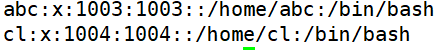
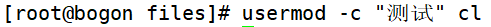
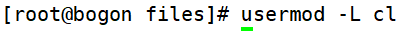
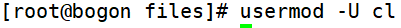
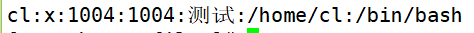

# 修改用户信息和修改用户密码状态

> 分类: Linux > 用户和用户组管理
> 更新时间: 2026-01-10T23:34:44.971990+08:00

---

# 一、修改用户信息usermod
1. [root@localhost~]usermod [选项] 用户名 
2. 选项：

| -u UID | 修改用户的UID号 |
| --- | --- |
| -c 用户说明 | 修改用户的说明信息 |
| -G 组名 | 修改用户的附加组 |
| -L | 临时锁定用户(Lock) |
| -U | 解锁用户锁定(Unlock) |

# 二、修改用户密码状态chage
1. [root@localhost~]#chage[选项]用户名
2. 选项：

| -l | 列出用户的详细密码状态 |
| --- | --- |
| -d 日期 | 修改密码最后一次更改日期（shadow3字段） |
| -m 天数 | 两次密码修改间隔（4字段） |
| -M 天数 | 密码有效期巧字段） |
| -W 天数 | 密码过期前警告天数（6字段） |
| -I 天数 | 密码过后宽限天数（7字段） |
| -E 日期 | 账号失效时间（8字段） |

# 三、操作实例

1. 修改用户的说明

1. 把用户加入其它组

1. 锁定用户

1. 解锁用户

 

 

 

 

 

 

