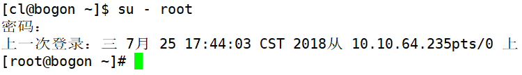

# 删除用户和切换用户身份
# 一、删除用户userdel
1. [root@localhost~]#userdel [-r] 用户名
2. 选项：-r 删除用户的同时删除用户家目录

# 二、查看用户id
1. [root@localhost~]#id 用户名

# 三、切换用户身份su
1. [root@localhost~]#su[选项]用户名
2. 选项：

| - | 选项只使用“-”代表连带用户的环境 变量一起切换 |
| --- | --- |
| -c 命令 | 仅执行一次命令，而不切换用户身份 |

# 四、操作实例
1. 删除用户的同时删除用户家目录

1. 查询用户id

1. 切换用户（连带环境一起切换）

1. 不切换成root，但调用root权限执行命令

 

