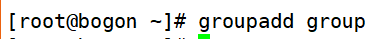
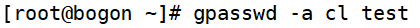

# 用户组管理命令
# 一、添加用户组

1. 选项
+ -g GID 指定组ID

# 二、修改用户组
1. [root@bogon ~]#      groupmod [选项] 组名

| -g GID | 修改组ID |
| --- | --- |
| -n 新组名 | 修改组名 |

1. 把组名group修改为test

# 三、删除用户组

# 四、把用户添加入组或从组中删除
1. [root@bogon ~]#      gpasswd 选项 组名
2. 选项

| -a 用户名 | 把用户加入组 |
| --- | --- |
| -d 用户名 | 把用户从组中删除 |

1. 把cl用户加入到test组

 

