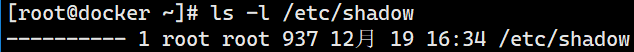
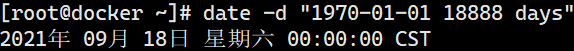

# 用户配置文件

> 分类: Linux > 用户和用户组管理
> 更新时间: 2026-01-10T23:34:44.428767+08:00

---

# 一、/etc/passwd
1. 用途：用户的配置文件， 保存用户账户的基本信息
2. /etc/passwd文件中每行定义一个用户账号，有多少行就表示多少个账号，在一行中可以清晰的看出，各内容之间又通过”:”号划分了7个字段，这7个字段分别定义了账号的不同属性
3. passwd文件分析

+ 字段1：用户名，这是用户登陆时使用的账户名称，在系统中是唯一的，不能重名
+ 字段2：密码占位符x，这个密码字段内容在/etc/shadow中。    
+ 字段3：UID；范围是0-65535
+ 字段4：GID；范围是0-65535；当添加用户时，默认情况下会同时建立一个与用户同名且UID和GID相同的组。
+ 字段5：用户说明；这个字段是对这个账户的说明
+ 字段6：用户家目录；用户登陆后首先进入的目录，一般与"/home/用户名"这样的目录
+ 字段7：登录Shell        当前用户登陆后所使用的shell，在centos/rhel系统中，默认的shell是bash；如果不希望用户登陆系统，可以通过usermod或者手动修改passwd设置，将该字段设置为/sbin/nologin      即可。大多数内置系统账户是/sbin/nologin,这表示禁止登陆系统。
1. 文件说明

因为每个用户登录时都需要取得UID和GID来判断权限问题，所以/etc/passwd的权限为644，这样一来就会带来安全问题，即所有的用户都可以查看/etc/passwd文件，即使文件内的密码是加密的，但还是存在一定的被攻击破解的安全隐患。因此，就有了/etc/shadow文件。

# 二、/etc/shadow
1. 用途：用户的影子口令文件 
2. 文件说明

由于passwd文件必须要被所有的用户读，所以会带来安全隐患。而shadow文件就是为了解决这个安全隐患而增加的。shadow文件的每一行内容，也是以冒号(:)作为分隔符，共9个字段

1. shadow文件分析

+ 字段1：帐号名称
+ 字段2：加密的密码
+ 字段3：最近更改密码的时间；从1970/1/1到上次修改密码的天数
+ 字段4：禁止修改密码的天数；从1970/1/1开始，多少天之内不能修改密码，默认值为0（和第3字段相比）
+ 字段5：用户必须更改口令的天数；密码的最长有效天数，默认值为99999（和第3字段相比）
+ 字段6：警告更改密码的期限；密码过期之前警告天数，默认值为7；在用户密码过期前多少天提醒用户更改密码。一旦超过密码过期日期，用户成功登陆，Linux会强迫用户设置一个新密码，设置完成后才开启Shell程序（和第5字段相比）
+ 字段7：不活动时间；密码过期之后账户宽限时间      3+5；在用户密码过期之后到禁用账户的天数（和第5字段相比）

0：代表密码过期后立即失效

-1：则代表密码永远不会失效。

+ 字段8：帐号失效时间，默认值为空；从1970/1/1日起，到用户被禁用的天数。若超过账户过期日期，Linux会禁止用户登陆系统，即使输入正确密码，也无法登陆
+ 字段9：保留字段（未使用）

# 三、时间戳换算
1. 把时间戳换算为日期

1. 把日期换算为时间戳

