# raid磁盘阵列

> 分类: Linux > 磁盘文件管理
> 更新时间: 2026-01-10T23:34:49.115758+08:00

---

# 一、概念
廉价磁盘冗余阵。是一些列放在一起，成为一个逻辑卷的磁盘集合。

# 二、分类
## RAID0
raid0是条带化（将切片数据随机存储到多个磁盘。至少要用两块磁盘。）

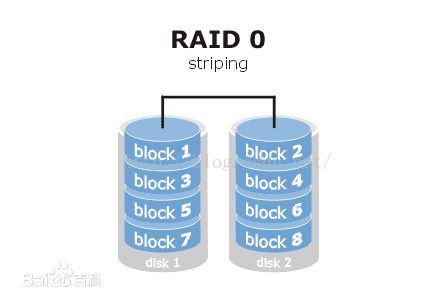

+ 好处是读写速度快。
+ 坏处是零容错。

## RAID1
raid1是镜像化（镜像用来自动备份数据。保存相同的内容到其他磁盘。）


+ 好处是当一个坏掉可以完全恢复。
+ 坏处是磁盘利用率变为原来的1/2,写性能也会变慢

## RAID4
raid4是奇偶校验（一块磁盘做校验）

+ 好处是如果坏了一块磁盘的话可以恢复数据，利用率为n-1/n。
+ 坏处是每次存储数据都要访问校验磁盘

## RAID5
raid5是分布式奇偶校验


+ 校验码分布在不同磁盘块。
+ 好处是如果坏了一块磁盘的话可以恢复数据，利用率为n-1/n。但坏两块就不行了

## ARID01
raid0+1（先组成RAID0,然后组成RAID1）

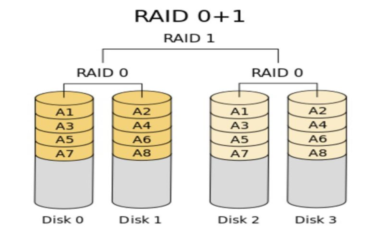 

## RAID10
+ 先组成RAID1,然后组成RAID0

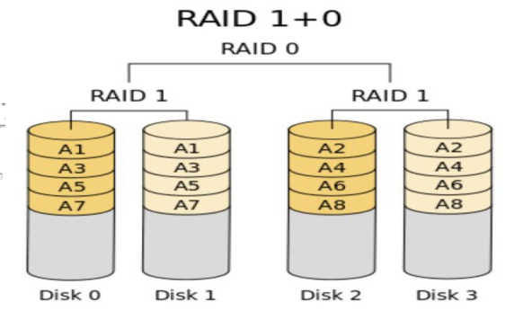

+ 先镜像再条带或先条带再镜像。
+ 1/2利用率，可重建。可用于数据库存储

# 三、操作过程（raid0为例）
1. 准备好磁盘并进行分区

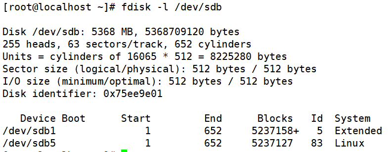 

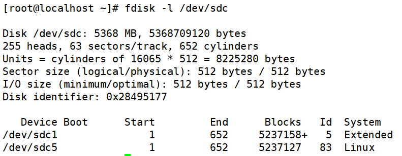

2. 修改磁盘分区类型

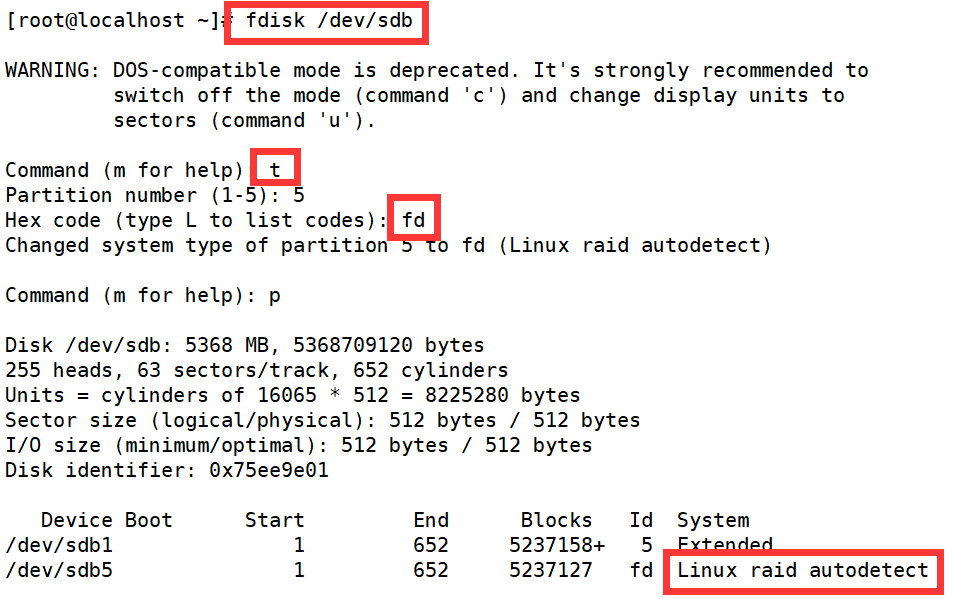

3. 建立磁盘阵列

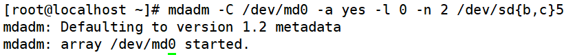

+ -C ：创建一个阵列，后跟阵列名称
+ -l ：指定阵列的级别；
+ -n ：指定阵列中活动devices的数目
4. 查看阵列状态


+ 在第一行中首先是**MD的设备名md0**，
+ **active和inactive**选项表示阵列是否能读/写
+ 接着是阵列的**RAID级别**raid0，
+ 后面是属于阵列的块设备，方括号[]里的数字表示设备在阵列中的序号
5. 将软raid信息写入到配置文件中去


6. 创建文件系统


7. 创建挂载点

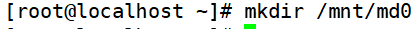

8. 挂载设备


9. 查看详细信息

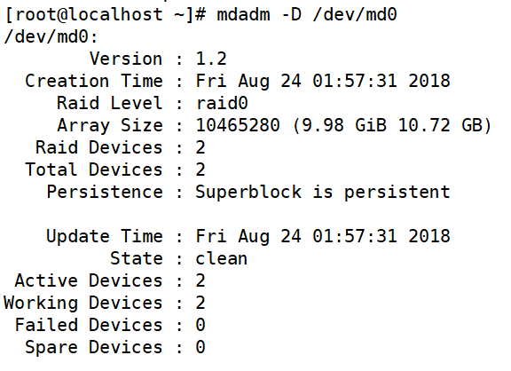

10. 写入配置文件


# 四、其他操作
1. <font style="color:#333333;">制作raid1（方法同上，不再赘述）</font>

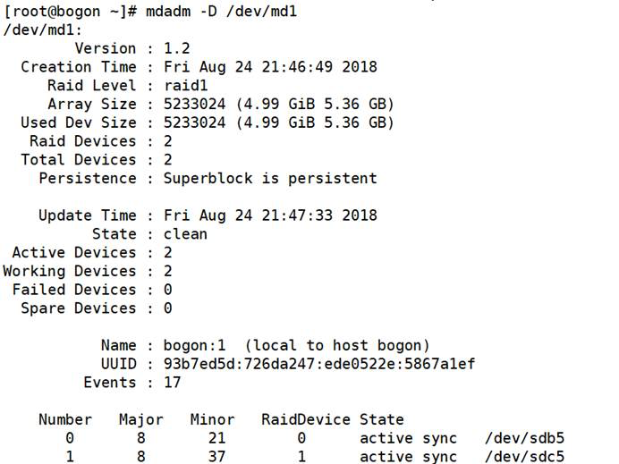 

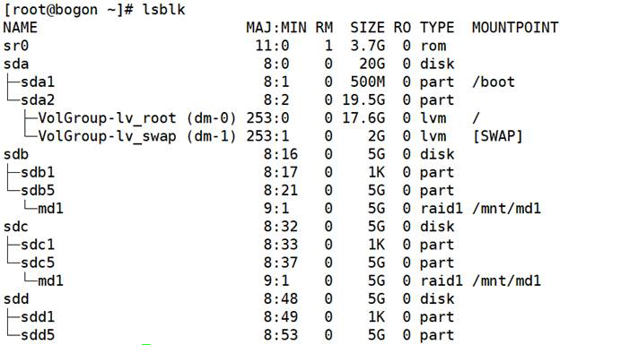

2. 模拟磁盘故障（sdc出现故障，使用sdd进行替换）

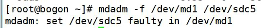

3. <font style="color:#333333;">热移除故障的硬盘：</font>


4. <font style="color:#333333;">给raid-1新增一个sdd盘</font>

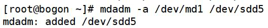

5. <font style="color:#333333;">查看状态</font>

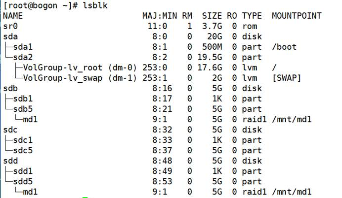

 

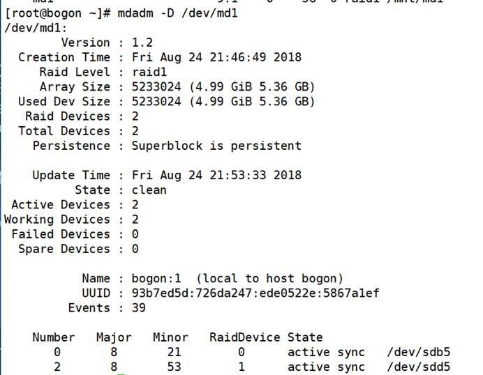

 6. **给raid-5新增一个spare盘：**

```yaml
[root@bogon ~]# mdadm  -a /dev/md0 /dev/sda5  
mdadm: added /dev/sda5 
```

7. 此时查看状态：

```yaml
[root@bogon ~]# cat /proc/mdstat  
Personalities : [raid6] [raid5] [raid4]  
md0 : active raid5 sda5[3](S) sdd1[2] sdc1[1]  sdb1[0] 
     9783296 blocks level 5,  64k chunk, algorithm 2 [3/3] [UUU] 
unused devices: <none> 
```

