# 逻辑卷lvm配置
# 一、简介
1. LVM是逻辑盘卷管理（Logical Volume Manager）的简称，它是Linux环境下对磁盘分区进行管理的一种机制，LVM是建立在硬盘和分区之上的一个逻辑层，来提高磁盘分区管理的灵活性。
2. LVM的工作原理其实很简单，它就是通过将底层的物理硬盘抽象的封装起来，然后以逻辑卷的方式呈现给上层应用。在传统的磁盘管理机制中，我们的上层应用是直接访问文件系统，从而对底层的物理硬盘进行读取，而在LVM中，其通过对底层的硬盘进行封装，当我们对底层的物理硬盘进行操作时，其不再是针对于分区进行操作，而是通过一个叫做逻辑卷的东西来对其进行底层的磁盘管理操作。比如说我增加一个物理硬盘，这个时候上层的服务是感觉不到的，因为呈现给上层服务的是以逻辑卷的方式。
3. LVM最大的特点就是可以对磁盘进行动态管理。因为逻辑卷的大小是可以动态调整的，而且不会丢失现有的数据。如果我们新增加了硬盘，其也不会改变现有上层的逻辑卷。作为一个动态磁盘管理机制，逻辑卷技术大大提高了磁盘管理的灵活性。

# 二、基本的逻辑卷管理概念
1. PV（Physical Volume）- 物理卷 

物理卷在逻辑卷管理中处于最底层，它可以是实际物理硬盘上的分区，也可以是整个物理硬盘，也可以是raid设备。

2. VG（Volumne Group）- 卷组 

卷组建立在物理卷之上，一个卷组中至少要包括一个物理卷，在卷组建立之后可动态添加物理卷到卷组中。一个逻辑卷管理系统工程中可以只有一个卷组，也可以拥有多个卷组。

3. LV（Logical Volume）- 逻辑卷 

逻辑卷建立在卷组之上，卷组中的未分配空间可以用于建立新的逻辑卷，逻辑卷建立后可以动态地扩展和缩小空间。系统中的多个逻辑卷可以属于同一个卷组，也可以属于不同的多个卷组。

关系图如下：


# 三、创建LVM
1. 查看磁盘信息，其中nvme0n2就是需要创建的LVM磁盘

```bash
[root@ceph-1 ~]# lsblk
NAME        MAJ:MIN RM  SIZE RO TYPE MOUNTPOINT
nvme0n1     259:0    0   50G  0 disk 
├─nvme0n1p1 259:1    0    1G  0 part /boot
└─nvme0n1p2 259:2    0   49G  0 part 
  ├─rl-root 253:0    0   47G  0 lvm  /
  └─rl-swap 253:1    0    2G  0 lvm  
nvme0n2     259:3    0  100G  0 disk
```

2. 准备好分区，不用格式化

```bash
[root@ceph-1 ~]# fdisk -l /dev/nvme0n2 
Disk /dev/nvme0n2：100 GiB，107374182400 字节，209715200 个扇区
单元：扇区 / 1 * 512 = 512 字节
扇区大小(逻辑/物理)：512 字节 / 512 字节
I/O 大小(最小/最佳)：512 字节 / 512 字节
```

3. 将/dev/nvme0n2设备创建为pv

```bash
[root@ceph-1 ~]# pvcreate /dev/nvme0n2
  Physical volume "/dev/nvme0n2" successfully created.
[root@ceph-1 ~]# pvs
  PV             VG Fmt  Attr PSize   PFree  
  /dev/nvme0n1p2 rl lvm2 a--  <49.00g      0 
  /dev/nvme0n2      lvm2 ---  100.00g 100.00g
```

4.  创建一个名为 `data_vg` 的卷组  

```bash
[root@ceph-1 ~]# vgcreate data_vg /dev/nvme0n2
  Volume group "data_vg" successfully created
[root@ceph-1 ~]# vgs
  VG      #PV #LV #SN Attr   VSize    VFree   
  data_vg   1   0   0 wz--n- <100.00g <100.00g
  rl        1   2   0 wz--n-  <49.00g       0 

```

5.  在卷组 `data_vg` 中创建一个逻辑卷 `data_lv`，大小可以设定为整个卷组的容量。这里我们假设使用整个容量：  

```bash
[root@ceph-1 ~]# lvcreate -l 100%VG -n data_lv data_vg
  Logical volume "data_lv" created.
[root@ceph-1 ~]# lvs
  LV      VG      Attr       LSize    Pool Origin Data%  Meta%  Move Log Cpy%Sync Convert
  data_lv data_vg -wi-a----- <100.00g                                                    
  root    rl      -wi-ao----  <46.97g                                                    
  swap    rl      -wi-a-----   <2.03g 
```

6. 格式化lv为 ext4  格式

```bash
[root@ceph-1 ~]# mkfs.ext4 /dev/data_vg/data_lv
mke2fs 1.45.6 (20-Mar-2020)
创建含有 26213376 个块（每块 4k）和 6553600 个inode的文件系统
文件系统UUID：f276343e-4d63-473a-839f-a9c16f3bfba7
超级块的备份存储于下列块： 
        32768, 98304, 163840, 229376, 294912, 819200, 884736, 1605632, 2654208, 
        4096000, 7962624, 11239424, 20480000, 23887872

正在分配组表： 完成                            
正在写入inode表： 完成                            
创建日志（131072 个块）完成
写入超级块和文件系统账户统计信息： 已完成
```

7.  创建挂载点并挂载 

```bash
[root@ceph-1 ~]# mkdir -p /data
[root@ceph-1 ~]# mount /dev/data_vg/data_lv /data
[root@ceph-1 ~]# df -h
文件系统                     容量  已用  可用 已用% 挂载点
devtmpfs                     1.8G     0  1.8G    0% /dev
tmpfs                        1.8G     0  1.8G    0% /dev/shm
tmpfs                        1.8G  868K  1.8G    1% /run
tmpfs                        1.8G     0  1.8G    0% /sys/fs/cgroup
/dev/mapper/rl-root           47G  4.0G   44G    9% /
/dev/nvme0n1p1              1014M  328M  687M   33% /boot
tmpfs                        364M     0  364M    0% /run/user/0
/dev/mapper/data_vg-data_lv   98G   24K   93G    1% /data
```

8.  配置开机自动挂载  

```bash
# 获取逻辑卷UUID
[root@ceph-1 ~]# blkid /dev/data_vg/data_lv
/dev/data_vg/data_lv: UUID="f276343e-4d63-473a-839f-a9c16f3bfba7" BLOCK_SIZE="4096" TYPE="ext4"
# 复制输出中的 UUID，然后将以下内容添加到 /etc/fstab 中：
UUID=f276343e-4d63-473a-839f-a9c16f3bfba7 /data ext4 defaults 0 0
```

# 四、LVM的扩容操作
> LVM最大的好处就是可以对磁盘进行动态管理，而且不会丢失现有的数据。假如有一天，lv1的使用量达到了80%，需要扩容，那我们该怎么做呢？因为vg0中还有很多剩余空间，所以我们可以从vg0中再分配点空间给lv1。
>

1. 查看vg0 的剩余容量，还有2.68g 可用。


2. 对lv1进行扩容。

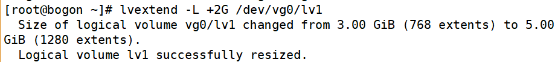

> 说明：在lv1原有的基础上增加了2G.
>

3. 查看现在vg0 的剩余容量，减少了2G.

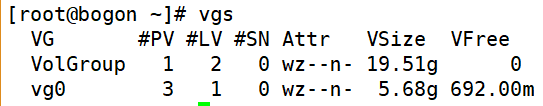

4. 再查看lv1的容量，从3G增加到了5G.

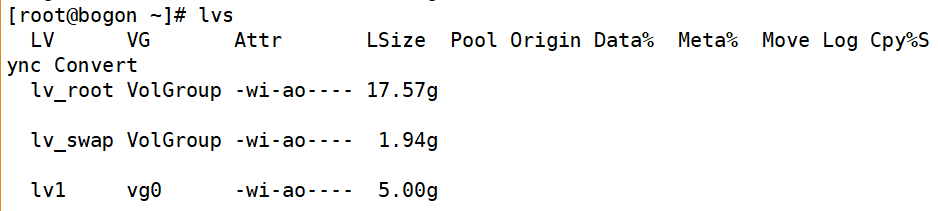

5. 查看实际的磁盘容量。


> 发现实际容量并没有变化，因为我们的系统还不认识刚刚添加进来的磁盘的文件系统，所以还需要对文件系统进行扩容。
>

6. 对文件系统进行扩容。


# 五、VG的扩容
> 还有一种情况，就是假如我们的vg0 空间不够用了，怎么办？这时我们就需要对VG进行扩容。
>

1. 创建PV，使用/dev/sdb1 来创建一个PV。


2. 扩容VG

现在的vg0 容量为5.68g.


```yaml
#  vgextend vg0 /dev/sdh
# vgs
```

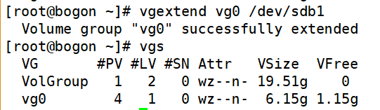

现在vg0 的容量为6.15g, 增加了500mb，VG扩容成功。

# 六、LVM的缩减操作
> **缩减操作需要离线处理。**
>

1. umount 文件系统

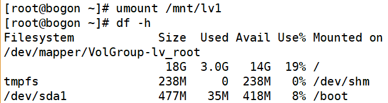

2. 缩减文件系统 


3. 提示需要先运行磁盘检查

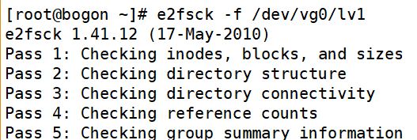

4. 再次执行缩减操作


5. 缩减文件系统成功，下面缩减LV的大小

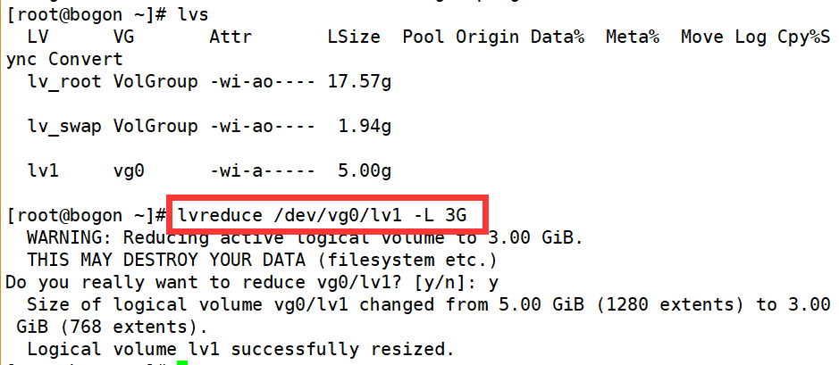

> **文件系统 和LV 缩减的大小必须保持一致，这里的4G是缩减到的大小；如果使用的是"-4G"，则表示容量减少多少的意思。**
>

6. 挂载查看

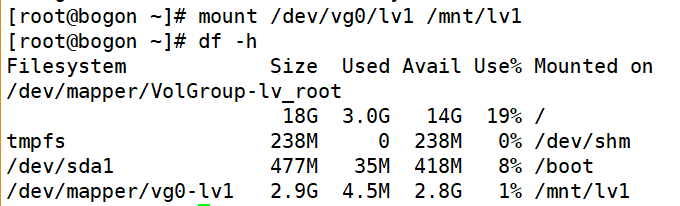

7. LV 缩减成功。查看测试数据

# 七、VG的缩减
1. umount 文件系统


2. 查看当前的PV详情

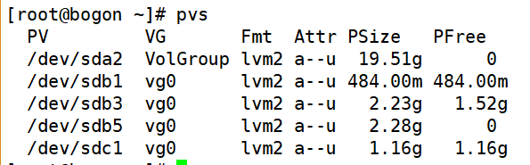

3. 将/dev/sdc1 从vg0 中移除


4. 再次查看PV情况


5. /dev/sdc1 已经不属于vg0了。查看vg0 的情况


vg0  的大小减少了500mb

6. 挂载分区

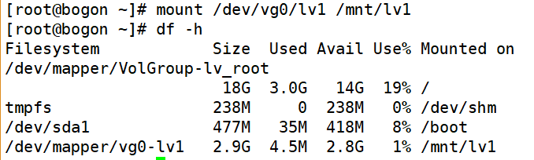

7. VG 缩减成功。

# 八、删除LVM
> 如果要彻底的来移除LVM的话，需要把创建的步骤反过来操作。
>

1. umount 文件系统


2. 移除LV

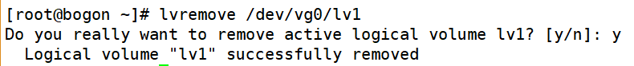

3. 移除VG


4. 移除PV


 

