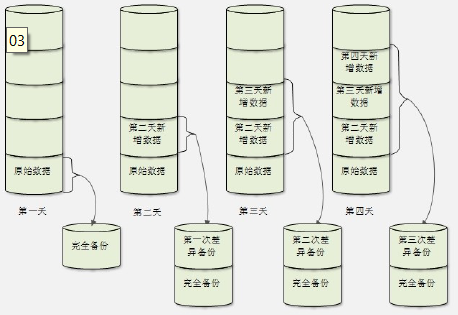

# 系统备份-概述

> 分类: Linux > 系统管理
> 更新时间: 2026-01-10T23:34:51.524113+08:00

---

# 一、Linux系统需要备份的数据
1. /root/目录：
2. /home/目录：
3. /var/spool/mail/目录：
4. /etc/目录：
5. 其他目录：

# 二、安装服务的数据
1. apache需要备份的数据
+ 配置文件
+ 网页主目录
+ 日志文件
2. mysql需要备份的数据
+ 源码包安装的mysql：/usr/local/mysql/data/
+ RPM包安装的mysql：/var/lib/mysql/

# 三、备份策略
1. 完全备份：完全备份就是指把所有需要备份的数据全部备份，当然完全备份可以备份整块硬盘，整个分区或某个具体的目录
2. 增量备份
+ 占用空间少
+ 恢复麻烦

1. 差异备份

 

 

 

 

