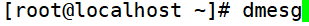
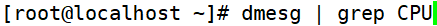
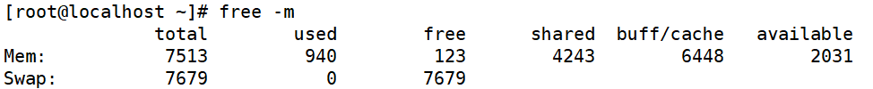
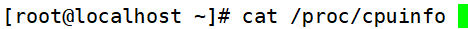
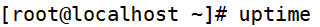
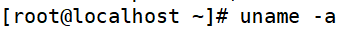
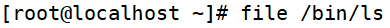
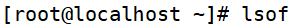

# 系统资源查看
# 一、vmstat命令监控系统资源
1. [root@localhost ~]#      vmstat [刷新延时 刷新次数]

# 二、dmesg开机时内核检测信息
1. [root@localhost ~]#      dmesg

1. [root@localhost ~]#      dmesg | grep CPU

# 三、free命令查看内存使用状态
1. [root@localhost ~]#      free [-b|-k|-m|-g]
2. 选项：

| -b：  | 以字节为单位显示 |
| --- | --- |
| -k： | 以KB为单位显示，默认就是以KB为单位显示 |
| -m： | 以MB为单位显示 |
| -g： | 以GB为单位显示 |

1. 缓存和缓冲的区别
+  简单来说缓存（cache）是用来加速数据从硬盘中“读取”的
+ 缓冲（buffer）是用来加速数据“写入”硬盘的。

# 四、查看CPU信息
1. [root@localhost ~]#      cat /proc/cpuinfo

# 五、uptime命令
1. [root@localhost ~]#      uptime

1. 显示系统的启动时间和平均负载，也就是top命令的第一行。w命令也可以看到这个数据。

# 六、查看系统与内核相关信息
1. [root@localhost ~]#      uname [选项]

1. 选项：

| -a：  | 查看系统所有相关信息； |
| --- | --- |
| -r：  | 查看内核版本； |
| -s：  | 查看内核名称。 |

1. 判断当前系统的位数

1. 查询当前Linux系统的发行版本

# 七、列出进程打开或使用的文件信息
1. 列出进程调用或打开的文件的信息

1. 选项：

| -c 字符串：  | 只列出以字符串开头的进程打开的文件 |
| --- | --- |
| -u 用户名： | 只列出某个用户的进程打开的文件 |
| -p   pid：  | 列出某个PID进程打开的文件 |

 

 

