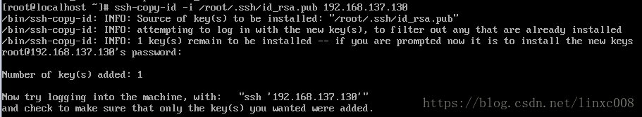
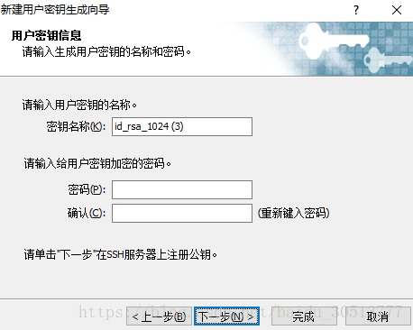
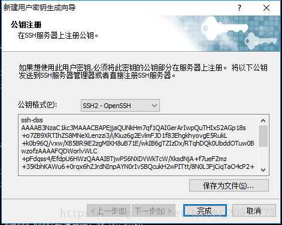
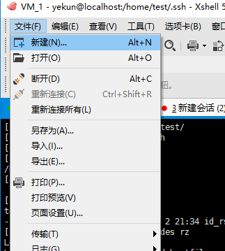
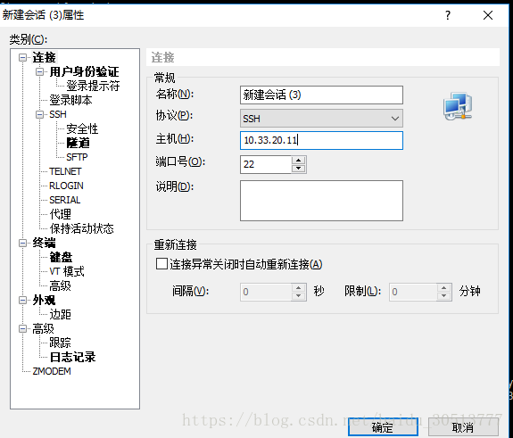

# 远程登录-免密登录

> 分类: Linux > 系统管理
> 更新时间: 2026-01-10T23:34:50.206312+08:00

---

# 一、linux主机间免密登录
1. 在客户端生成公钥私钥对

# ssh-keygen -t rsa

+ 一路默认回车，系统在/root/.ssh下生成id_rsa、id_rsa.pub
1. 查看系统生成的公钥私钥对

# ls /root/.ssh

1. 将生成的公钥私钥对id_rsa.pub发送到其他的服务器上。

# ssh-copy-id -i /root/.ssh/id_rsa.pub 192.168.137.129 

+ 可以看到成功将公钥私钥对发送到了其他服务器，更多服务器一样操作即可。
1. 现在可以测试连接其他服务器是否不需要密码登录，可以看到确实成功了。
+ 登录其他服务器命令：ssh      192.168.137.130     #ssh serverid

# 二、xshell免密登录
1. xshell创建密钥
+ 工具-新建用户密钥生成向导

+ 密钥类型选择：RSA，然后下一步

+ 输入密钥名称和密码

+ 公钥格式为SSH-OpenSSH,保存为文件(后缀为pub)（记录此文件目录）

1. 登录在需要免密登录的主机上。
+ 进入需要用户家目录（我这里是test），并建立.ssh文件夹

[root@localhost .ssh]# cd /home/test/

[root@localhost test]# mkdir .ssh

[root@localhost test]# cd .ssh/

[root@localhost .ssh]# pwd

/home/test/.ssh

+ 将刚刚生成并保存的公钥(后缀pub)的文件上传到此文件夹

[root@localhost .ssh]# rz

[root@localhost .ssh]# ll

-rw-r--r--. 1 root root 208 Jul 2 21:34 id_rsa_1024.pub

+ 将公钥改成需要的名字

[root@localhost .ssh]# cat id_rsa_1024.pub > authorized_keys

+ 修改/etc/ssh/sshd_config

[root@localhost .ssh]# vi /etc/ssh/sshd_config

#禁止root远程登录

PermitRootLogin no

#禁止密码登录

PasswordAuthentication no

RSAAuthentication yes

PubkeyAuthentication yes

+ 重启sshd

[root@localhost .ssh]# systemctl restart sshd

1. 用Xshell连接
+ 文件-新建

+ 输入主机IP

+ 用户身份验证：

+ 接受主机密钥。

