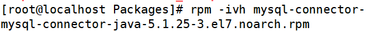

# rpm安装升级与卸载

> 分类: Linux > 软件包管理
> 更新时间: 2026-01-10T23:34:46.482261+08:00

---

# 一、包全名与包名
1. 包全名：操作的包是没有安装的软件包时，使用包全名。而且要注意路径
2. 包名：操作己经安装的软件包时，使用包名。是搜索/var/libhvm/中的数据库

# 二、RPM安装
1. rpm-ivh包全名
2. 选项：

| -i（install) | 安装 |
| --- | --- |
| -v（verbose） | 显示详细信息 |
| -h（hash) | 显示进度 |
| --nodeps | 不检测依赖性 |

# 三、RPM包升级
1. rpm -Uvh 包全名
2. 选项：-U（upgrade） 升级

# 四、RPM包卸载
1. rpm -e 包名
2. 选项：

| -e（erase） | 卸载 |
| --- | --- |
| --nodeps | 不检查依赖性 |

# 五、操作实例
1. 安装rpm包

1. 卸载rpm包

 

 

 

 

 

 

 

 

 

 

 

