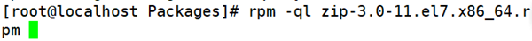
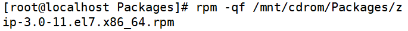
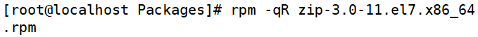

# rpm查询

> 分类: Linux > 软件包管理
> 更新时间: 2026-01-10T23:34:46.589969+08:00

---

# 一、查询是否安装
1. 查询包是否安装

[root@localhost~]#rpm -q 包名

+ 选项：-q 查询 (query)
1.  查询所有已经安装的rpm包

[root@localhost、]#rpm - qa

+ 选项：-a 所有（all）

# 二、查询软件包详细信息
1. [root@localhost~]#rpm      -qi 包名
2. 选项

| -i | 查询软件信息（information） |
| --- | --- |
| -p | 查询安装包信息（package） |

# 三、查询包中文件安装位置
1. [root@localhost~]#rpm      -ql 包名
2.  选项

| -l | 列表（list） |
| --- | --- |
| -p | 查询未安装包信息（package） |

# 四、查询系统文件属于哪个rpm包
1.  [root@localhost~]#rpm -qf 系统文件名
2.  选项：-f 查询系统文件属于哪个软件包

# 五、查询软件包的依赖性
1.  [root@localhost~]#rpm -qR 包名
2. 选项

| -R | 查询软件包的依赖性（requires） |
| --- | --- |
| -p | 查询未安装包信息（package） |

# 六、操作实例
1.  查询包是否安装

1. 查询所有已经安装的rpm包

1. 查询软件包信息

1. 查询包中文件安装位置

1.  查询系统文件属于哪个软件包

1. 查询已安装软件包依赖性

1. 查询未安装软件包依赖性

 

 

 

 

