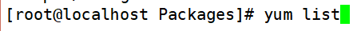
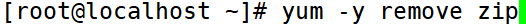
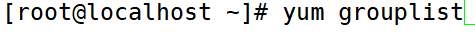
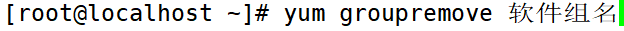

# yum命令

> 分类: Linux > 软件包管理
> 更新时间: 2026-01-10T23:34:46.904473+08:00

---

# 常用yum命令
1. 查询
+ yum list（查询所有可用软件包列表）
+ yum search 关键字（搜索服务器上所有和关键字相关的包）
2. 安装（yum -y ）

| install | 安装 |
| --- | --- |
| -y | 自动回答yes |


1. 升级

| update | 升级 |
| --- | --- |
| -y | 自动回答yes |


1. 卸载

| remove | 卸载 |
| --- | --- |
| -y | 自动回答yes |


# yum软件组管理命令
1. 列出所有可用的软件组列表
+ yum grouplist
2. 安装指定软件组，组名由grouplist查询出来
+ yum groupinstall 软件组名
3. 卸载指定软件组
+ yum groupremove 软件组名

# 操作实例
1. 查询所有可用软件包列表



1. 搜索服务器上所有和zip相关的包


1. yum在线安装软件


1. yum在线升级


1.  yum卸载软件



1. 列出所有可用的软件组列表



1. 安装指定软件组，组名由grouplist查询出来


1. 卸载指定软件组



# 安装指定版本软件包
<font style="color:rgb(51, 51, 51);">yum默认都是安装最新版的软件，这样可能会出一些问题，或者我们希望yum安装指定(特定)版本(旧版本)软件包.所以，就顺带分享yum安装指定(特定)版本(旧版本)软件包的方法。</font>

<font style="color:rgb(51, 51, 51);">过程如下： 假设这里是我们想安装的是prce ，输入：</font>

```bash
[root@k8s-master ~]# yum list docker-ce --showduplicate  | sort -r
docker-ce.x86_64                3:23.0.6-1.el8                  docker-ce-stable
docker-ce.x86_64                3:23.0.5-1.el8                  docker-ce-stable
docker-ce.x86_64                3:23.0.4-1.el8                  docker-ce-stable
```

<font style="color:rgb(51, 51, 51);">找到你要安装的版本的完整的名字，这里安装</font>docker-ce-20.10.6<font style="color:rgb(51, 51, 51);">，输入：</font>

```javascript
# yum install docker-ce-20.10.6
```


