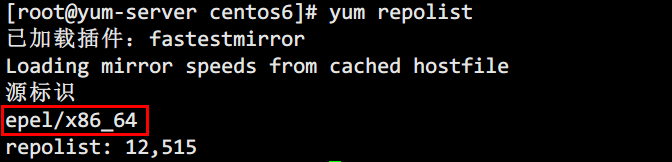

# 局域网yum源

> 分类: Linux > 软件包管理
> 更新时间: 2026-01-10T23:34:47.464563+08:00

---

1. 安装相关服务软件包

`yum  install -y wget make cmake gcc gcc-c++   &&`

`yum install -y pcre-devel lib zlib-devel  openssl openssl-devel createrepo yum-utils`

2. 创建索引

`mkdir -p /yum/centos6`

`mkdir -p /yum/centos7`

3. 配置nginx

```bash
server  {
    listen       80 default_server;
    listen       [::]:80 default_server;
    server_name  _;
    root         /yum;
    # Load configuration files for the  default server block.
    include /etc/nginx/default.d/*.conf;
    location / {
        autoindex on;
        autoindex_exact_size off;
        autoindex_localtime on;
        index index.html;
 }
```

3. 查看yum源标识

`yum  repolist`

+ 
4. 同步相关包

```bash
reposync -r base -p  /yum/centos7
reposync -r extras -p /yum/centos7
reposync -r updates -p /yum/centos7
# 创建索引
createrepo -pdo /yum/centos7 /yum/centos7
```

5. 客户端配置

```bash
[net]
name=centos-net
baseurl=http://211.167.72.82/yum/centos7/
enabled=1
gpgcheck=0
```

6. 刷新yum源

`yum clean all && yum makecache`

