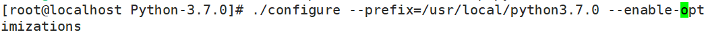
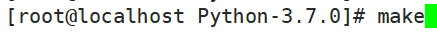
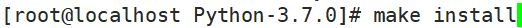
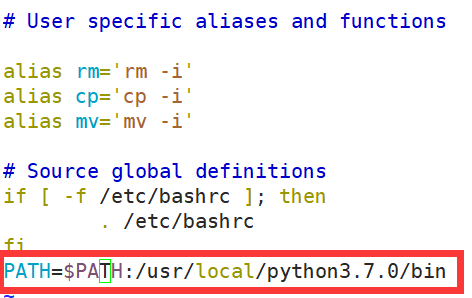
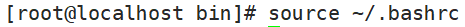

# 源码包安装过程
# 一、编译安装cmatrix-2.0
1. 下载源码包

wget '[https://github.com/abishekvashok/cmatrix/archive/v2.0.tar.gz](https://github.com/abishekvashok/cmatrix/archive/v2.0.tar.gz)'

1. 安装编译环境

yum -y install gcc autoconf automake ncurses-devel

1. 解压源码包文件

tar xvf cmatrix-2.0.tar.gz

1. 进入项目文件

cd cmatrix-2.0

1. 更新配置文件

autoreconf -i

1. 配置安装路径

./configure --prefix=/usr/local/cmatrix

1. 编译

make

1. 安装

make install

1. 执行命令即可见证动态矩阵数字雨：/usr/local/cmatrix/bin/cmatrix

# 二、安装python
1. 将源码包放到/usr/local/src文件夹中

1. 解压.tgz压缩文件

1. 进入到解压后的文件夹中

1. 定义安装目录并执行优化
+ ./configure      --prefix=/usr/local/python3.7.3 --enable-optimizations --enable-shared      CFLAGS=-fPIC

1. 预编译

1. 编译安装

# 四、配置环境变量
1. 修改vi ~/.bashrc

1. 让配置文件生效

#  
