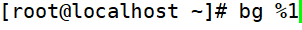

# 工作管理

> 分类: Linux > 进程管理
> 更新时间: 2026-01-10T23:34:52.602395+08:00

---

# 一、把进程放入后台
1. 在命令后加&
+ 
2. 在执行命令的过程中，按ctrl+z快捷键（放入后台暂停运行）
3. 当把终端断掉之后，命令就自动停止了

# 二、查看后台的工作
1. [root@localhost ~]#      jobs [-l]

1. 选项：-l： 显示工作的PID
2. “+”号代表最近一个放入后台的工作，也是工作恢复时，默认恢复的工作。“-”号代表倒数第二个放入后台的工作

# 三、将后台暂停的工作恢复到前台执行
1. [root@localhost ~]#      fg %工作号

1. 参数：
+ %工作号： %号可以省略，但是注意工作号和PID的区别

# 四、把后台暂停的工作恢复到后台执行
1. [root@localhost ~]#      bg %工作号

+ 注：后台恢复执行的命令，是不能和前台有交互的，否则不能恢复到后台执行

