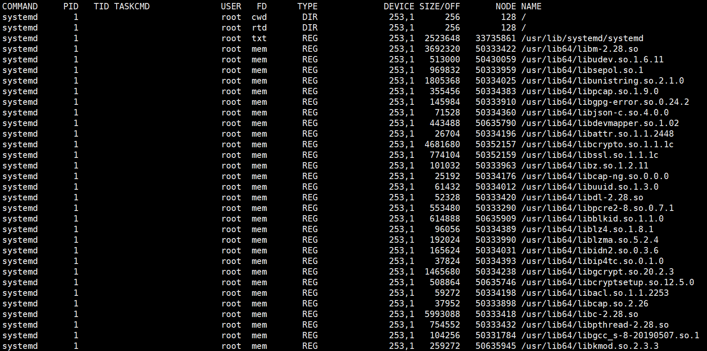

# 查看占用文件进程lsof

> 分类: Linux > 进程管理
> 更新时间: 2026-01-10T23:34:52.829442+08:00

---

# 一、简介
1. lsof(list open      files)是一个列出当前系统打开文件的工具。在linux环境下，任何事物都以文件的形式存在，通过文件不仅仅可以访问常规数据，还可以访问网络连接和硬件。所以如传输控制协议      (TCP) 和用户数据报协议 (UDP)      套接字等，系统在后台都为该应用程序分配了一个文件描述符，无论这个文件的本质如何，该文件描述符为应用程序与基础操作系统之间的交互提供了通用接口。因为应用程序打开文件的描述符列表提供了大量关于这个应用程序本身的信息，因此通过lsof工具能够查看这个列表对系统监测以及排错将是很有帮助的。

# 二、输出信息含义
1. 在终端下输入lsof即可显示系统打开的文件，因为 lsof      需要访问核心内存和各种文件，所以必须以 root 用户的身份运行它才能够充分地发挥其功能。
2. 直接输入lsof部分输出为:

+ COMMAND：进程的名称 PID：进程标识符
+ USER：进程所有者
+ FD：文件描述符，应用程序通过文件描述符识别该文件。如cwd、txt等      TYPE：文件类型，如DIR、REG等
+ DEVICE：指定磁盘的名称
+ SIZE：文件的大小
+ NODE：索引节点（文件在磁盘上的标识）
+ NAME：打开文件的确切名称

FD 列中的文件描述符cwd 值表示应用程序的当前工作目录，这是该应用程序启动的目录，除非它本身对这个目录进行更改,txt 类型的文件是程序代码，如应用程序二进制文件本身或共享库，如上列表中显示的 /sbin/init 程序。

其次数值表示应用程序的文件描述符，这是打开该文件时返回的一个整数。如上的最后一行文件/dev/initctl，其文件描述符为 10。u 表示该文件被打开并处于读取/写入模式，而不是只读 ® 或只写 (w) 模式。同时还有大写 的W 表示该应用程序具有对整个文件的写锁。该文件描述符用于确保每次只能打开一个应用程序实例。初始打开每个应用程序时，都具有三个文件描述符，从 0 到 2，分别表示标准输入、输出和错误流。所以大多数应用程序所打开的文件的 FD 都是从 3 开始。

与 FD 列相比，Type 列则比较直观。文件和目录分别称为 REG 和 DIR。而CHR 和 BLK，分别表示字符和块设备；或者 UNIX、FIFO 和 IPv4，分别表示 UNIX 域套接字、先进先出 (FIFO) 队列和网际协议 (IP) 套接字。

# 三、lsof使用实例
1. 查找谁在使用文件系统

在卸载文件系统时，如果该文件系统中有任何打开的文件，操作通常将会失败。那么通过lsof可以找出那些进程在使用当前要卸载的文件系统，如下： # lsof /GTES11/ COMMAND PID USER FD TYPE DEVICE SIZE NODE NAME bash 4208 root cwd DIR 3,1 4096 2 /GTES11/ vim 4230 root cwd DIR 3,1 4096 2 /GTES11/ 在这个示例中，用户root正在其/GTES11目录中进行一些操作。一个 bash是实例正在运行，并且它当前的目录为/GTES11，另一个则显示的是vim正在编辑/GTES11下的文件。要成功地卸载/GTES11，应该在通知用户以确保情况正常之后，中止这些进程。 这个示例说明了应用程序的当前工作目录非常重要，因为它仍保持着文件资源，并且可以防止文件系统被卸载。这就是为什么大部分守护进程（后台进程）将它们的目录更改为根目录、或服务特定的目录（如 sendmail 示例中的 /var/spool/mqueue）的原因，以避免该守护进程阻止卸载不相关的文件系统。

1. 恢复删除的文件

当Linux计算机受到入侵时，常见的情况是日志文件被删除，以掩盖攻击者的踪迹。管理错误也可能导致意外删除重要的文件，比如在清理旧日志时，意外地删除了数据库的活动事务日志。有时可以通过lsof来恢复这些文件。 当进程打开了某个文件时，只要该进程保持打开该文件，即使将其删除，它依然存在于磁盘中。这意味着，进程并不知道文件已经被删除，它仍然可以向打开该文件时提供给它的文件描述符进行读取和写入。除了该进程之外，这个文件是不可见的，因为已经删除了其相应的目录索引节点。 在/proc 目录下，其中包含了反映内核和进程树的各种文件。/proc目录挂载的是在内存中所映射的一块区域，所以这些文件和目录并不存在于磁盘中，因此当我们对这些文件进行读取和写入时，实际上是在从内存中获取相关信息。大多数与 lsof 相关的信息都存储于以进程的 PID 命名的目录中，即 /proc/1234 中包含的是 PID 为 1234 的进程的信息。每个进程目录中存在着各种文件，它们可以使得应用程序简单地了解进程的内存空间、文件描述符列表、指向磁盘上的文件的符号链接和其他系统信息。lsof 程序使用该信息和其他关于内核内部状态的信息来产生其输出。所以lsof 可以显示进程的文件描述符和相关的文件名等信息。也就是我们通过访问进程的文件描述符可以找到该文件的相关信息。 当系统中的某个文件被意外地删除了，只要这个时候系统中还有进程正在访问该文件，那么我们就可以通过lsof从/proc目录下恢复该文件的内容。

 

