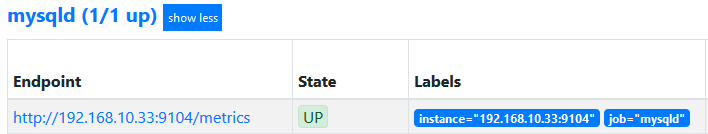
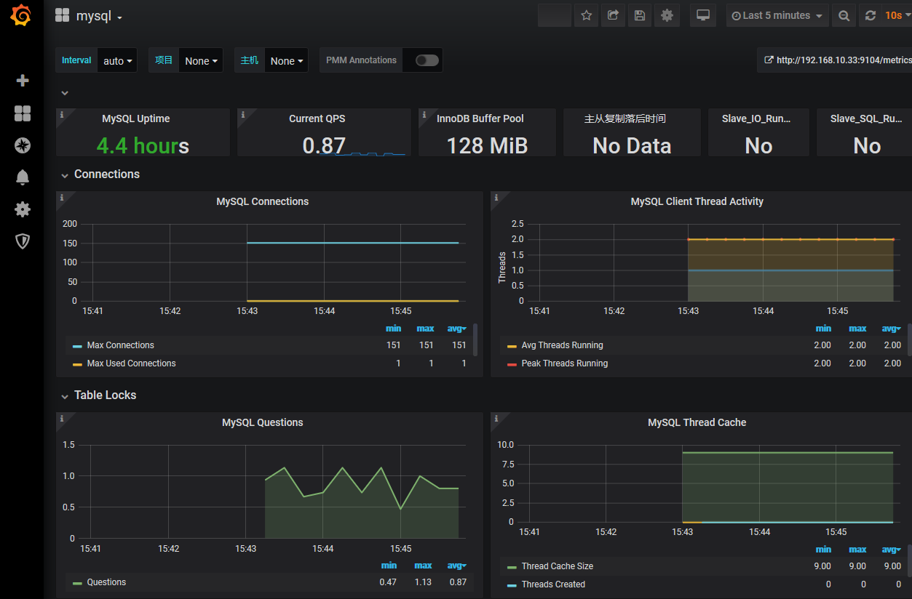

# Mysql Exporter

> 分类: Prometheus > Exporter
> 更新时间: 2026-01-10T23:33:50.787062+08:00

---

# 一、部署MySQLD Exporter
[下载地址](https://github.com/prometheus/mysqld_exporter/releases)

1. 解压

```bash
# tar xvf mysqld_exporter-0.11.0.linux-amd64.tar.gz
```

2. 创建配置文件

```bash
vim /root/.my.cnf
[client]
user=mysql_monitor
password=123456
port=3306
host=127.0.0.1
```

3. 启动

```bash
# ./mysqld_exporter &
```

4. 或者使用docker

```bash
docker network create my-mysql-network
docker pull prom/mysqld-exporter
docker run -d   -p 9104:9104 --network my-mysql-network  -e DATA_SOURCE_NAME="user:password@(my-mysql-network:3306)/"  prom/mysqld-exporter
```

# 二、与Prometheus集成
1. 修改/etc/prometheus/prometheus.yml，将mysqld_exporter添加监控数据采集任务目标当中：


2. 重新启动Prometheus服务:
3. 在Prometheus UI中查看到当前所有的Target状态：



4. grfana导入仪表盘查看数据（id11323）



 

