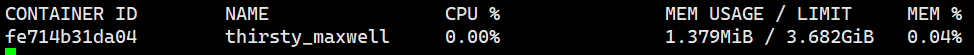
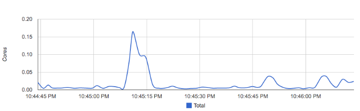
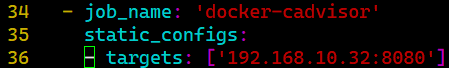
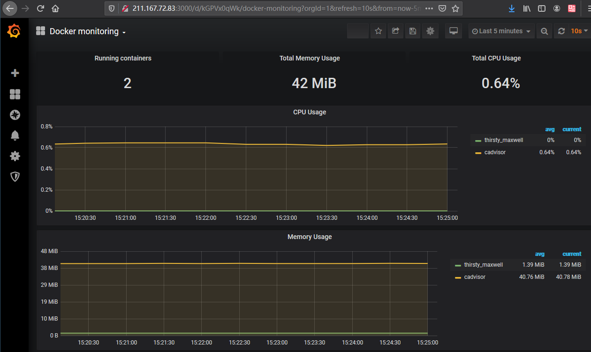

# cAdvisor
# 一、创建并查看容器
1. 在本地启动一个Nginx服务：

# docker run -d nginx

1. 通过Docker的stats命令获取到当前主机上运行容器的统计信息，可以查看容器的CPU利用率、内存使用量、网络IO总量以及磁盘IO总量等信息。

1. 除了使用命令以外，用户还可以通过Docker提供的HTTP      API查看容器详细的监控统计信息。

# 二、使用CAdvisor
1. CAdvisor是Google开源的一款用于展示和分析容器运行状态的可视化工具。通过在主机上运行CAdvisor用户可以轻松的获取到当前主机上容器的运行统计信息，并以图表的形式向用户展示。
2. 在本地运行CAdvisor：

docker run --volume=/:/rootfs:ro --volume=/var/run:/var/run:rw --volume=/sys:/sys:ro --volume=/var/lib/docker/:/var/lib/docker:ro --publish=8080:8080 --detach=true --name=cadvisor google/cadvisor:latest

1. 通过访问http://localhost:8080可以查看，当前主机上容器的运行状态，如下所示：

1. CAdvisor已经内置了对Prometheus的支持。访问http://localhost:8080/metrics即可获取到标准的Prometheus监控样本输出:
2. CAdvisor中获取到的典型监控指标：

| 指标名称 | 类型 | 含义 |
| --- | --- | --- |
| container_cpu_load_average_10s | gauge | 过去10秒容器CPU的平均负载 |
| container_cpu_usage_seconds_total | counter | 容器在每个CPU内核上的累积占用时间 (单位：秒) |
| container_cpu_system_seconds_total | counter | System   CPU累积占用时间（单位：秒） |
| container_cpu_user_seconds_total | counter | User   CPU累积占用时间（单位：秒） |
| container_fs_usage_bytes | gauge | 容器中文件系统的使用量(单位：字节) |
| container_fs_limit_bytes | gauge | 容器可以使用的文件系统总量(单位：字节) |
| container_fs_reads_bytes_total | counter | 容器累积读取数据的总量(单位：字节) |
| container_fs_writes_bytes_total | counter | 容器累积写入数据的总量(单位：字节) |
| container_memory_max_usage_bytes | gauge | 容器的最大内存使用量（单位：字节） |
| container_memory_usage_bytes | gauge | 容器当前的内存使用量（单位：字节 |
| container_spec_memory_limit_bytes | gauge | 容器的内存使用量限制 |
| machine_memory_bytes | gauge | 当前主机的内存总量 |
| container_network_receive_bytes_total | counter | 容器网络累积接收数据总量（单位：字节） |
| container_network_transmit_bytes_total | counter | 容器网络累积传输数据总量（单位：字节） |

# 三、与Prometheus集成
1. 修改/etc/prometheus/prometheus.yml，将cAdvisor添加监控数据采集任务目标当中：

1. 重新启动Prometheus服务:
2. 在Prometheus UI中查看到当前所有的Target状态：

1. grfana导入仪表盘查看数据（id193）

 

