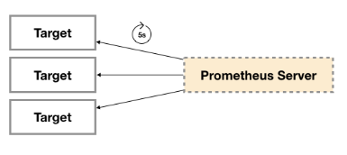

# exporter

> 分类: Prometheus > Exporter
> 更新时间: 2026-01-10T23:33:50.354652+08:00

---

# 一、Exporter简介
所有可以向Prometheus提供监控样本数据的程序都可以被称为一个Exporter。而Exporter的一个实例称为target，如下所示，Prometheus通过轮询的方式定期从这些target中获取样本数据:

# 二、Exporter的来源
1. 社区提供的

| 范围 | 常用Exporter |
| --- | --- |
| 数据库 | MySQL   Exporter, Redis Exporter, MongoDB Exporter, MSSQL Exporter等 |
| 硬件 | Apcupsd   Exporter，IoT Edison Exporter， IPMI Exporter, Node Exporter等 |
| 消息队列 | Beanstalkd   Exporter, Kafka Exporter, NSQ Exporter, RabbitMQ Exporter等 |
| 存储 | Ceph   Exporter, Gluster Exporter, HDFS Exporter, ScaleIO Exporter等 |
| HTTP服务 | Apache   Exporter, HAProxy Exporter, Nginx Exporter等 |
| API服务 | AWS   ECS Exporter， Docker Cloud   Exporter, Docker Hub Exporter, GitHub Exporter等 |
| 日志 | Fluentd   Exporter, Grok Exporter等 |
| 监控系统 | Collectd   Exporter, Graphite Exporter, InfluxDB Exporter, Nagios Exporter, SNMP   Exporter等 |
| 其它 | Blockbox   Exporter, JIRA Exporter, Jenkins Exporter， Confluence Exporter等 |

1. 用户自定义的

除了直接使用社区提供的Exporter程序以外，用户还可以基于Prometheus提供的Client Library创建自己的Exporter程序，目前Promthues社区官方提供了对以下编程语言的支持：Go、Java/Scala、Python、Ruby。同时还有第三方实现的如：Bash、C++、Common Lisp、Erlang,、Haskeel、Lua、Node.js、PHP、Rust等。

# 三、Exporter的运行方式
1. 独立使用的

用户只能通过独立运行一个程序的方式，通过操作系统提供的相关接口，将系统的运行状态数据转换为可供Prometheus读取的监控数据。

1. 集成到应用中的

有些开源项目如Kubernetes，ETCD等直接在代码中使用了Prometheus的Client Library，提供了对Prometheus的直接支持。

# 四、Exporter规范
+ Exporter返回的样本数据，主要由三个部分组成：样本的一般注释信息（HELP），样本的类型注释信息（TYPE）和样本。Prometheus会对Exporter响应的内容逐行解析：

1. 如果当前行以# HELP开始，Prometheus将会按照以下规则对内容进行解析，得到当前的指标名称以及相应的说明信息：
2. 如果当前行以# TYPE开始，Prometheus会按照以下规则对内容进行解析，得到当前的指标名称以及指标类型:

