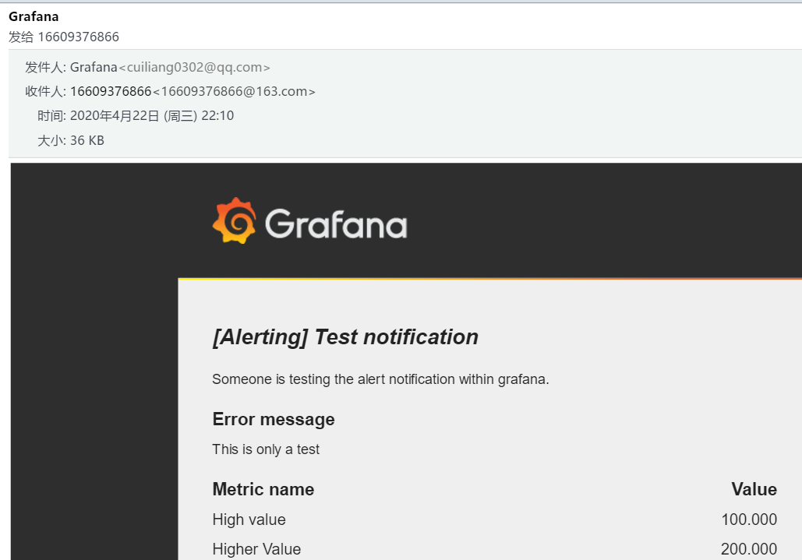
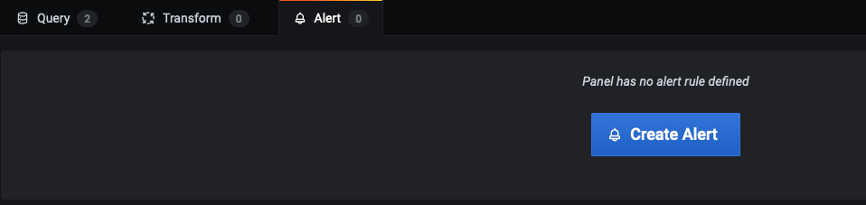
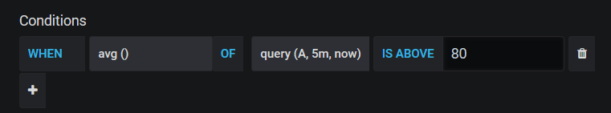
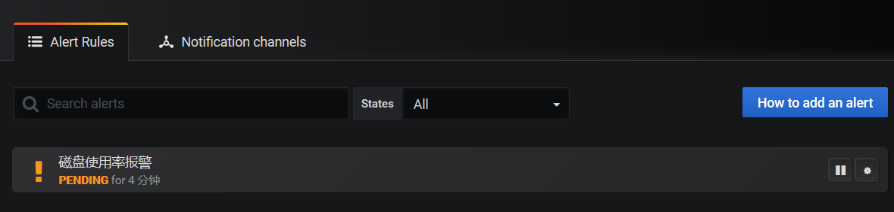

# grafana报警

> 分类: Prometheus > grafana
> 更新时间: 2026-01-10T23:33:52.085480+08:00

---

# 一、简介
1. 所有的graph图形都可以设置连接上多个报警平台并设置阈值并报警
2. prometheus_server(alertmanager插件)-Pagerduty仅仅作为数据源即可（没有必要再使⽤prometheus做报警设置了）
3. 整个的流程如下


# 二、grafana告警平台设置
> 使用qq邮箱发送报警信息
>

1. 修改grafana配置文件

`# vim /etc/grafana/grafana.ini` 


2. 重启grafana服务

`# systemctl restart grafana-server` 

3. 设置grfana报警平台

    

    

4. 发送测试短信并查看

    

# 三、图表添加报警规则
1. 进⼊编辑模式后,选择 Alert 选项卡



2. 设置告警规则


+ name：告警名称
+ evaluate every：告警检测时间间隔（可填写`30s`<font style="color:#464C54;">, </font>`3m`<font style="color:#464C54;">, </font>`5m`<font style="color:#464C54;"> or </font>`1h`）
+ for：在触发告警前，需要查询多长时间的间隔（当告警满足触发条件，不会立即告警，而是先转为peding，一旦超过for设置的时长，再转为alerting状态）


3. 开始设置对于这⼀个graph监控的阈值

    

+ when：聚合操作类型（可以是 avg、max、min、last等）
+ of：查询公式Query(A,5m,now)。其中的A是Graph曲线编号,5m表示取开始时间区间，now表示结束时间区间。也可以是(1h,now-50m)
+ IS ABOVE：报警的触发阈值了，当⼤于80的时候 就会发出报警到 Pagerduty
4. 无数据和错误处理


+ If no data or all values are null：如果没有数据或所有值都为空
+ If execution error or timeout：如果执行错误或超时

| 选项 | 介绍 |
| --- | --- |
| No Data | 将警报规则状态设置为无数据 |
| Alerting | 将警报规则状态设置为警报 |
| Keep Last State | 保持当前的警报规则状态。 |
| Ok | 将警报规则状态设置为正常 |


5. 设置报警工具与内容

    

6. tag设置
+ 目前支持自定义tag类型为：<font style="color:#464C54;">Prometheus Alertmanager、</font>[Webhook](https://grafana.com/docs/grafana/v7.3/alerting/notifications/#webhook)
7. 查看报警信息




    


 四、webhook

```bash
{
  "dashboardId":1,
  "evalMatches":[
    {
      "value":1,
      "metric":"Count",
      "tags":{}
    }
  ],
  "imageUrl":"https://grafana.com/assets/img/blog/mixed_styles.png",
  "message":"Notification Message",
  "orgId":1,
  "panelId":2,
  "ruleId":1,
  "ruleName":"Panel Title alert",
  "ruleUrl":"http://localhost:3000/d/hZ7BuVbWz/test-dashboard?fullscreen\u0026edit\u0026tab=alert\u0026panelId=2\u0026orgId=1",
  "state":"alerting",
  "tags":{
    "tag name":"tag value"
  },
  "title":"[Alerting] Panel Title alert"
}
```

 

