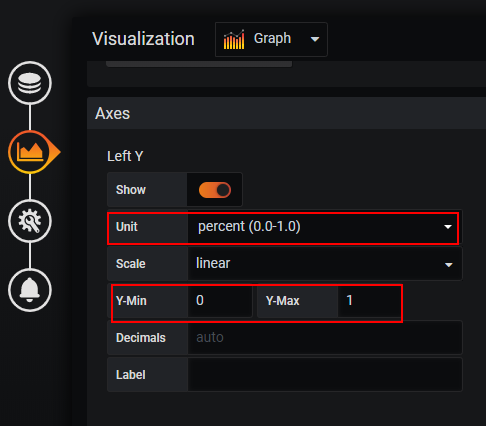
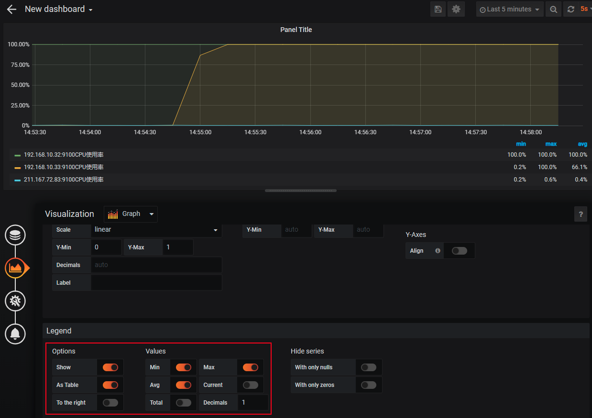
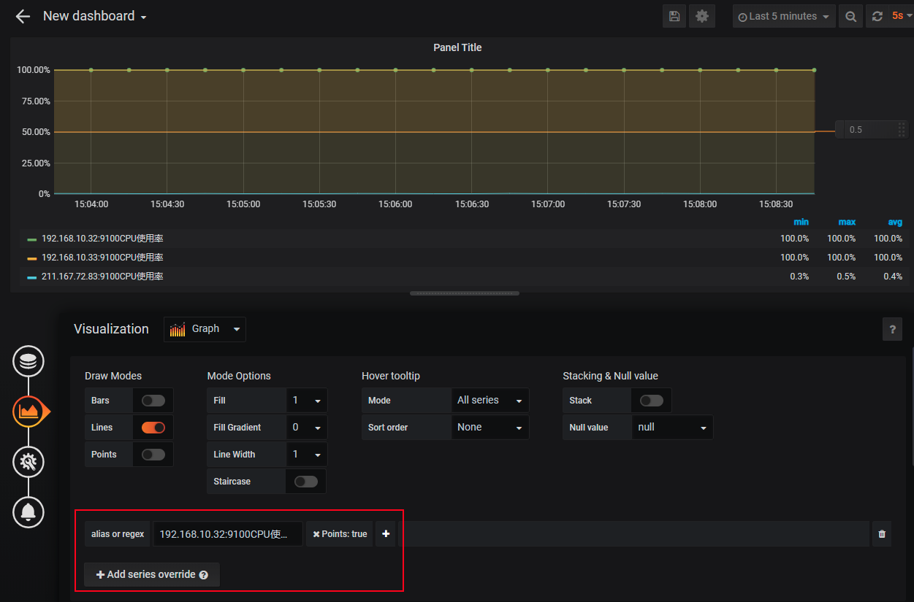
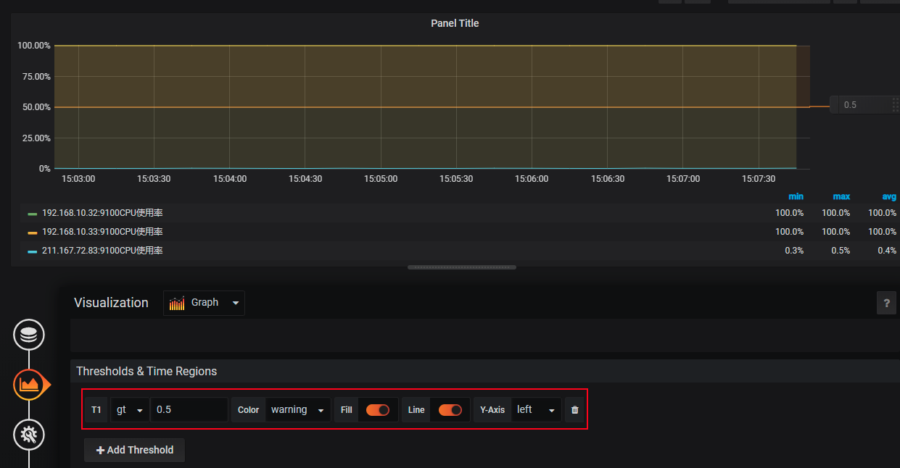

# graph面板常用操作

> 分类: Prometheus > grafana
> 更新时间: 2026-01-10T23:33:51.658542+08:00

---

1. 自定义每条线的图例名称

2. Y轴按百分比显示数值

| 数据类型 | 使用场景 |
| --- | --- |
| percent(0-100) | CPU、内存使用率 |
| bytes | 总内存大小 |
| seconds（s） | 系统运行时间 |
| bytes/sec | 磁盘读取速率 |
| bits/sec | 下行带宽速率 |

3. 显示当前时间序列的最小 最大 平均值，并设置显示时保留1位小数

4. 自定义规则，指定某主机以点的形式显示在图表中

5. 定义一个Threshold规则，如果CPU超过50%的区域显示为warning状态

+ Graph面板则会在图表中显示一条阈值，并且将所有高于该阈值的区域显示为warining状态，通过可视化的方式直观的在图表中显示一些可能出现异常的区域。

