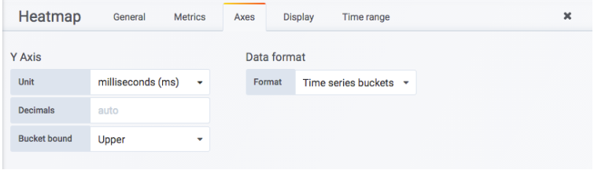
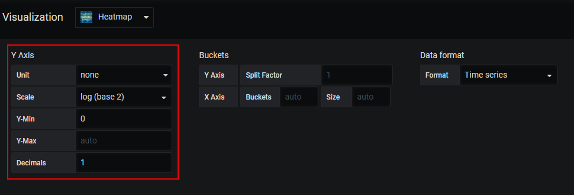

# 分布统计：Heatmap面板
# 一、使用Heatmap可视化Histogram样本分布情况
1. 当使用Heatmap可视化Histogram类型的监控指标时，需要设置Format      as选项为Heatmap。当使用Heatmap格式化数据后，Grafana会自动根据样本的中的le标签，计算各个Bucket桶内的分布，并且按照Bucket对数据进行重新排序。Legend      format模板则将会控制Y轴中的显示内容。如下所示：

1. 默认情况下，Heatmap      Panel会自行对PromQL查询出的数据进行分布情况统计，而在Prometheus中Histogram类型的监控指标其实是已经自带了分布的Bucket信息的，因此为了直接使用这些Bucket信息，我们需要在Axes选项中定义数据的Date      format需要定义为Time series buckets。该选项表示Heatmap      Panel不需要自身对数据的分布情况进行计算，直接使用时间序列中返回的Bucket即可。如下所示：

通过以上设置，即可实现对Histogram类型监控指标的可视化。

# 二、使用Heatmap可视化其它类型样本分布情况
1. 对于非Histogram类型，由于其监控样本中并不包含Bucket相关信息，因此在Metrics选项中需要定义Format      as为Time series，如下所示：

1. 并且通过Axes选项中选择Data      format方式为Time series。设置该选项后Heatmap Panel会要求用户提供Bucket分布范围的设置，如下所示：

1. 在Y轴（Y      Axis）中需要通过Scale定义Bucket桶的分布范围，默认的Bucket范围支持包括：liner（线性分布）、log(base      10)（10的对数）、log(base 32)（32的对数）、log(base 1024)（1024的对数）等。
2. 例如，上图中设置的Scale为log(base      2)，那么在Bucket范围将2的对数的形式进行分布，即[1,2,4,8,....]，如下所示：

1. 通过以上设置，Heatmap会自动根据用户定义的Bucket范围对Prometheus中查询到的样本数据进行分布统计。

 

