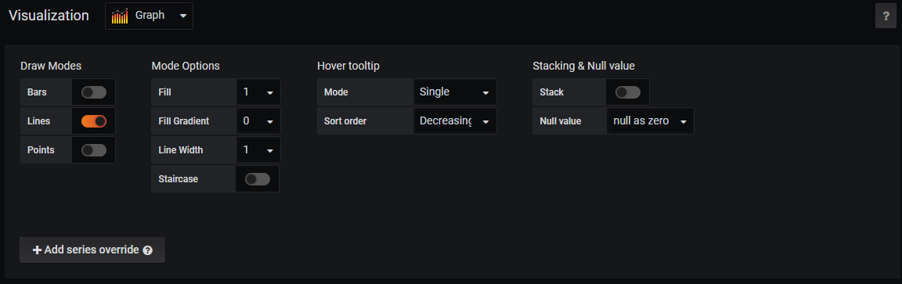
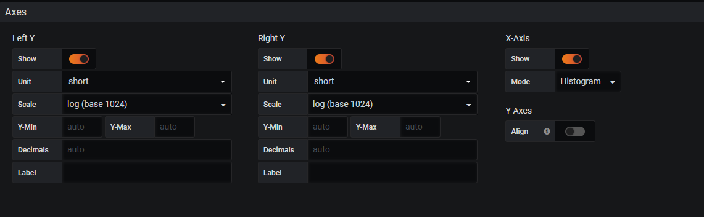
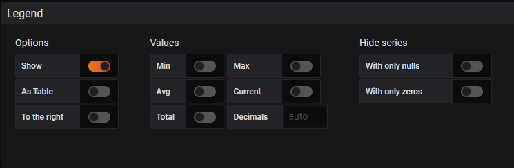

# 变化趋势：Graph面板
# 一、Queries查询选项

1. query：用于选择数据源
2. Add query：添加数据源，可以向面板中添加多条数据
3. query inspector：提供了调试相关的功能，点击可以展开相关的调试面板：

1. metric：在此输入查询表达式，结果会在上图显示
2. Legend      format：用于控制如何格式化每条时间序列的图例信息。Grafana支持通过模板的方式，根据时间序列的标签动态生成图例名称
3. Min Step：当查询到的样本数据量非常大时可以导致Grafana渲染图标时出现一些性能问题，设置查询数据时的最小步长（Step），从而减少从Prometheus返回的数据量。
4. Resolution选项，控制Grafana自身渲染的数据量。例如，如果Resolution的值为1/10，Grafana会将Prometeus返回的10个样本数据合并成一个点。因此Resolution越小可视化的精确性越高，反之，可视化的精度越低。
5. Format      as选项定义如何格式化Prometheus返回的样本数据。这里提供了3个选项：Table,Time      Series和Heatmap，分别用于Tabel面板，Graph面板和Heatmap面板的数据可视化。

# 二、Visualization可视化

1. Draw      Options用于设置当前图标的展示形式、样式以及交互提示行为。其中，Draw      Modes用于控制图形展示形式：Bar（柱状）、Lines（线条）、Points（点），用户可以根据自己的需求同时启用多种模式。
2. Mode Options则设置各个展示模式下的相关样式。
3. Hover      tooltip用于控制当鼠标移动到图形时，显示提示框中的内容。
4. Stacking & Null      value：stack(多series是否堆叠显示)，

Null value，空值怎么显示(connected：null值被忽略，直线直接跳转到下一个值，null：空值被保留为空，这将在图中留下空白区域，null as zero：空值被绘制为零值)

1. 在Axes选项中可以控制图标的X轴和Y轴相关的行为：
+ 默认情况下，Y轴会直接显示当前样本的值，通过Left      Y的Unit可以让Graph面板自动格式化样本值。除了百分比以外，Graph面板支持如日期、货币、重量、面积等各种类型单位的自动换算，用户根据自己当前样本的值含义选择即可。

 

