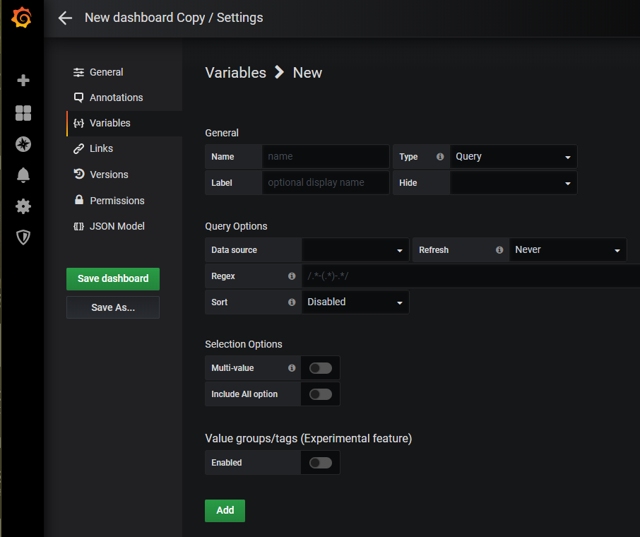
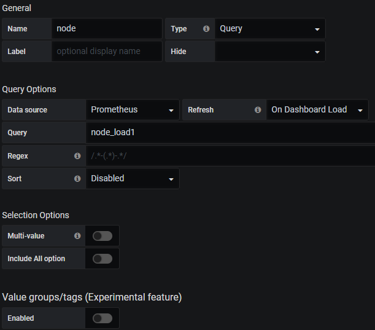
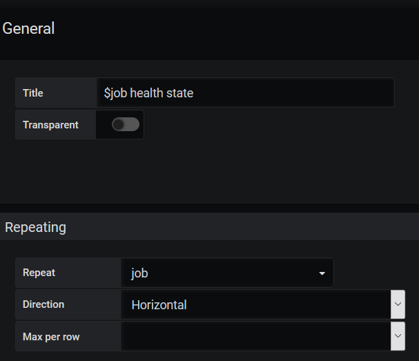
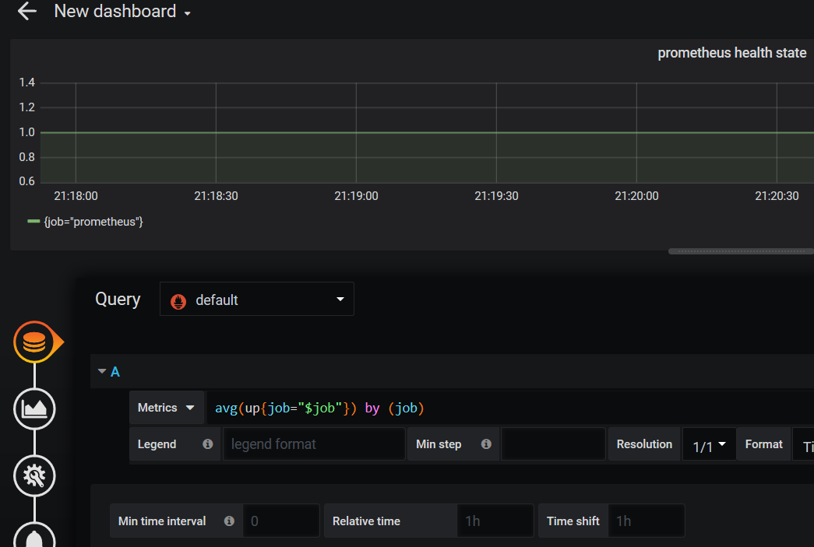

# 变量

> 分类: Prometheus > grafana
> 更新时间: 2026-01-10T23:33:51.970960+08:00

---

# 一、变量定义
1. 通过Dashboard页面的Settings选项，可以进入Dashboard的配置页面并且选择Variables子菜单:

1. 用户需要指定变量的名称，后续用户就可以通过$variable_name的形式引用该变量。Grafana目前支持6种不同的变量类型，而能和Prometheus一起工作的主要包含以下5种类型：

| 类型 | 工作方式 |
| --- | --- |
| Query | 允许用户通过Datasource查询表达式的返回值动态生成变量的可选值 |
| Interval | 该变量代表时间跨度，通过Interval类型的变量，可以动态改变PromQL区间向量表达式中的时间范围。如rate(node_cpu[2m]) |
| Datasource | 允许用户动态切换当前Dashboard的数据源，特别适用于同一个Dashboard展示多个数据源数据的情况 |
| Custom | 用户直接通过手动的方式，定义变量的可选值 |
| Constant | 常量，在导入Dashboard时，会要求用户设置该常量的值 |

1. Label属性用于指定界面中变量的显示名称，Hide属性则用于指定在渲染界面时是否隐藏该变量的下拉框。

# 二、使用变量过滤时间序列
1. 为Dashboard创建了一个名为node的变量，并且指定其类型为Query。Query类型的变量，允许用户指定数据源以及查询表达式，并通过正则匹配（Regex）的方式对查询结果进行处理，从而动态生成变量的可选值。在这里指定了数据源为Prometheus，通过使用node_load1我们得到了两条时间序列：

1. 通过指定正则匹配表达式为/.*instance="([^"]*).*/从而匹配出标签instance的值作为node变量的所有可选项

1. Selection Options选项中可以指定该变量的下拉框是否支持多选，以及是否包含全选（All）选项。

1. 保存变量后，用户可以在Panel的General或者Metrics中通过$node的方式使用该变量，如下所示：

1. 使用Query类型的变量能够根据允许用户能够根据时间序列的特征维度对数据进行过滤。在定义Query类型变量时，除了使用PromQL查询时间序列以过滤标签的方式以外，Grafana还提供了几个有用的函数：

| 函数 | 作用 |
| --- | --- |
| label_values(label) | 返回Promthues所有监控指标中，标签名为label的所有可选值 |
| label_values(metric,   label) | 返回Promthues所有监控指标metric中，标签名为label的所有可选值 |
| metrics(metric) | 返回所有指标名称满足metric定义正则表达式的指标名称 |
| query_result(query) | 返回prometheus查询语句的查询结果 |

# 三、使用变量动态创建Panel和Row
1. 示例：当需要可视化当前系统中所有采集任务的监控任务运行状态时，由于Prometheus的job采集任务配置可能随时发生变更，通过硬编码的形式实现，会导致Dashboard配置的频繁变更
2. 为Dashboard定义了一名为job的变量：

+ 通过使用label_values函数，获取到当前Promthues监控指标up中所有可选的job标签的值：label_values(up,      job)
1. General中的Repeat选项

1. Repeat选项设置完成后，Grafana会根据当前用户的选择，自动创建一个到多个Panel实例。 为了能够使Singlestat Panel能够展示正确的数据，如下所示，在Prometheus中，我们依然使用了$job变量，不过此时的$job反应的是当前迭代的值：

1. 如果还希望能够自动生成Row，只需要在Row的设置中，选择需要Repeat的变量即可：

 

 

 

 

 

 

 

 

