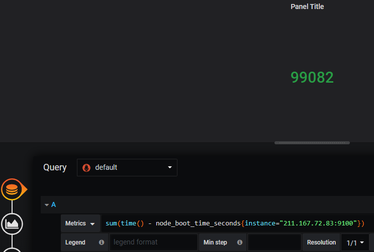
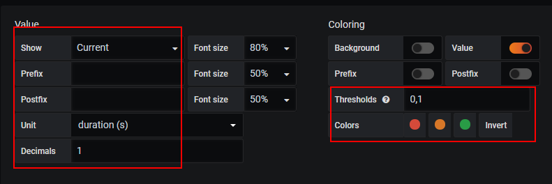

# 当前状态：SingleStat面板
1. Singlem       Panel侧重于展示系统的当前状态而非变化趋势。如下所示，在以下场景中特别适用于使用SingleStat：
+ 当前系统中所有服务的运行状态；
+ 当前基础设施资源的使用量；
+ 当前系统中某些事件发生的次数或者资源数量等。
2. Query查询211.167.72.83主机系统启动时间

+ 通过Value配置项组可以控制当前面板中显示的值，以及字体大小等。对于主机负载而言，我们希望能够显示当前的最新值，因此修改Stat为Current即可。
3. 如果希望面板能够根据不同的值显示不同的颜色的话，则可以定义Thresholds与Colors的映射关系，例如，定义Thresholds的分割区间值为“0,1”，则当Value的值落到不同的范围内时，将显示不同的颜色。

