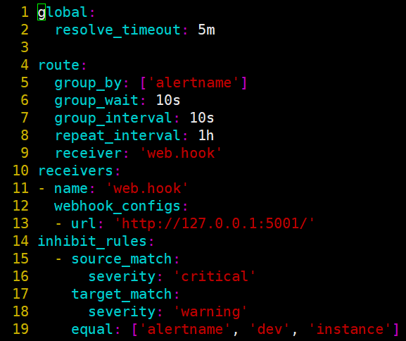

# Alertmanager配置概述

> 分类: Prometheus > prometheus告警处理
> 更新时间: 2026-01-10T23:33:49.710379+08:00

---

# 一、配置文件概述
1. Alertmanager的配置主要包含两个部分：路由(route)以及接收器(receivers)。所有的告警信息都会从配置中的顶级路由(route)进入路由树，根据路由规则将告警信息发送给相应的接收器。
2. 在Alertmanager中可以定义一组接收器，比如可以按照角色(比如系统运维，数据库管理员)来划分多个接收器。接收器可以关联邮件，Slack以及其它方式接收告警信息。
3. 当前配置文件中定义了一个默认的接收者default-receiver由于这里没有设置接收方式，目前只相当于一个占位符。
4. 在配置文件中使用route定义了顶级的路由，路由是一个基于标签匹配规则的树状结构。所有的告警信息从顶级路由开始，根据标签匹配规则进入到不同的子路由，并且根据子路由设置的接收器发送告警。目前配置文件中只设置了一个顶级路由route并且定义的接收器为default-receiver。因此，所有的告警都会发送给default-receiver。

# 二、配置文件详细说明
1. 全局配置（global）：用于定义一些全局的公共参数，如全局的SMTP配置，Slack配置等内容；
2. 模板（templates）：用于定义告警通知时的模板，如HTML模板，邮件模板等；
3. 告警路由（route）：根据标签匹配，确定当前告警应该如何处理；
4. 接收人（receivers）：接收人是一个抽象的概念，它可以是一个邮箱也可以是微信，Slack或者Webhook等，接收人一般配合告警路由使用；
5. 抑制规则（inhibit_rules）：合理设置抑制规则可以减少垃圾告警的产生

 

