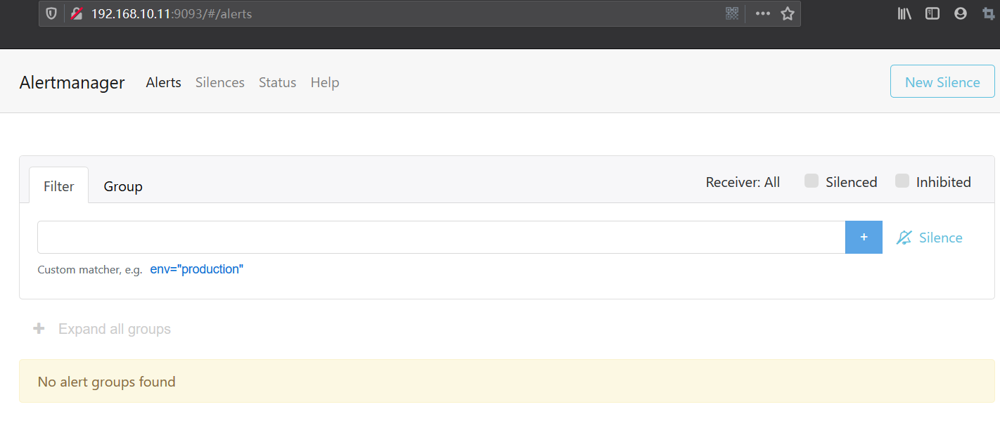
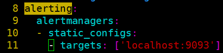
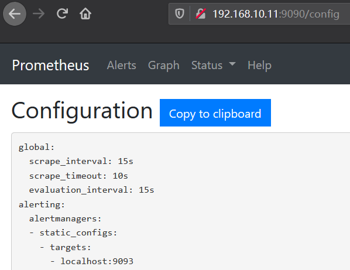
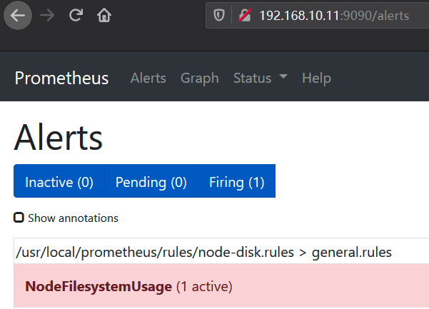

# 部署Alertmanager

> 分类: Prometheus > prometheus告警处理
> 更新时间: 2026-01-10T23:33:49.599233+08:00

---

# 一、下载安装Alertmanager
1. 获取并安装软件包AlertManager二进制包
+ 下载地址
2. 启动Alertmanager

Alermanager会将数据保存到本地中，默认的存储路径为data/。因此，在启动Alertmanager之前需要创建相应的目录：

./alertmanager

1. 查看运行状态

Alertmanager启动后可以通过9093端口访问

# 二、关联Prometheus与Alertmanager
1. 编辑Prometheus配置文件prometheus.yml,并添加以下内容

1. 重启Prometheus服务，成功后，可以从[http://192.168.33.10:9090/config](http://192.168.33.10:9090/config)查看alerting配置是否生效。

1. 模拟触发问题，等待Prometheus告警进行触发状态：

1. 查看Alertmanager      UI此时可以看到Alertmanager接收到的告警信息。

 

