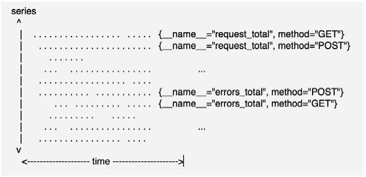

# 数据模型

> 分类: Prometheus > prometheus基础
> 更新时间: 2026-01-10T23:33:48.068960+08:00

---

+ Prometheus从根本上将所有数据存储为时间序列：带有时间戳值的数据流属于同一度量标准和同一组标签维度。除了存储的时间序列，Prometheus可能会生成临时的导出时间序列作为查询的结果。

# 一、指标定义
1. 监控指标格式：

`<metric name>{<label name>=<label value,……>}` 

2. 指标名称（metric name）

用于说明指标的含义，必须由字母、数值下画线或者冒号组成，其中的冒号指标不能用于exporter。

3. 标签（label）

标签可体现指标的维度特征，用于过滤和聚合。它通过标签名（label name）和标签值（label value）这种键值对的形式，形成多种维度。

# 二、示例
1. 给定度量标准名称和一组标签，通常使用以下表示法标识时间序列：

`<metric name>{<label name>=<label value>, ...}` 

2. 例如，度量标准名称api_http_requests_total和标签      method="POST" 和 handler="/messages"的时间序列可以这样写：`api_http_requests_total{method="POST", handler="/messages"}`

# 三、数据样本
1. Prometheus会将所有采集到的样本数据以时间序列（time-series）的方式保存在内存数据库中，并且定时保存到硬盘上。time-series是按照时间戳和值的序列顺序存放的，我们称之为向量(vector). 每条time-series通过指标名称(metrics name)和一组标签集(labelset)命名。如下所示，可以将time-series理解为一个以时间为Y轴的数字矩阵：

2. 在time-series中的每一个点称为一个样本（sample），样本由以下三部分组成：
+ 指标(metric)：metric name和描述当前样本特征的labelsets;
+ 时间戳(timestamp)：一个精确到毫秒的时间戳;
+ 样本值(value)：一个float64的浮点型数据表示当前样本的值。

 

