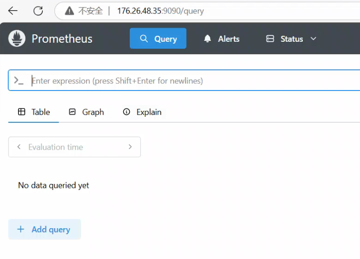
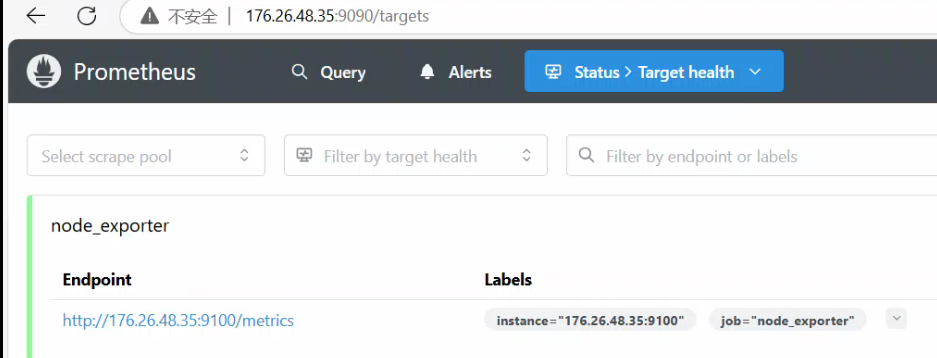
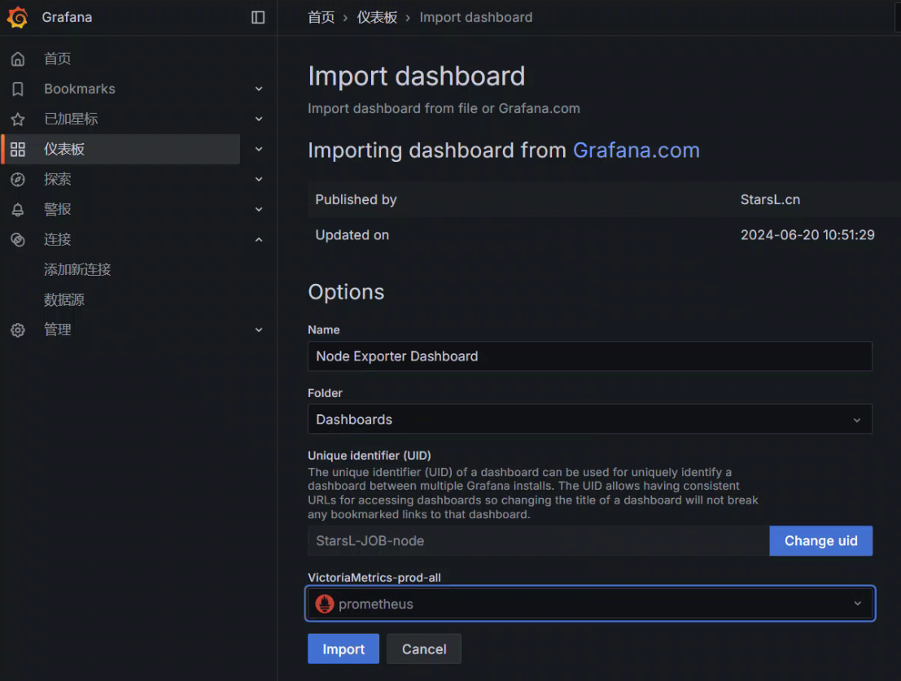

# 源码包部署监控组件
# 安装prometheus
[下载链接](https://prometheus.io/download/)

## 安装
```bash
[root@tiaoban ~]# wget https://github.com/prometheus/prometheus/releases/download/v3.2.0/prometheus-3.2.0.linux-amd64.tar.gz
[root@tiaoban ~]# tar -xvf prometheus-3.2.0.linux-amd64.tar.gz
[root@tiaoban ~]# mv prometheus-3.2.0.linux-amd64 /opt/prometheus
```

## 创建服务脚本
```bash
[root@tiaoban ~]# vim /usr/lib/systemd/system/prometheus.service
[Unit]
Description=Prometheus
Documentation=https://prometheus.io/
After=network.target
 
[Service]
# Type设置为notify时，服务会不断重启
Type=simple
User=root
Group=root
# --storage.tsdb.path是可选项，默认数据目录在运行目录的./dada目录中
# --web.enable-lifecycle 允许通过API接口实现热更新
ExecStart=/opt/prometheus/prometheus --config.file=/opt/prometheus/prometheus.yml --web.enable-lifecycle 
Restart=on-failure
 
[Install]
WantedBy=multi-user.target
```

## 启动prometheus
```bash
[root@tiaoban ~]# systemctl daemon-reload 
[root@tiaoban ~]# systemctl enable prometheus.service
[root@tiaoban ~]# systemctl start prometheus.service
[root@tiaoban ~]# systemctl status prometheus 
```

## 验证
浏览器打开IP:9090端口即可打开 Prometheus 监控页面



# 安装grafana
[下载链接](https://grafana.com/grafana/download)

## 安装
```bash
[root@tiaoban ~]# yum install -y https://dl.grafana.com/enterprise/release/grafana-enterprise-11.5.1-1.x86_64.rpm
```

## 启动
```bash
[root@tiaoban ~]# systemctl enable grafana-server.service
[root@tiaoban ~]# systemctl start grafana-server.service
```

## 访问grafana
浏览器访问IP:3000端口，即可打开grafana页面，默认用户名密码都是admin，初次登录会要求修改默认的登录密码


添加prometheus数据源


添加url地址并保存


添加dashboard


查看仪表盘


# 监控linux主机
下载地址：[https://prometheus.io/download/#node_exporter](https://prometheus.io/download/#node_exporter)

## 安装node-exporter
```bash
# wget https://github.com/prometheus/node_exporter/releases/download/v1.9.0/node_exporter-1.9.0.linux-amd64.tar.gz
# tar -zxf node_exporter-1.9.0.linux-amd64.tar.gz 
# mv node_exporter-1.9.0.linux-amd64 /opt/node_exporter
```

## 创建服务脚本
```bash
# vim /usr/lib/systemd/system/node_exporter.service
[Unit]
Description=node_exporter
After=network.target
 
[Service]
Type=simple
User=root
ExecStart=/opt/node_exporter/node_exporter
Restart=on-failure
 
[Install]
WantedBy=multi-user.target
```

## 启动node_exporter
```bash
# systemctl daemon-reload  
# systemctl enable node_exporter.service
# systemctl start node_exporter.service
# systemctl status node_exporter.service
```

## 添加监控项
```bash
# vim /opt/prometheus/prometheus.yml 
scrape_configs:
  - job_name: "node_exporter"
    static_configs:
      - targets: ["176.26.48.35:9100"]
# systemctl restart prometheus.service
```

## 查看验证


## grafana导入自定义的dashboard
[https://grafana.com/grafana/dashboards/16098-node-exporter-dashboard-20240520-job/](https://grafana.com/grafana/dashboards/16098-node-exporter-dashboard-20240520-job/)

创建自定义dashboard，选择导入


配置数据源，dashboard名称



查看dashboard


