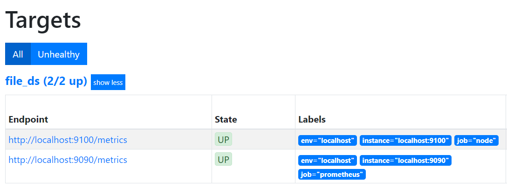
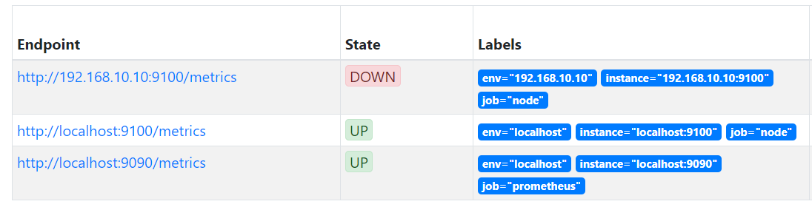

# 基于文件的服务发现
# 一、简介
1. 在Prometheus支持的众多服务发现的实现方式中，基于文件的服务发现是最通用的方式。这种方式不需要依赖于任何的平台或者第三方服务。
2. 通过基于文件的服务发现方式下，Prometheus会定时从文件中读取最新的Target信息，因此，你可以通过任意的方式将监控Target的信息写入即可。

# 二、示例
1. 创建yml文件定义2个采集任务，以及每个任务对应的Target列表：

```yaml
# vim /usr/local/prometheus/target.yml
- targets:
    - "localhost:9090"
  labels:
    env: "localhost"
    job: "prometheus"
- targets:
    - "localhost:9100"
    - "10.20.33.105:9100"
  labels:
    job: "node exproter"
```

2. 创建prometheus配置文件，定义了一个基于file_sd_configs的监控采集任务

```bash
# vim /usr/local/prometheus/prometheus-file-sd.yml
global:
  scrape_interval: 15s 
  scrape_timeout: 10s 
  evaluation_interval: 15s 
scrape_configs:
- job_name: 'file_ds'
  file_sd_configs:
  - files:
    - target.yml
```

3. 启动prometheus服务

```bash
# ./prometheus --config.file=prometheus-file-sd.yml --storage.tsdb.path=/data/prometheus
```

4. prometheus查看target信息



1. Prometheus会自动的周期性读取文件中的内容。当文件中定义的内容发生变化时，不需要对Prometheus进行任何的重启操作。




 

 

