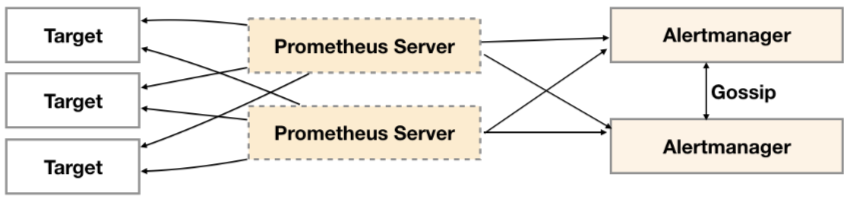

# Alertmanager高可用

> 分类: Prometheus > 集群与高可用
> 更新时间: 2026-01-10T23:33:52.641460+08:00

---

# 一、Gossip
1. Alertmanager引入了Gossip机制。Gossip机制为多个Alertmanager之间提供了信息传递的机制。确保及时在多个Alertmanager分别接收到相同告警信息的情况下，也只有一个告警通知被发送给Receiver。

 

