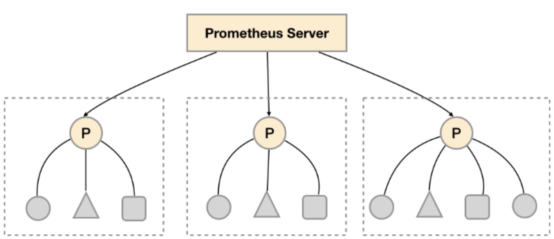

# 联邦集群
# 一、Prometheus 联邦
1. 在多个数据中心部署 Prometheus      需要将多数据中心数据合在一起管理，使用联邦模式非常合适
2. 优点集中式管理数据,报警，不需要为每个 Prometheus      实例管理数据，如有些敏感节点报警要求高可以在 Prometheus 数据节点上加报警信息,可以按功能环境划分启动多个 Prometheus      采集实例;
3. 缺点数据集中化，网络可能会延时，数据单点等问题;
4. 在每个数据中心部署单独的Prometheus Server，用于采集当前数据中心监控数据。并由一个中心的Prometheus Server负责聚合多个数据中心的监控数据。这一特性在Promthues中称为联邦集群。

# 二、功能分区
1. 联邦集群的特性可以帮助用户根据不同的监控规模对Promthues部署架构进行调整。可以在各个数据中心中部署多个Prometheus      Server实例。每一个Prometheus      Server实例只负责采集当前数据中心中的一部分任务(Job)，例如可以将不同的监控任务分离到不同的Prometheus实例当中，再有中心Prometheus实例进行聚合。

1. 功能分区，即通过联邦集群的特性在任务级别对Prometheus采集任务进行划分，以支持规模的扩展。

