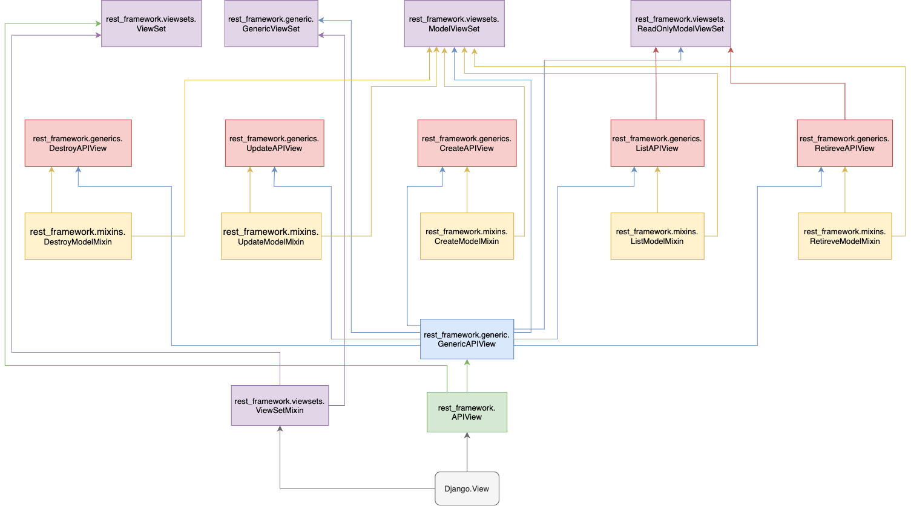

# 视图概览

> 分类: Python > DRF视图
> 更新时间: 2026-01-10T23:34:30.659650+08:00

---

> REST framework 提供了众多的通用视图基类与扩展类，以简化视图的编写。
>

## 一、视图的继承关系：
[DRF.drawio](https://www.yuque.com/attachments/yuque/0/2021/drawio/2308212/1616209284336-570877c5-c703-4dff-91e2-8f399f50d1fa.drawio)

## 二、视图关联关系
### 1.视图类：APIView、GenericAPIView     
+ APIView：作为drf的基础view；as_view()禁用csrf；dispatch()二次封装request、三大认证、解析、渲染、响应、异常等模块；一堆类属性，可以用来做全局或局部插拔配置     
+ GenericAPIView：继承APIView；三个方法三个属性(obj,queryset,serializer) 

### 2. 视图工具集：mixin五大工具类(六个方法)     
+ list：群查	mixin.ListModelMixin　　   
+ retrieve：单查 mixin.RetreveModelMixin　
+ create：单增 mixin.CreateModelMixin　
+ destroy：单删 mixin.DestroyModelMixin　
+ update：单整体改 mixin.UpdateModelMixin
+ partial_update：单局部改 mixin.UpdateModelMixin　　　 

### 3.视图工具：generic各种子类(共10个子类)     
ListAPIView(ListModelMixin, GenericAPIView):继承该类的视图类，只需要提供几个类属性，就可以完成群查，不需要书写get方法     ListCreateAPIView(ListModelMixin, CreateModelMixin, GenericAPIView) 

### 4、视图集：ViewSet、GenericViewSet     
ViewSetMixin：重写as_view()，可以将请求方法与视图类中的自定义函数名完成映射         as_view({'get': 'list', 'post': 'my_post'})              

GenericViewSet：可以自定义请求映射的Model操作视图集          

ViewSet：可以自定义请求映射的任意操作视图集（一般与Model操作不是那么密切相关）         登陆的post并非新增、短信的验证码(get或post)都和model无关　

## 三、视图使用原则
1. 仅读取数据，不涉及序列化器。例如统计注册用户数 ——> 一级视图（APIView） 
2. 需要用到queryset、serializer实现自定业务逻辑——>二级视图（GenericApiView）
3. 需要对模型进行单查、群查、单增、单删、单整体改、单局部改等业务逻辑——>混合视图(mixins)
4. 将整个表的数据返回，涉及到序列化器    ListAPIView
5. 对数据表写入数据修改等需求，使用CreateAPIView，重写相关的方法
6. 对模型进行增删改查操作，使用ModelViewSet，重写相关方法

