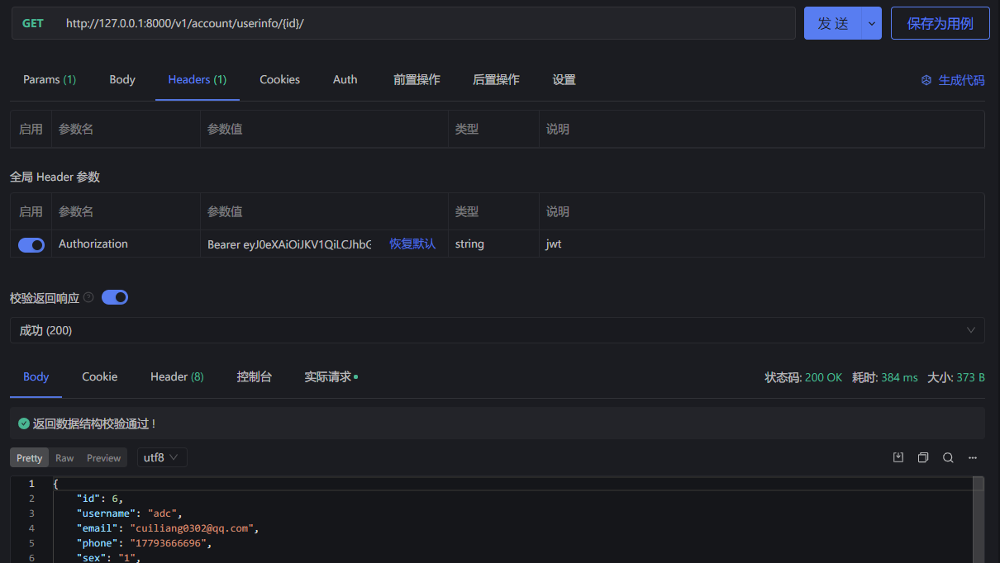

# JWT认证

> 分类: Python > DRF项目
> 更新时间: 2026-01-10T23:34:32.811281+08:00

---

**我们在验证完用户的身份后（检验用户名和密码），需要向用户签发JWT，在需要用到用户身份信息的时候，还需核验用户的JWT。**

## 安装配置
### 安装
```bash
pip install djangorestframework-simplejwt
```

### 配置
```python
INSTALLED_APPS = [
    ...
    'rest_framework_simplejwt',
    ...
]
REST_FRAMEWORK = {
    ...
    'DEFAULT_AUTHENTICATION_CLASSES': (
        ...
        'rest_framework_simplejwt.authentication.JWTAuthentication',
    )
    ...
}
# 指定jwt有效期
SIMPLE_JWT = {
    # 访问令牌有效期，默认5分钟
    'ACCESS_TOKEN_LIFETIME': timedelta(minutes=15),
    # 刷新令牌有效期，默认14天
    'REFRESH_TOKEN_LIFETIME': timedelta(days=1),
    
    # 可选：每次刷新后生成新刷新令牌
    'ROTATE_REFRESH_TOKENS': True,
    # 可选：刷新后旧令牌加入黑名单
    'BLACKLIST_AFTER_ROTATION': True,
}
```


## 自定义返回字段
### 序列化器（api/serializers.py） 
```python
from rest_framework_simplejwt.serializers import TokenObtainPairSerializer
class MyTokenObtainPairSerializer(TokenObtainPairSerializer):
    '''
    自定义jwt返回数据
    '''
    
    def validate(self, attrs):
        data = super().validate(attrs)
        data['username'] = self.user.username  # 自定义返回用户名
        data['user_id'] = self.user.id  # 自定义返回用户id
        return data
```

### 视图(api/views.py)
```python
from rest_framework_simplejwt.views import TokenObtainPairView
from public/utils.py import MyTokenObtainPairSerializer
class LoginTokenObtainPairView(TokenObtainPairView):
    """
    用户登录
    """
    serializer_class = MyTokenObtainPairSerializer
```

### 路由(account/urls.py)
```python
urlpatterns = [
    path('login/', views.LoginTokenObtainPairView.as_view()),
]
```

### 返回结果


## 接口请求验证
<font style="color:#444444;">在请求头里面加上</font>**Authorization字段，值为**Bearer**+ 空格 + token**



## 自定义校验规则
### setting配置
```python
# 登录认证后端
AUTHENTICATION_BACKENDS = ('django.contrib.auth.backends.AllowAllUsersModelBackend',  # 创建用户不自动关联数据库的is_active
                           'django.contrib.auth.backends.ModelBackend',  # 指定Django的modelbackend类
                           'public.utils.CustomJwtBackend'  # 指定django登录认证类
                           )
```

### 自定义验证后端(account/urls.py)
```python
class CustomJwtBackend(ModelBackend):
    """
    自定义jwt登录校验规则
    """

    def authenticate(self, request, username=None, password=None, **kwargs):
        if re.match('^1[0-9]\d{9}$', username):
            # 手机号正则
            user = UserInfo.objects.filter(phone=username).first()
        elif re.match('^.+@.+$', username):
            # 邮箱登录正则
            user = UserInfo.objects.filter(email=username).first()
        else:
            # 用户名登录
            user = UserInfo.objects.filter(username=username).first()
        if user:
            # 查找到用户
            if user.check_password(password):
                # 如果登录成功,手动创建新令牌
                user.last_login = timezone.now()
                user.save()
                return user
            else:
                raise serializers.ValidationError('密码错误')
        else:
            raise serializers.ValidationError('用户名不存在')
```

