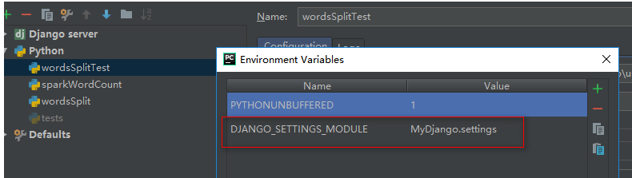

# 其他py文件调用django项目
```bash
import os, django
os.environ.setdefault("DJANGO_SETTINGS_MODULE", "rice_field.settings")
django.setup()
from public.models import SensorHistory, Sensor
```

<font style="color:rgb(77, 77, 77);">将配置添加到pycharm中的python配置中</font>



