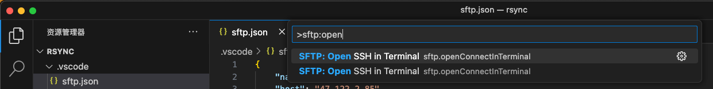

# vscode同步文件到服务器
# 安装插件


# 配置同步
打开命令面板，搜索配置项


修改sftp配置文件

```json
{
    "name": "XXX服务器",
    "host": "XXXXXX",
    "protocol": "sftp",
    "port": XXX,
    "username": "root",
    "password": "XXX",
    "privateKeyPath": "C:/Users/cuiliang/.ssh/id_rsa", // 密码和密钥二选一
    "remotePath": "/root/rsync",
    "uploadOnSave": true,
    "useTempFile": false,
    "openSsh": false,
    "ignore": [
        ".vscode",
        ".git",
        ".DS_Store"
    ],
    "watcher": {
        "files": "**/*",
        "autoUpload": true,
        "autoDelete": true
    }
}

```

打开命令面板，连接服务器



