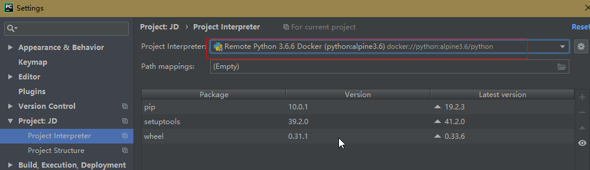
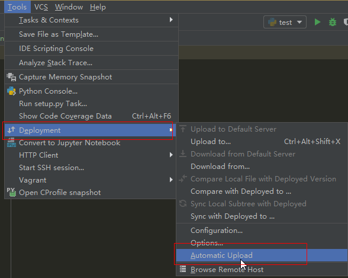

# 使用Pycharm远程连接及管理Docker

> 分类: Python > pycharm
> 更新时间: 2026-01-10T23:34:28.484597+08:00

---

> 为了使远端服务器上的 Docker 能与本机的 Pychrm 进行连接和通信，需要在远端服务器上做一些设置，允许 docker 能被指定 IP 访问
>

# 开放远端连接
1. 修改配置文件  
执行命令： `vim /lib/systemd/system/docker.service`  

2. 重启服务  
执行命令： `systemctl daemon-reload && systemctl restart docker`

# Pycharm 中连接远端 Docker
1. 打开 docker 连接窗口  

2. 添加连接信息  
选择 TCP 连接，输入自己远端的 IP 地址和 docker 服务端口号，连接成功会在下方自动显示 Connection successful, 若连接失败可能是由于防火墙未开放端口引起的，需要先使用防火墙开启 2375 端口。  

3. 连接成功  
连接成功后即可远程对 Docker 进行管理和信息显示。

中实现了 Pycharm 远程连接到 Docker 服务，接下来为 pycharm 配置 Docker 的 python 解释器。

**1. 安装 python 镜像**

在 Docker 服务器中执行命令下载镜像：`docker pull python:alpine3.6`

**2. 在设置中选择 docker 中的 python 镜像作为解释器**

image.png

选择使用该 docker 中的解释器即可：

image.png

**3. 文件映射配置**

当你试着直接运行程序时，会发生如下错误：

image.png

因为我们只是使用了远端的解释器，但是当前的代码还在本机上，远端的解释器无法在它环境中的默认路径下找到代码文件，因此无法执行代码。

因此，这里还需要配置一个 SFTP 连接，将本地代码文件自动上传到远程机上的指定目录下。

**4. 配置方式如下：**

+ 打开配置设置

image.png

+ 连接配置  
**注意： 这里最好设置 User name 用户为 root 用户进行连接，否则后续代码上传时可能因为权限问题导致上传失败。**  
  
image.png
+ 文件映射配置

image.png

+ 上传本地代码到远端机  
右键单击需要上传的目录或文件，选择 Deployment 上传，如果上传失败，请在连接配置中修改 User name 为 root 用户：  
  
image.png
+ 成功运行代码  
再次运行代码，使用远程 Docker 解释器执行成功。
+ 自动上传代码  
此时已经可以正常运行，但是若映射目录的代码有变动时，每次执行前都需要点击代码上传才能使改动部分正常执行。  
可设置代码自动上传：  
  
image.png  
这样每次代码修改将不必都手动进行 upload 操作。

