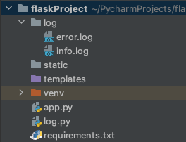

# flask日志
## 项目结构


## logConfig.py
```python
import logging
from logging.handlers import TimedRotatingFileHandler
from pathlib import Path

BASE_DIR = Path(__file__).resolve(strict=True).parent
log_dir: Path = BASE_DIR / "log"
log_dir.mkdir(exist_ok=True)


def init_logger() -> logging.Logger:
    logger = logging.getLogger("default")
    level = logging.DEBUG
    logger.setLevel(level)
    formatter = logging.Formatter(
        "%(asctime)s - %(levelname)s - %(module)s.%(funcName)s - %(filename)s:%(lineno)s - %(message)s"
    )

    debug_handler = logging.StreamHandler()
    debug_handler.setLevel(logging.DEBUG)
    debug_handler.setFormatter(formatter)

    info_path = log_dir / "info.log"
    info_handler = TimedRotatingFileHandler(
        filename=info_path, when="MIDNIGHT", backupCount=5, encoding="UTF-8"
    )
    info_handler.setLevel(logging.INFO)
    info_handler.setFormatter(formatter)

    error_path = log_dir / "error.log"
    error_handler = TimedRotatingFileHandler(
        filename=error_path, when="MIDNIGHT", backupCount=5, encoding="UTF-8"
    )
    error_handler.setLevel(logging.ERROR)
    error_handler.setFormatter(formatter)

    logger.addHandler(debug_handler)
    logger.addHandler(info_handler)
    logger.addHandler(error_handler)
    return logger


logger = init_logger()
```

## app.py使用
```python
from flask import Flask
from log import logger
app = Flask(__name__)


@app.route('/')
def index():
    logger.info('info log')
    logger.warning('warning log')
    return 'Hello!'


if __name__ == '__main__':
    app.run(debug=True)
```


