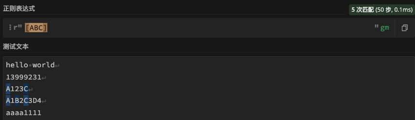
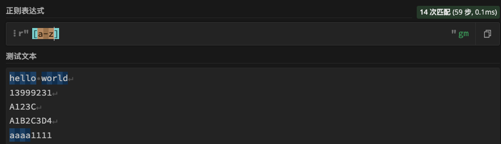

# 普通字符
| 字符 | 描述 |
| --- | --- |
| **[ABC]** | 匹配 **[...]** 中的所有字符 |
| **[^ABC]** | 匹配除了 **[...]** 中字符的所有字符 |
| **[A-Z]** | [A-Z] 表示一个区间，匹配所有大写字母，[a-z] 表示所有小写字母。 |
| **.** | 匹配除换行符（\n、\r）之外的任何单个字符，相等于 [^\n\r]。 |

## [……]匹配包含指定字符
匹配包含ABC的字符

## [^……]匹配不包含指定字符
匹配不包含ABC的字符

## [a-z]匹配所有小写字符

## [A-Z]匹配所有大写字符

## .匹配除换行符之外的字符
匹配除换行符（\n、\r）之外的任何单个字符

## 
