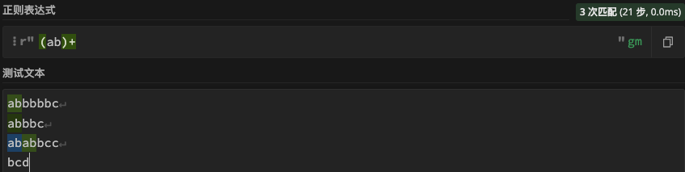
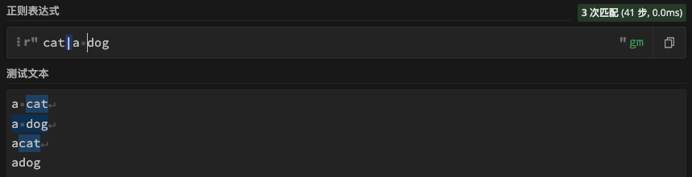
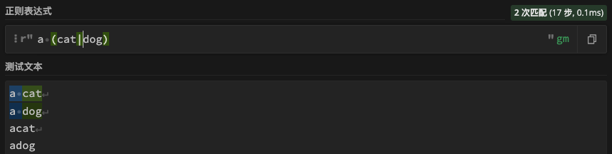

# 特殊字符

> 分类: Python > 正则表达式
> 更新时间: 2026-01-10T23:34:27.264628+08:00

---

| 符号 | 描述 |
| --- | --- |
| ^ | 匹配输入字符串的开始位置，除非在方括号表达式中使用，当该符号在方括号表达式中使用时，表示不接受该方括号表达式中的字符集合 |
| $ | 匹配输入字符串的结尾位置。如果设置了 RegExp 对象的 Multiline 属性，则 $ 也匹配 '\n' 或 '\r' |
| () | 标记一个子表达式的开始和结束位置。子表达式可以获取供以后使用 |
| \ | 将下一个字符标记为或特殊字符、或原义字符、或向后引用、或八进制转义符 |
| | | 指明两项之间的一个选择 |

## ^匹配开头
匹配以a开头的字符a

## $匹配结尾
匹配以d结尾的字符d

## ()匹配多个字符
匹配ab最少出现一次的字符

## | 连接多个匹配条件
+ 匹配cat或者a dog

+ 匹配a cat或a dog

## \转义字符

