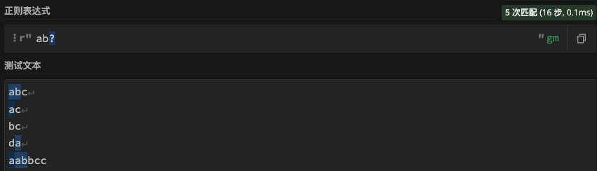
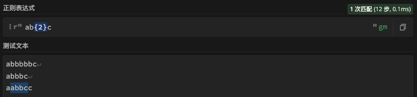
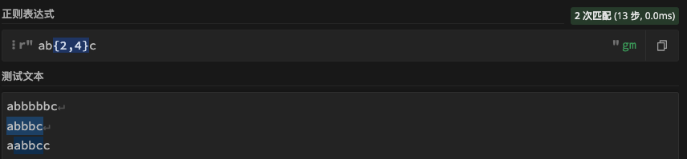

# 限定符

> 分类: Python > 正则表达式
> 更新时间: 2026-01-10T23:34:27.044361+08:00

---

| 符号 | 功能 |
| --- | --- |
| **?** | 前面的字符最多只可以出现一次（0次或1次）。 |
| ***** | 前面的字符可以不出现，也可以出现一次或者多次（0次、或1次、或多次）。 |
| **+** | 前面的字符必须至少出现一次（1次或多次）。 |
| {n} | 匹配确定的 n 次 |
| {n,} | 至少匹配n 次 |
| {n,m} | n <= m。最少匹配 n 次且最多匹配 m 次 |

## ?匹配前面字符最多出现1次
匹配字符a后面包含或不包含b的字符

## *匹配前面字符可有可无
匹配a和c中间可以有0个或多个b的字符

## +匹配前面字符最少出现1次
匹配a和c中间最少出现一次b的字符

## {}匹配出现次数
+ 匹配a和c之间有2个b的字符

+ 匹配a和c之间有2到4个b的字符

+ 匹配a和c之间有最少2个b的字符

