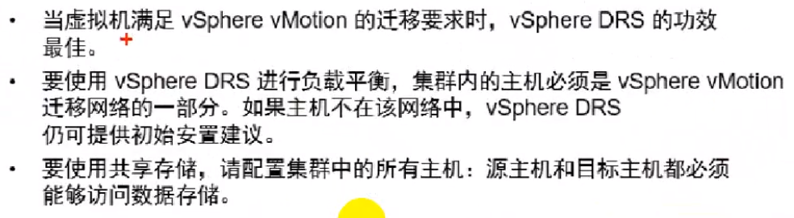
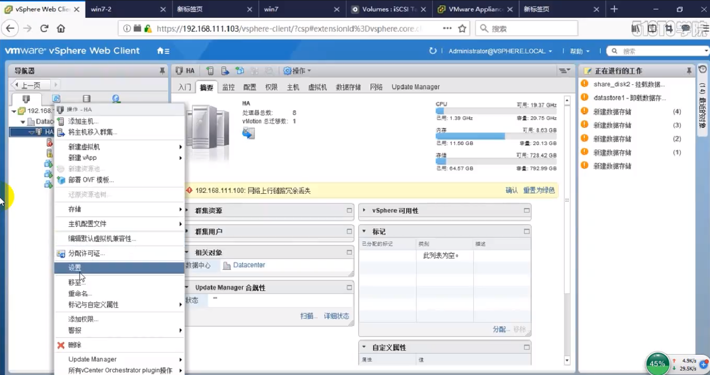
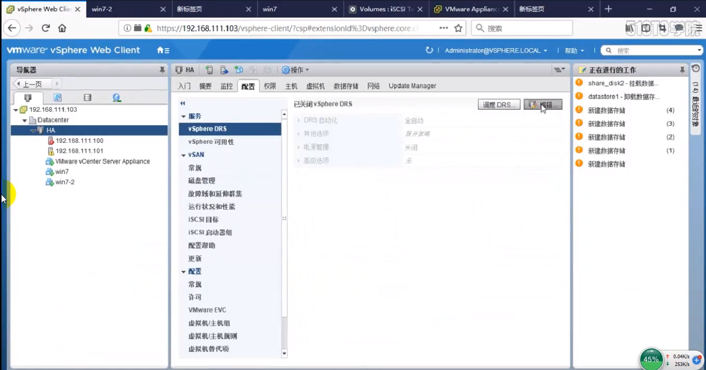
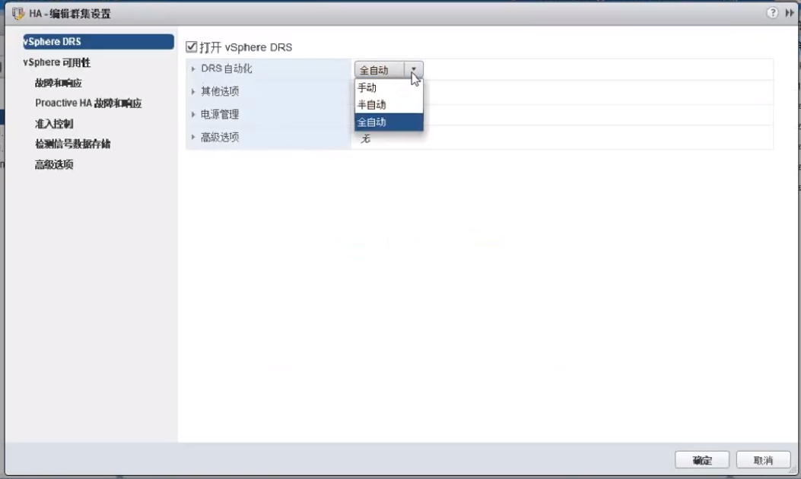

# vsphere DRS

> 分类: VMware Vsphere > DRS
> 更新时间: 2026-01-10T23:34:41.088772+08:00

---

# 一、理论知识
1. DRS启用条件

1. 虚拟机关联性

1. HA与DRS关系

# 二、开启DRS
1. 集群——设置

1. DRS——编辑

1. 打开DRS

# 三、配置DRS规则
1. 配置——虚拟机/主机规则

+ 聚集，多个虚拟机绑定在一起，始终在一个主机运行
+ 分开，与聚集相反
+ 虚拟机到主机，虚拟机与主机进行绑定

1. 优先级配置

+ 必须在组中的主机运行：DRS>HA
+ 应在组中的主机运行：HA>DRS

