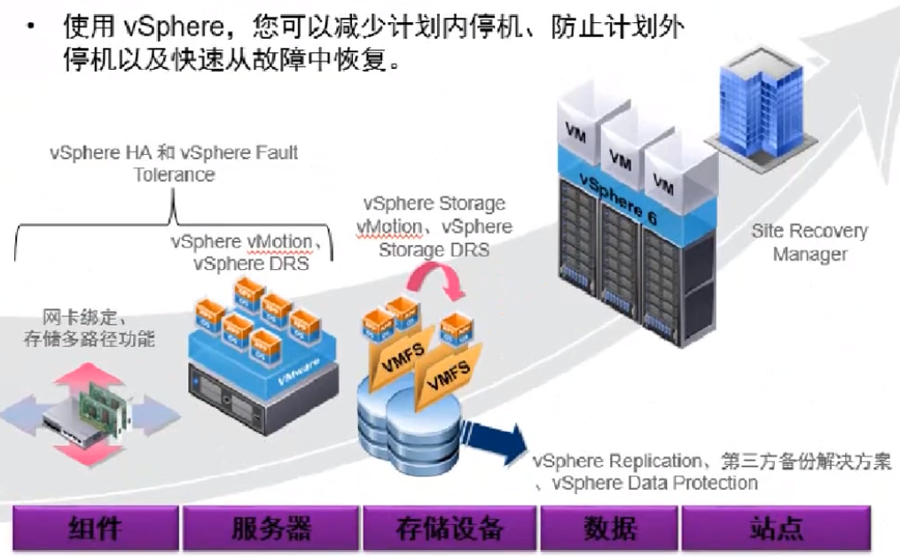
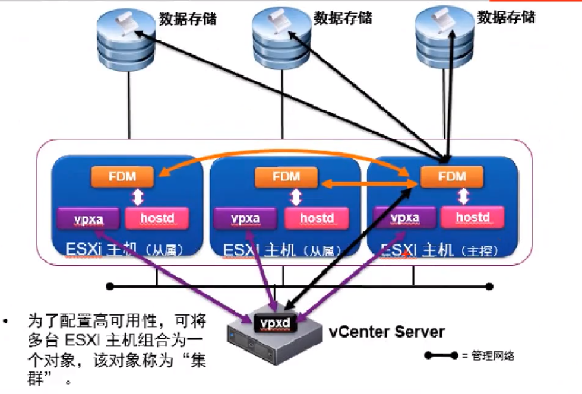
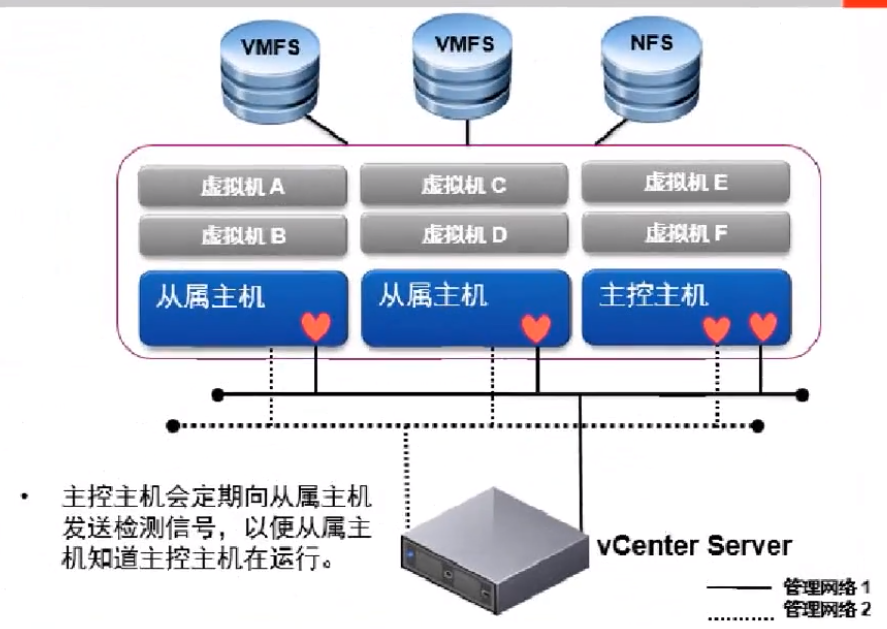

# vsphere HA

> 分类: VMware Vsphere > HA
> 更新时间: 2026-01-10T23:34:40.981112+08:00

---

# 一、概述
1. 高可用级别

1. esxi主机故障

1. 虚拟机出现故障

# 二、HA体系结构
1. 代理通信

1. 网络检测信号

1. 数据存储信号检测

# 三、HA开启
1. 数据中心——创建集群

1. 勾选HA选项

# 四、HA故障模拟
1. 前提条件
+ 每个主机都能访问共享存储，虚拟机安装在共享存储上
+ 每个虚拟机安装vm tools

