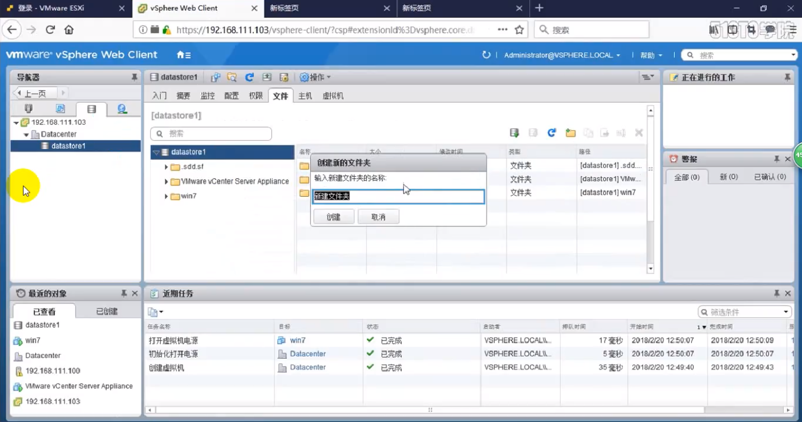
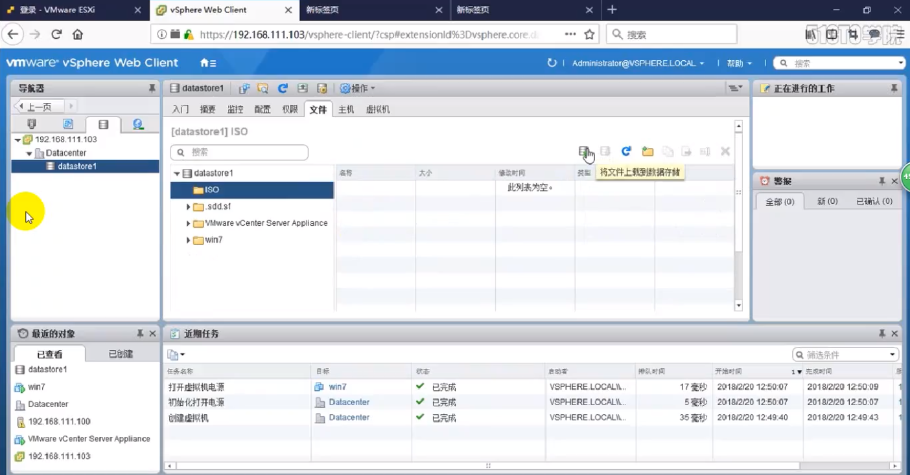
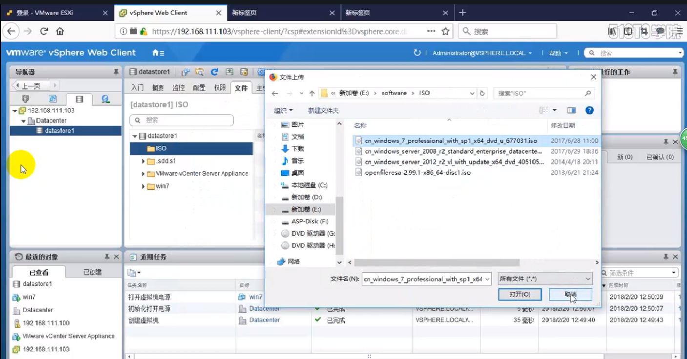
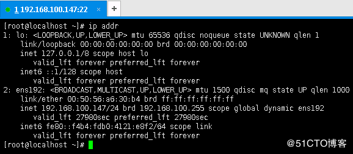
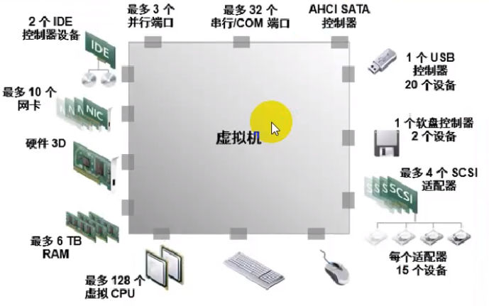
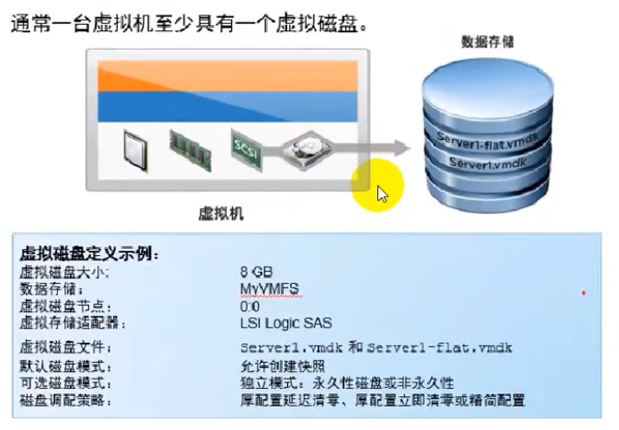

# 创建虚拟机

> 分类: VMware Vsphere > 创建虚拟机
> 更新时间: 2026-01-10T23:34:40.540871+08:00

---

# 一、上传系统镜像
    1. 打开数据中心
+ 
    1. 新建文件夹，存放镜像
+ 
    1. 点击上传文件按钮
+ 
    1. 找到本地镜像上传
+ 

# 二、安装虚拟机
    1. 创建虚拟机
+ 
    1. 选择创建类型
+ 
    1. 为虚拟机命名并选择虚拟机安装的所在位置
+ 
    1. 选择计算资源
+ 
    1. 选择存储
+ 
    1. 选择兼容性
+ 
    1. 选择虚拟机操作系统
+ 
    1. 配置虚拟机硬件
+ 
    1. 在新CD/DVD驱动器项选择内容库ISO文件
+ 
    1. 选择要挂载的ISO镜像
+ 
    1. 之后会显示配置概要，确认后点击“完成”即可
+ 
    1. 之后右键点击该虚拟机进行启动
+ 
    1. 启动之后打开控制台
+ 
    1. 配置安装该虚拟机系统
+ 
    1. 安装完成后即可进入该虚拟机系统
+ 
    1. 现在可以使用SSH远程该虚拟机
+ 

# 三、注册虚拟机
+ 平时使用中很有可能会得到一些在其他环境上创建的虚拟机。例如：只给了一些虚拟机文件（ VMX和 VMDK文件等），我们就可以通过这些文件部署虚拟机。
    1. 打开登录vsphere web       client，找到存储列表
+ 
    1. 选择要把虚拟机文件放置的数据存储
+ 
    1. 将虚拟机文件上传至该数据存储，点击存储根目录，上传文件夹（将包含 VMX、 VMDK等虚拟机文件的文件夹上传）。
+ 
    1. 确认虚拟机文件上传成功，确认 vmdk、 vmx文件（其他文件后期在关于虚拟机备份时会详细讲到）。
+ 
    1. 注册虚拟机，选中 vmx文件，"注册虚拟机"由灰色变亮色
+ 
    1. 指定名称（可以不变也可以修改）和虚拟机放置位置
+ 
    1. 选择计算资源，可以直接选择群集（会将虚拟机自动分配至某个主机上），也可以指定某个主机。
+ 
    1. 确认配置，完成注册
+ 

# 四、虚拟机硬件以及软件版本
    1. 虚拟机硬件限制
+ 
    1. 虚拟机硬件版本兼容性
+ 
    1. 虚拟机cpu、内存限制
+ 
    1. 虚拟磁盘
+ 
    1. 厚配置虚拟磁盘
+ 

# 五、vmware  tools
+ 

# 六、vmware控制台
+ 

