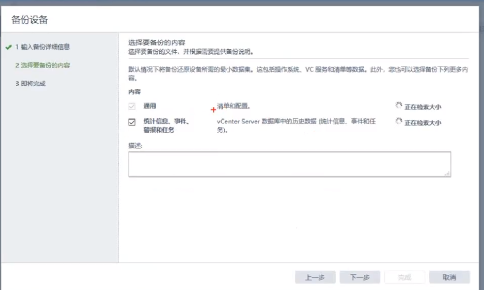
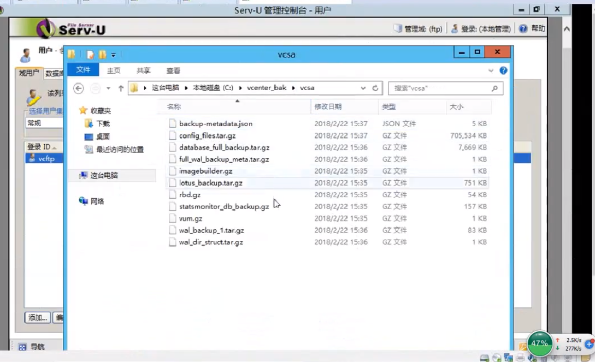

# vcenter备份与还原
# 一、vcenter备份
1. 进入vcenter配置模式（vcenter管理ip:5480）

1. 摘要——备份

1. 填写备份信息

1. 选择备份内容

1. 查看备份内容

# 二、vcsa还原
1. 打开vcsa安装包，选择还原按钮； 

1. 同意许可，并在备份信息中填入备份信息；

1. 确认备份信息，然后如普通安装一样选择部署目标和虚拟机信息等恢复VCSA就可以了；

 

