# 配置和管理虚拟存储
# 一、虚拟机文件
    1. 一台vmware虚拟机文件夹中包括的文件

| .log  | 这个文件记录了VMware Workstation对虚拟机调节运行的情况。当你碰到问题时，这些文件对我们做出故障诊断非常有用。这个文件和虚拟机的配置文件（.vmx）储存在一个目录里面。 |
| --- | --- |
| .nvram  | 这是一个储存虚拟机BIOS状态信息的文件。 |
| .vmdk  | 这是一个虚拟磁盘文件，它储存了虚拟机硬盘驱动器里的内容。 一台虚拟机可以由一个或几个虚拟磁盘文件组成。如果你已经特别指定了虚拟磁盘每2GB为一单独文件的话，虚拟磁盘的大小就决定了虚拟磁盘文件的数量。随着数据写入虚拟磁盘，虚拟磁盘文件将变大，直到这些文件为2GB。（如果你在创建虚拟磁盘时已经把所有的空间都分配了，那么这些文件将在初始时就具有最大尺寸并且不再变大了）。几乎所有的虚拟磁盘文件内容关于虚拟机里的磁盘数据，仅仅一小部分是虚拟机的分区信息。 如果虚拟机是直接与物理硬盘所连接而不是虚拟磁盘的话，虚拟磁盘文件则保存着虚拟机能够访问的分区信息。 早期版本的VMware产品用.dsk扩展名来表示虚拟磁盘文件。 <disk    name>-<###>.vmdk  这是一个再次命名文件，当虚拟机有一个或多个快照时，就会自动创建它。当虚拟机运行时，这个文件就用来储存对虚拟磁盘作更改的内容。可能这样的文件有多个。虚拟机通过加###这种文件名不重复出现的后缀的命名方式以避免文件重名。 |
| .vmem  | 虚拟机页面文件，它用来备份客户机保存在宿主机上主内存信息。这个文件只有在虚拟机运行时或崩溃后存在。 每个虚拟机运行时所建立的快照对应一个.vmem文件，它包含了客户机的驻内存信息，它是快照的一部分。 |
| .vmsd  | 这是一个集中储存了快照的相关信息和元数据的文件。在它的目录中，可能其它一些文件只有在虚拟机运行时才存在。（而它不会消失） |
| .vmsn  | 这是一个快照状态信息文件，它记录了你在建立快照时虚拟机的状态信息 |
| .vmss  | 这是一个储存虚拟机挂起状态信息的文件。一些早期版本的VM产品用.std来表示这个文件。 |
| .vmtm  | 这是含有虚拟机组资料的配置文件。 |
| .vmx  | 这是一个初始的配置文件，它储存着创建虚拟机向导或虚拟机编辑器对虚拟机的一些设置。如果你用的是Linux下的VM虚拟机，这个文件的扩展名将是.cfg。 |
| .vmxf  | 这个文件是虚拟机组中补充的配置文件。注意当虚拟机组被移除后，这个文件将保留下来。 |

# 二、vmware存储
    1. vmware支持的存储类型
+ 
    1. 存储协议
+ 
    1. 数据存储类型
+ 
    1. RDM裸设备映射（写入数据不经过vmfs封装，性能好，不可迁移）
+ 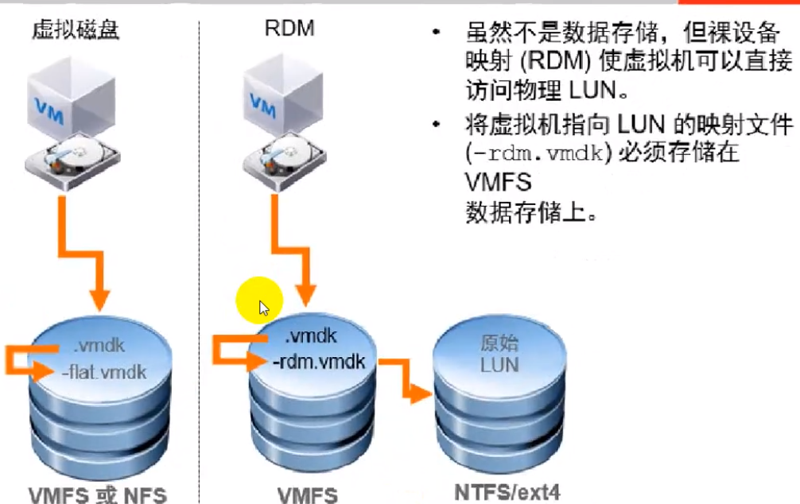
    1. 虚拟机添加RDM盘
+ 
    1. 光纤fc-san
+ 
    1. 光纤通道多路径（冗余）
+ 
    1. FCoE适配器（ipsan、fcsan共存组网情况使用）
+ 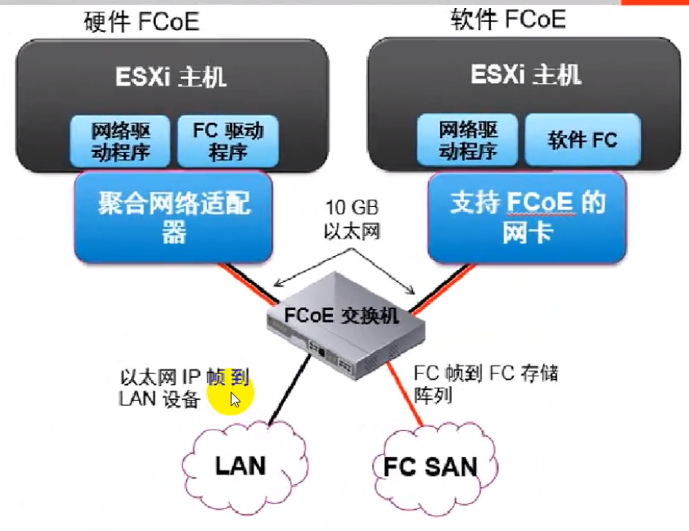
    1. ip-san
+ 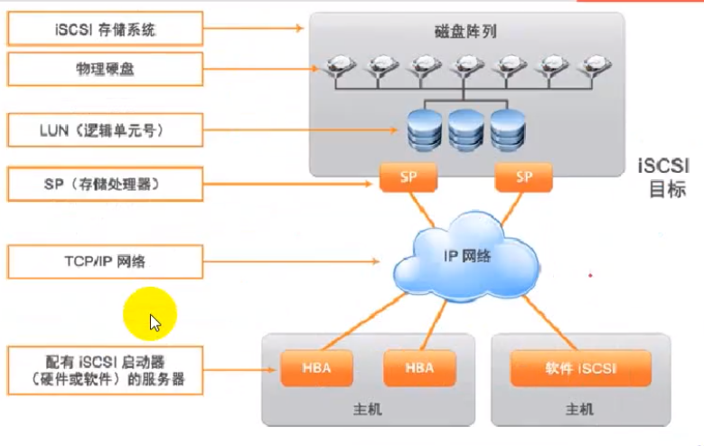
    1. iscsi适配器
+ 
    1. ip-san网络配置
+ 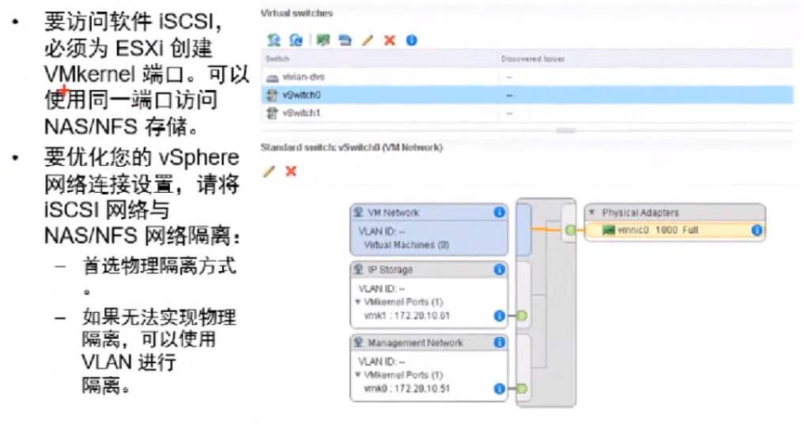
    1. 创建与发现iscsi服务
+ 
    1. nfs
+ 

# 三、vsan
    1. 架构
+ 
    1. 磁盘组
+ 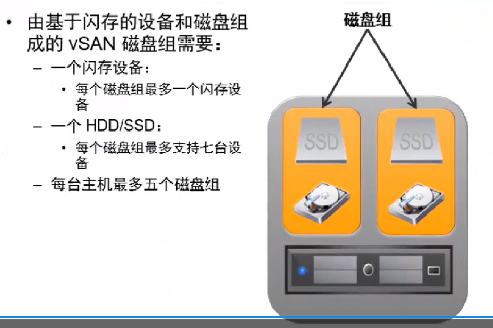

# 四、IP-san配置
    1. centos开启ipsan服务
    - yum -y install       scsi-target-utils
    2. 修改配置文件
+ vim  /etc/tgt/targets.conf   #  增加以下内容，以下是iscsi的格式
+ <target  iqn.2016-08.cn.node01.www:target4_scan>     #命名 
+         backing-store /dev/sdb1                    #共享的分区
+         initiator-address 192.168.137.102          #允许访问的地址
+         initiator-address 192.168.137.103
+         vendor_id node                             #标示
+         product_id target4                         #产品编号
+ </target>
+ [root@node01  ~]# systemctl restart tgtd
+ [root@node01  ~]# tgt-admin  -show             #查看状态
    2. vcenter添加存储，数据中心——存储——配置——存储适配器——添加新的存储适配器——添加iscsi软件适配器
+ 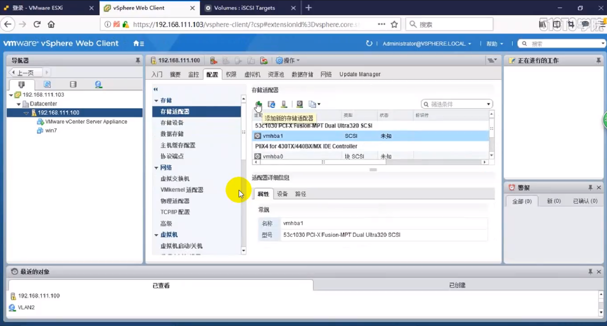
    2. 选择新建的存储适配器——目标——动态发现——添加
+ 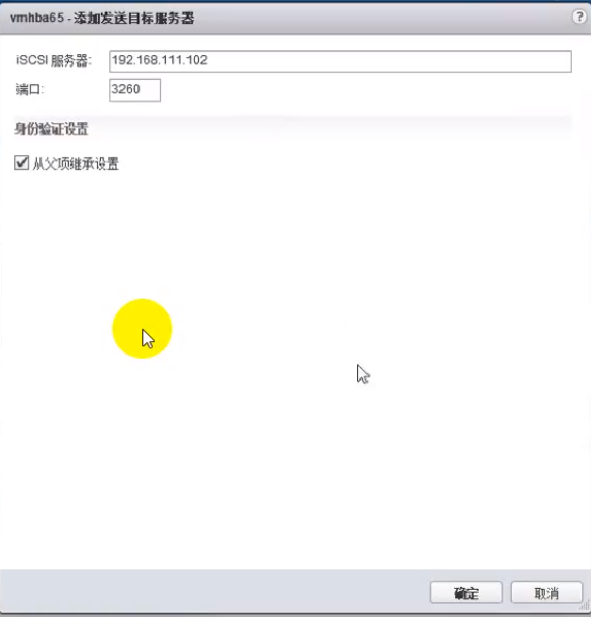
    2. 重新扫描存储适配器
+ 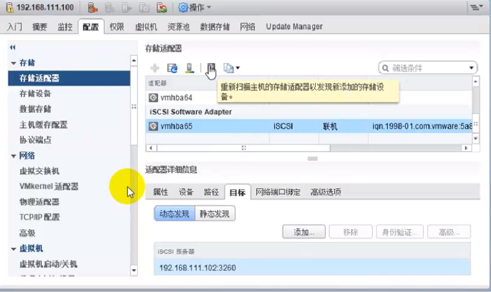
    2. 添加数据存储
+ 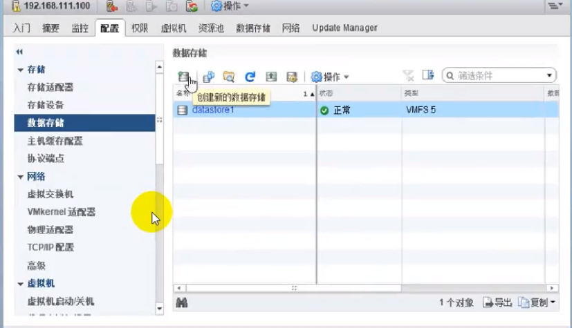
    2. 选择磁盘格式vmfs——设备名称——分区
+ 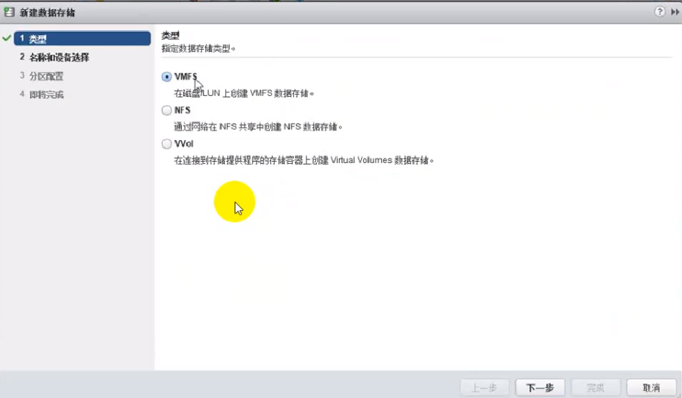

# 五、光纤通道SAN简介
+ 如果要设置主机与SAN配合使用，那么我们必须掌握SAN概念的相关应用知识。
    1. 存储区域网络(SAN)
+ 将计算机系统或主机服务器连接到高性能存储子系统的专用高速网络。SAN组件包括主机服务器中的主机总线适配器(HBA)、用于路由存储流量的交换机、线缆、存储处理器(SP)以及存储磁盘阵列。
+ 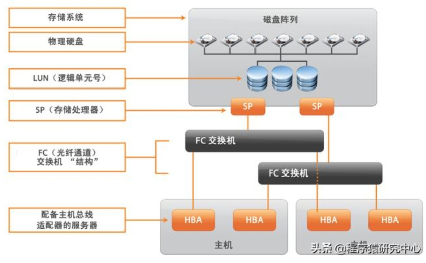
    1. 光纤通道SAN中的端口
+ 端口是指设备与SAN的连接。SAN中的每个节点（例如主机、存储设备或架构组件）均有一个或多个端口，用于将其连接到SANO端口可通过多种方式进行标识。
    - WWPN（全球端口名称）．一种全球唯一的端口标识符，可允许特定应用程序访问相应端口。FC交换机会发现设备或主机的WWPN,并向该设备分配一个端口地址。
    - Port_ID（端口地址）：在SAN中，各端口具有唯一的端口旧，用作端口的FC地址。通过这个唯一ID可将数据经由SAN路由至相应端口。FC交换机在设备登录到相应架构时为其分配端口ID。仅当设备登录后端ID才有效。
    1. 光纤通道存储阵列类型
+ ESXI可支持不同的存储系统和阵列。
+ 主机支持的存储类型包括主动一主动、主动一被动和ALUA合规。
    - 主动-主动存储系统：允许通过所有可用的存储器端口同时访问多个LUN,而不会明显降低性能。所有路径始终保持活动状态，除非路径发生故障。
    - 主动-被动存储系统：存储处理器在其中主动提供对给定LUN的访问权限的系统。其他处理器用作备用LUN,并且可以主动提供对其他LUN I/O的访问权限。只能向给定LUN的主动端口成功发送1/0如果通过主动存储器端口访问失败，则其中一个被动存储处理器可通过服务器对其进行访问而激活。
    - 非对称存储系统：支持非对称逻辑单元访问（ALUA）合规存储系统对每个端口提供不同级别的访问。ALI-JA允许主机确定目标端口的状态，并区分路径的优先级。主机会将某些活动路径用作主路径，其他用作辅助路径。
    1. 虚拟机如何访问光纤通道SAN上的数据
+ ESXi会将虚拟机的磁盘文件存储到位于SAN存储设备上的VMFS数据存储内。当虚拟机客户机操作系统向其虚拟磁盘发出SCSI命令时，SCSI虚拟化层会将这些命令转换成VMFS文件操作。
+ 虚拟机与其在SAN上存储的虚拟磁盘交互时，将发生以下过程：
    - 虚拟机中的客户机操作系统读写SCSI磁盘时，将向虚拟磁盘发出SCSI命令。
    - 虚拟机操作系统中的设备驱动程序将与虚拟SCSI控制器进行通信。
    - 虚拟SCSI控制器将命令转发至VMkernel。
    - VMkernel将执行以下任务。
+ 在VMFS卷中查找与客户机虚拟机磁盘对应的文件。
+ 将对虚拟磁盘上块的请求映射到相应物理设备上的块。
+ 将修改后的I/O请求从VMkernel中的设备
+ 驱动程序发送到物理HBAO
    - 物理HBA可执行以下任务。
+ 依据FC协议的规则将I/O请求打包。
+ 将请求传输至SANO
    - 根据HBA用于连接架构的端口，相应SAN交换机会收到请求并将其路由至主机要访问的存储设备。
+ 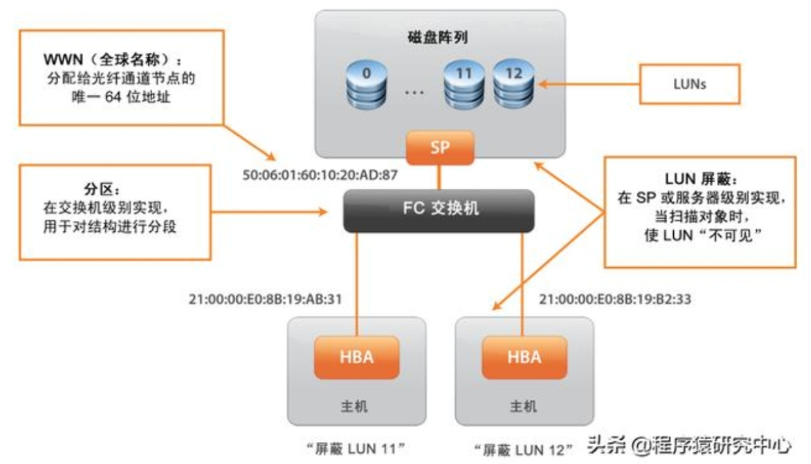
    1. FCoE适配器
+ ESXi可以使用以太网光纤通道(FCOE)适配器来访问光纤通道存储器。FCoE协议将光纤通道帧封装到以太网帧中。因此，主机不需要特殊的光纤通道链接来连接到光纤通道存储器，但可以使用10Gbit无损以太网传输光纤通道
+ 要使用FCoE，您需要安装FCoE适配器。VMware支持的适配器通常可分为两类，即使用ESXI中的本机FCoE堆栈的硬件FCoE适配器和敦件FCoE适配器。
+ 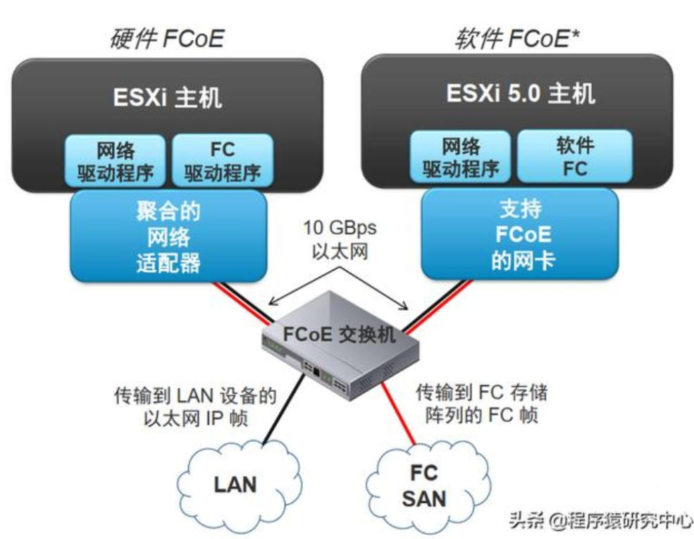
    1. 硬件FCoE适配器
+ 此类别包括完全卸载的专用聚合网络适配器(CNA),该适配器在同一个卡上包含了网络和光纤通道功能。
+ 安装了此类适配器后，主机可检测并使用两个CNA组件。在vsphereClient中，网络组件显示为标准网络适配器(vmnic),光纤通道组件显示为FCoE适配器(vmhba)o您无需配置硬件FCoE适配器即可进行使用。
    1. 软件FCoE适配器
+ 软件FCoE适配器使用ES)(i中的本机FCoE协议堆栈进行协议处理。软件FCoE适配器与提供数据中心桥接(DCB)和I/O卸载功能的网卡配合使用。
+ 对于软件FCoE适配器，必须正确配置网络连接，然后才能激活该适配器。
+ 
    1. 光纤通道的多路径功能
+ 在主机服务器与存储器之间传输数据时，SAN将使用一种叫做多路径的技术。使用多路径，您可以通过多条物理路径从ESXi主机到达存储系统上的LUN
+ 通常，从主机到LUN的单一路径包括HBA、交换机端口、连接电缆和存储控制器端口。如
+ 果路径中的任何组件出现故障，主机将选择另一条可用路径用于1/00检测故障路径并切换
+ 到另一条路径的过程称为路径故障切换。
+ 

# 六、通过光纤通道添加LUN
+ 通过光纤通道将LUN添加至vsphere确实更多是存储管理员的任务，通过光纤通道SAN能够
+ 连接一个LUN,需要几个步骤的操作，其中只有一个是在vsphere环境中完成的。
    1. 对光纤通道SAN进行分区，是ESXi主机能够查看到存储阵列的目标端口。
    2. 在存储阵列上，将LUN添加到ESXi主机上。在不同供应商的产品上，这个过程会有所不同。一般，添加主机的WINN到一个发起者。具体操作可参考存储供应商的操作说明。
    3. 重新扫描和发现ESXi的新存储设备。
+ 最后一步是在vsphere环境中执行的步骤。有2种方法可以扫描发现新存储设备：重新扫描一
+ 个特定的存储适配器，或者重新扫描所有的存储适配器。
+ 执行如下步骤，重新扫描一个特定的存储适配器：
    - 打开vsphereWeb客户端，或者vSphere vCenterweb client端，在主机和群集视图打开一个指定的ESXi主机。
    - 在"配置"存储区域，选择"存储适配器。会显示所识别的存储适配器。
    - 单击"重新扫描适配器'。
    - 如果只想扫描ES)(i主机分区或连接的新LUN,则选择"重新扫描存储'。会扫描新的存储设备和\/MFS卷。
+ 
+ 重新扫描I-IBA的任务非常简单，其实就是检查ESXi主机HBA队列，查看是否有新的存储设
+ 备。如果有新存储设备可以连接适配器，就会显示在vsphere web客户端的存储适配器区域。
+ 扫描VMFS数据存储，略有不同。VMFS重新扫描会自动触发，会扫描现有\/MFS数据存储的
+ 可用存储设备。如果发现一个VMFS数据存储，会尝试挂载这个VMFS数据存储，使ESXi主机可以使用这个存储。自动触发VMFS重新扫描可以简化ESXi主机连接新VMFS数据存储的过程。

# 七、通过FCoE添加LUN
+ 在老版本vsphere中，FCOE完全通过硬件支持，意味着必须在ESXi主机上安装FCoECNA才能使用FCoE0在这种配置中，CAN驱动程序负责将CNA连接到ESXi主机上，就像是光纤通道一样。
+ 假设有了支持的NIC，配置软件FCoE发起者的过程包括2各部分：配置FCoE网络，然后激活软件FCoE适配器。
+ 执行如下步骤，配置软件FCoE的网络连接。
    1. 登录到vsphereweb,然后连接一个ESXi主机或vCenterServer实例。
    2. 打开主机与群集视图。
    3. 选择一个主机，点击"配置'，选择网络选项部分。
    4. "添加网络'，新建带有VMkernel适配器的vsphere标准交换机。
    5. 在选择新的vswitch的上行链路时，要选择支持FCoE局部负载转移的NIC。vswitch可以添加多个NIC，或者将FCoE中每一个支持负载转移NIC添加到一个独立的vSwitch上。
    6. 配置好网络后，在ESXi主机的"配置"选项卡中选择存储子选项。
    7. 单击"添加软件适配器"，选择添加软件FCoE适配器。
+ vsphere将在Storage Adapters列表上创建一个新的适配器。在创建适配器之后，就可以查看它的属性，如查看分配给敦件适配器的WWN。

# 八、修复iSCSl LUN故障
+ 如果ESXi主机无法连接iSCSILUN,可参考下面的方法检查故障：
    1. 是否能够从发起者ping通iSCSl目标（例如：ESXishell,执行vmkping命令）
    2. VMkernel适配器上的MTU配置是否正确。巨型帧是��设置为支持，如果是，它是否正确的配置为端到端
    3. 物理线路是否有问题
    4. VLAN配置是否正确
    5. IP路由是否正确和有效，是否为VMkernel适配器和阵列上连接iSCSl目标的接口上配置了正确的|p地址，他们是否位于同一个子网
    6. iSCSI是否允许通过某些防火墙，如果能ping通，但是iSCSl发起者无法登陆到iSCSl目标，则要检查TCP端口3620是否被阻挡
    7. CHAP配置是否正确，是否在iSCSl发起者和iSCSl目标上都配置了正确的身份验证

# 九、创建VMFS数据存储
+ 将LUN连接到ESXi主机之后，就可以开始创建一个\/MFS数据存储了。
    1. 启动vSphere Web Client,连接到一个vcenter client
+ 
    1. 打开"主机和群集"视图，选择一个主机
+ 
    1. 右击主机，选中"存储"，点击'新建数据存储'
+ 
    1. 新建数据存储，创建VMFS数据存储
+ 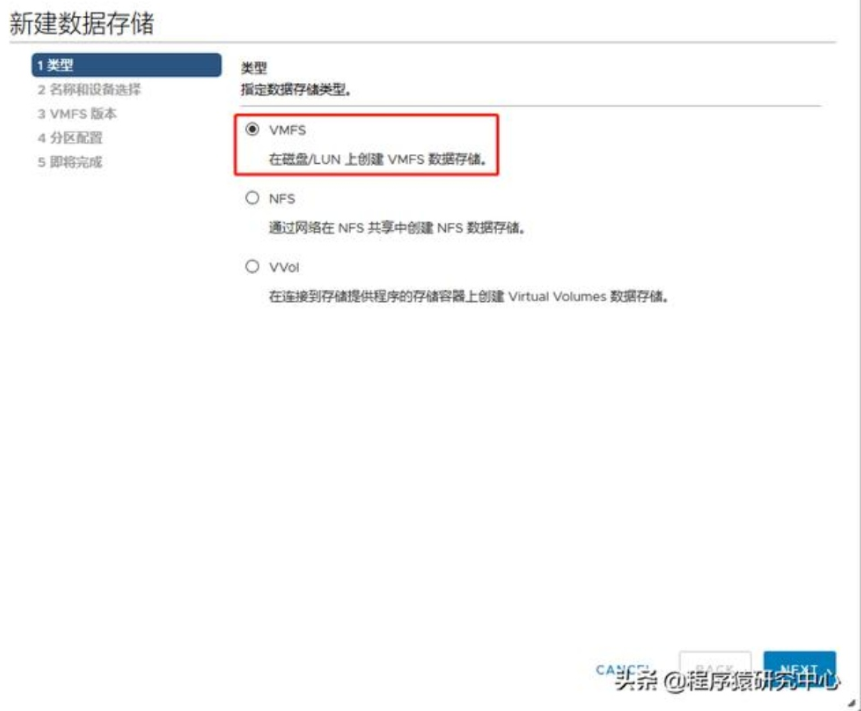
    1. 指定数据存储名称（建议使用有意义的名称，清晰的数据存储命名可以方面管理员确定虚拟机位置，利于快速修复出现的问题）。
+ 选择要使用的LUN，每一个可见的LUN都会显示名称和标识符信息。
+ 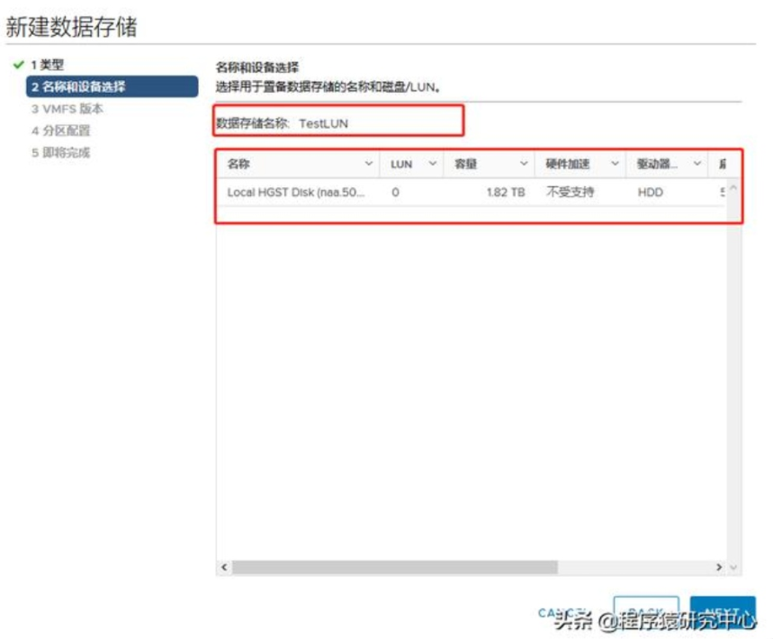
    1. 指定VMFS版本
+ 
    1. 指定分区配置：
+ **使用所有可用分区：**将整个磁盘专用于单个VMFS数据存储。如果选择此选项，则当前存储在此设备上的所有文件系统和数据将损坏。
+ **使用可用空间：**在剩余的可用磁盘空间中部署VMFS数据存储。
+ 如果为数据存储分配的空间超过您的计划，请调整"数据存储大小"字段中的容量值。默认情
+ 况下，将分配存储设备上的全部可用空间。对于VMFS6,请指定块大小并定义空间回收参数。
+ 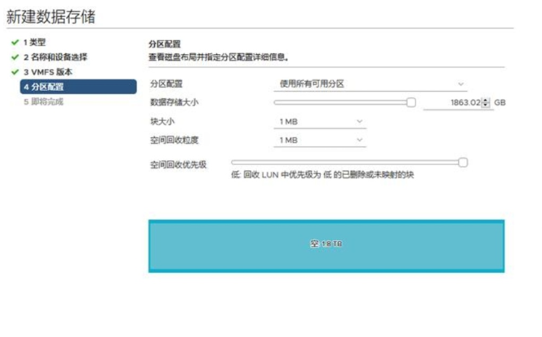
    1. 在'即将完成"页面，检查数据存储配置信息，然后单击完成。
+ 

# 十、管理过量分配的数据存储
+ 当很多精简配置的虚拟磁盘使用的磁盘空间接近分配给它们的最大空间值时，就会发生数据存储过量分配。
    1. 主动监视数据存储容量：
    - 使用通知发出以下警报：
+ 数据存储磁盘过度分配
+ 虚拟机磁盘使用情况
    - 使用报告查看空间使用情况。
    2. 主动管理数据存储容量：
    - 必要时可增加数据存储容量。
    - 使用vSphereStoragevMotion来减少特定数据存储上的空间使用问题。

# 十一、增加VMFS数据存储的容量
    1. 通常，在对存储分配进行任何更改之前：
    - 先进行一次重新扫描，以确保主枧可以看到最新的存储。
    - 将所有相关磁盘上的I/0设为静默状态
    - 请注意要扩展的卷的唯一标识符（例如，NAA ID）
    2. 增加VMFS数据存储的容量可使其具有更多空间，而且还可能提高性能。
    3. 通过以下这两种方式可动态增加VMFS数据存储的容量：
    - 添加数据区(LUN)O
    - 在数据区范围内扩展数据存储。
+ 
+  

