# VMware vsphere 6.7

> 分类: VMware Vsphere > 安装部署
> 更新时间: 2026-01-10T23:34:40.427261+08:00

---

VMware vsphere 6.7 虚拟化平台搭建及配置

 

目录

[VMware vsphere 6.7 虚拟化平台搭建及配置](#_Toc11341451)

[目录](#_Toc11341452)

[一、       环境规划与准备](#_Toc11341453)

[1.    环境规划](#_Toc11341454)

[2.    软件包准备](#_Toc11341455)

[二、       安装EXSI 6.7](#_Toc11341456)

[1.    创建虚拟机](#_Toc11341457)

[2.    开启虚拟机，安装ESXI](#_Toc11341458)

[3.    配置服务器IP地址](#_Toc11341459)

[4.    浏览器登录ESXI，进行相关设置](#_Toc11341460)

[三、       安装VCSA 6.7](#_Toc11341461)

[1.    下载文件并运行安装向导](#_Toc11341462)

[2.    部署设备](#_Toc11341463)

[3.    设置设备](#_Toc11341464)

[4.    浏览器登录VCSA，进行相关设置](#_Toc11341465)

[5.    添加root用户管理员权限](#_Toc11341466)

[6.    创建虚拟主机](#_Toc11341467)

 

 

 

# 一、环境规划与准备
## 1.   环境规划
| 角色 | CPU | 内存 | 磁盘 | IP |
| --- | --- | --- | --- | --- |
| EXSI-1 | 4 | 4 | 10 | 192.168.1.202 |
| EXSI-2 | 4 | 4 | 10 | 192.168.1.201 |
| VCSA | 8 | 10 | 40 | 192.168.1.200 |

## 2.   软件包准备
1)      EXSI与VCSA下载

[https://my.vmware.com/cn/web/vmware/info/slug/datacenter_cloud_infrastructure/vmware_vsphere/6_7](https://my.vmware.com/cn/web/vmware/info/slug/datacenter_cloud_infrastructure/vmware_vsphere/6_7)

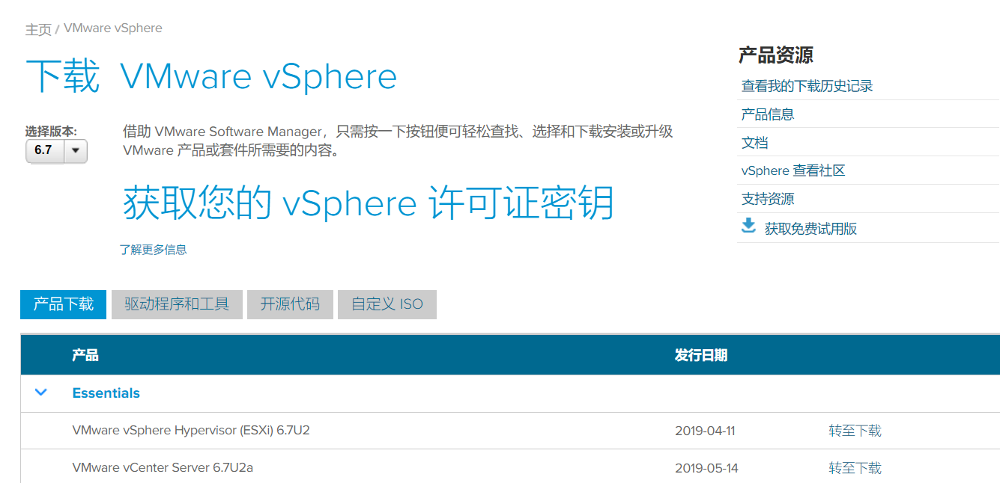

# 二、安装EXSI 6.7
## 1.    创建虚拟机
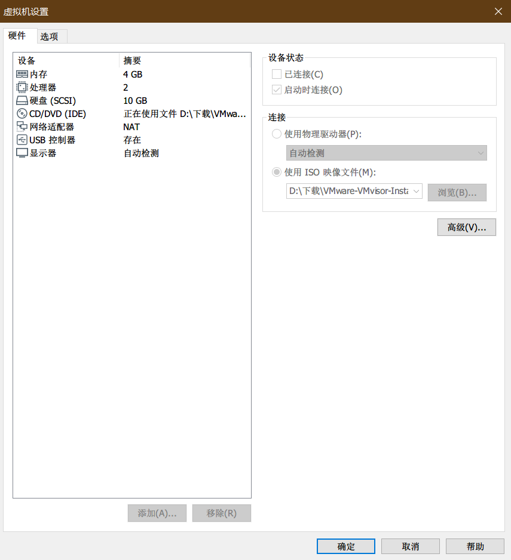

## 2.   开启虚拟机，安装ESXI
1)       开启电源

2)       选择ESXI启动项

3)       等待完成加载

4)       系统欢迎界面，按回车继续

5)       在该安装许可协议界面，按下F11以继续

6)       系统会自动检查可用存储设备，之后在该界面选择安装的磁盘位置，回车以继续

7)       选择US default(美式)键盘

8)       继续，输入root密码;注意密码最少为7位。（123.com）

9)       配置完所有信息后来到该界面，按下F11以开始安装

10)    安装完成后，在该界面回车以重启

11)  重启完成后进入主界面

## 3.   配置服务器IP地址
1)      按下F2键弹出登陆界面

2)      在弹出的登陆界面输入root账号、密码，回车登陆

 

3)      选择 "Configure Management Network"

l  **选项作用：**Configure Password 配置root密码Configure Management Network 配置网络Restart Management Network   重启网络Test Management Network 使用ping测试网络Network Restore Options   还原配置Troubleshooting Options  故障排查选项View System Logs 查看系统日志Reset System Conf iguration ESXi 出厂设置

4)      修改IP地址

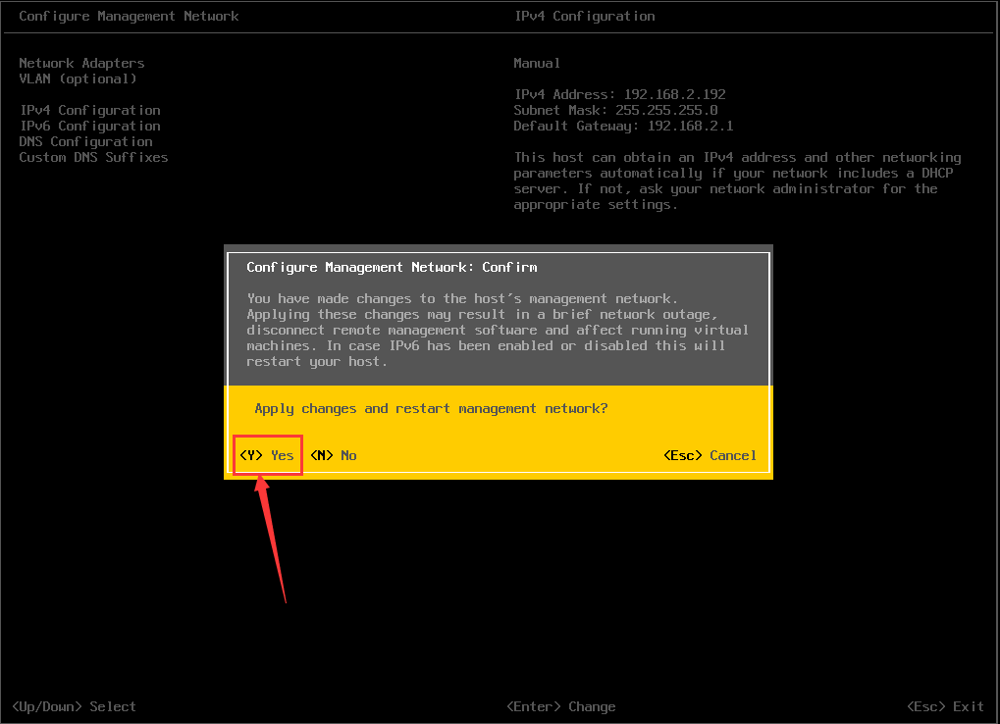

5)   配置完成

## 4.   浏览器登录ESXI，进行相关设置
1)   登录ESXI管理界面

2)      激活ESXI，主机->管理->许可

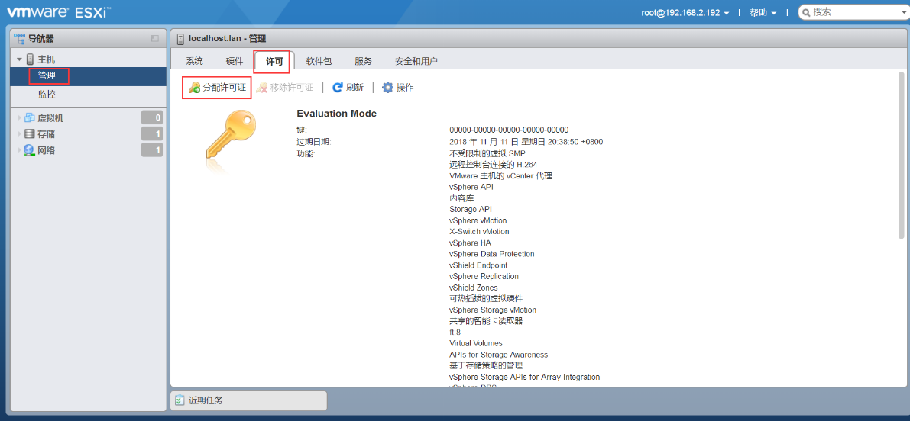

l  许可账号：HV4WC-01087-1ZJ48-031XP-9A843

# 三、安装VCSA 6.7
## 1.   下载文件并运行安装向导
1)      下载VMware-VCSA文件，用虚拟光驱挂载或者解压运行，选择“安装”

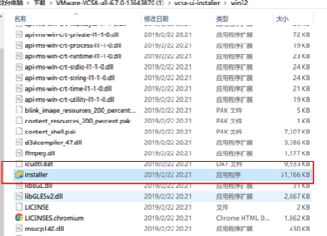

2)      进入安装程序向导

## 2.   部署设备
1)      点击安装，接着点击下一步进行部署设备

2)      勾选“我接受许可协议条款”。

3)      选择“嵌入式PSC”

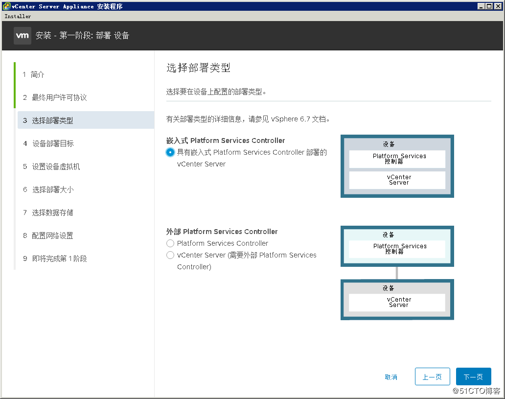

4)      指定VCSA 6.7部署到ESXi主机或VC。

5)      提示证书警告，选择“是”。

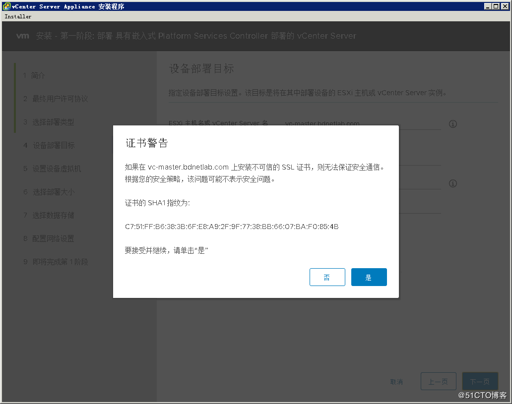

6)      设置VCSA管理密码

7)      选择部署大小。

8)      选择VCSA 6.7虚拟机存储。

9)      第12步，配置VCSA 6.7虚拟机网络。

10)    确认第1阶段参数。

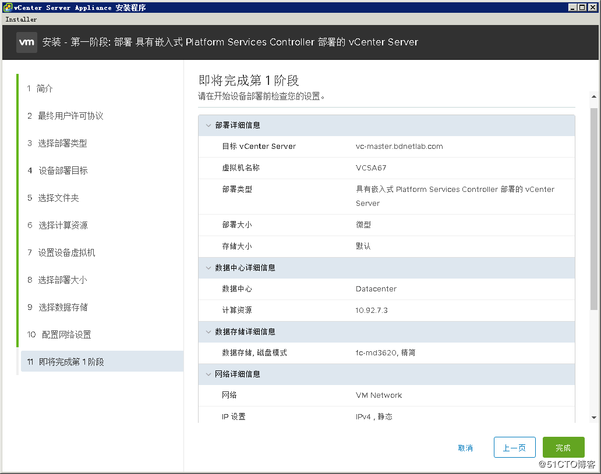

11)    开始第一阶段部署。

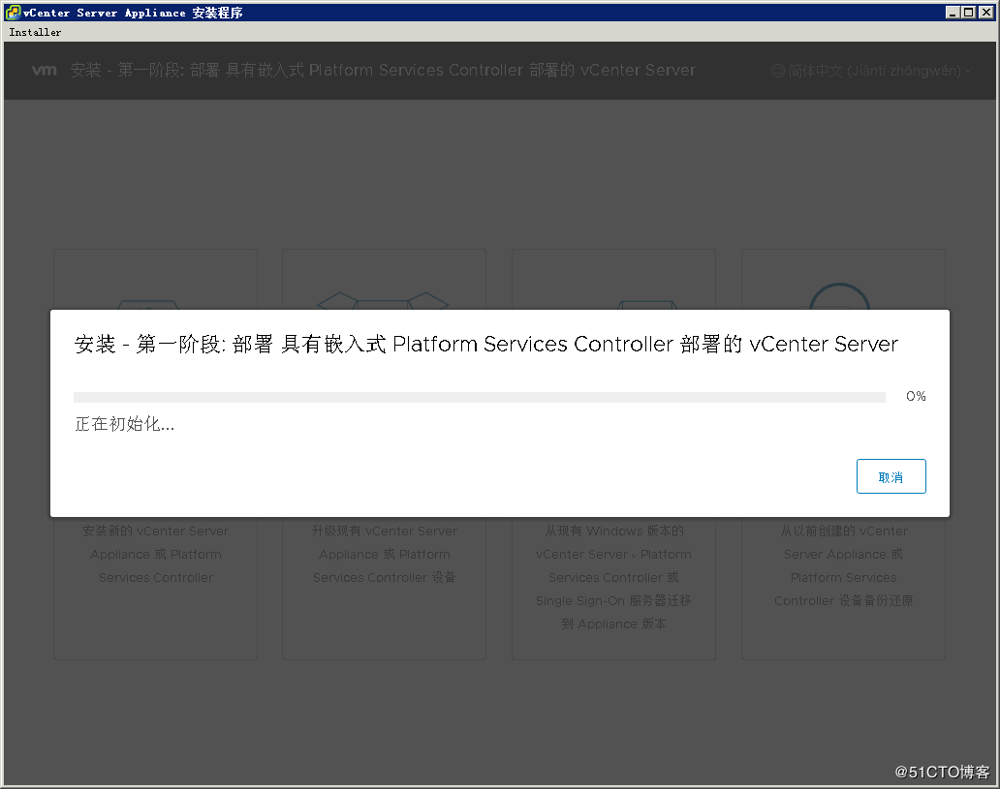

12)    完成第一阶段部署，开始第二阶段部署。

## 3.   设置设备
1)      开始第二阶段配置。

2)      配置NTP服务器。

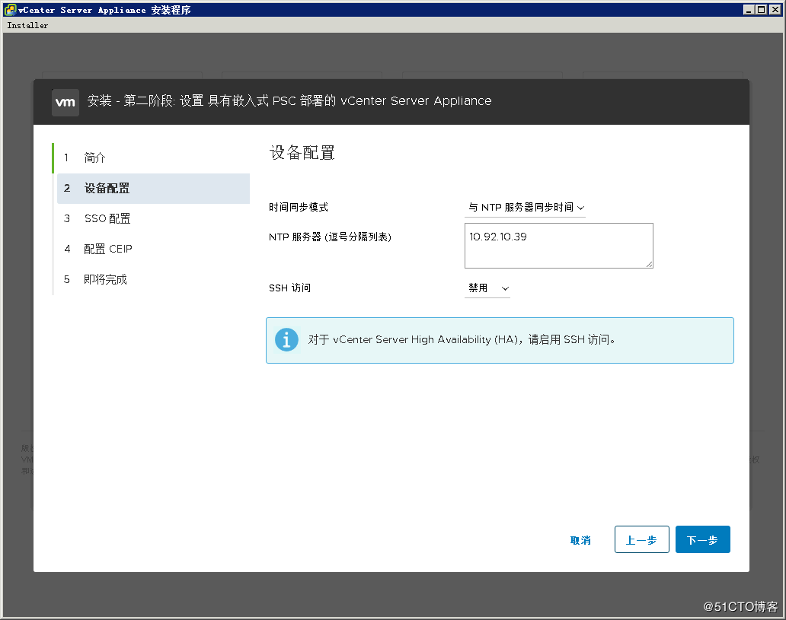

3)      配置SSO参数。

4)      确认是否加入CEIP。

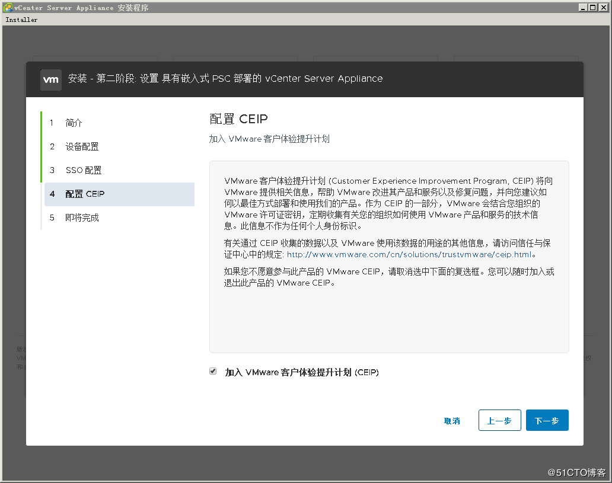

5)      确认参数。

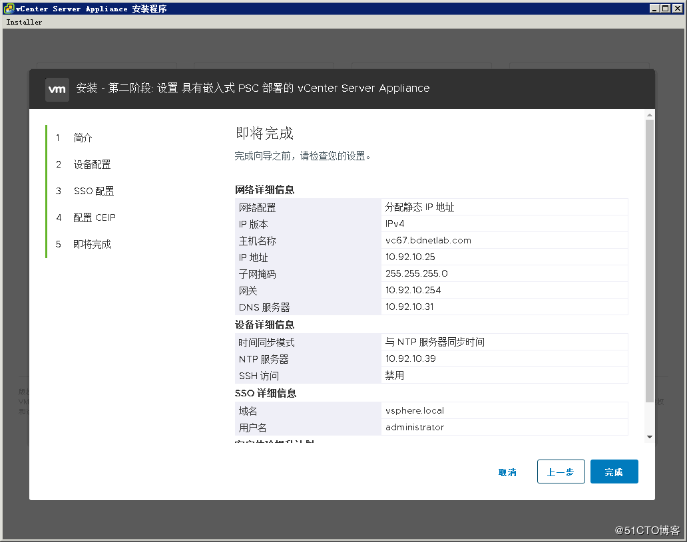

6)      确定开始第二阶段部署。

7)      开始配置。

8)      服务启动。

9)      查看VCSA 6.7虚拟机控制台。

## 4.   浏览器登录VCSA，进行相关设置
1)      VCSA登录。

2)      HTML5主界面。

3)      添加主机

## 5.   添加root用户管理员权限
1)      登陆用vcenter，打到系统管理并打开

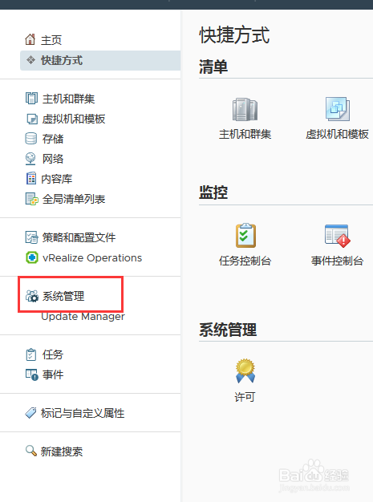

2)      点击Single Sign On 下的“用户和组”，在右边可以看到用户了

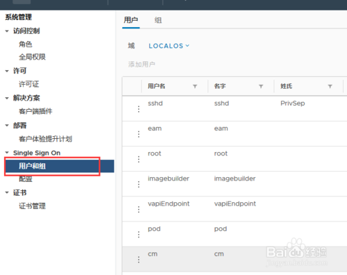

3)      其中用户分本地和域的用户

4)      选择部署vcsa时域，然后开始添加用户

5)      设置用户名、密码等信息，确认完成用户添加。用户添加完成后需要授权才能使用。

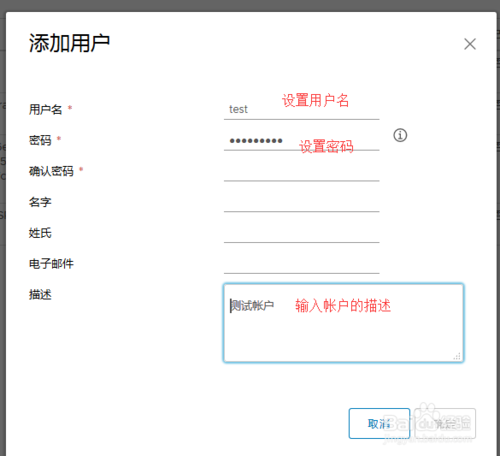

6)      点击“全局权限”中的“+”开始添加授权

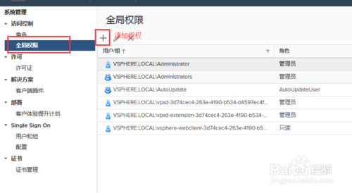

7)      选择要授权的用户，及要添加的权限

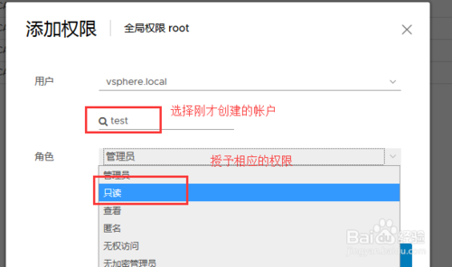

8)      用新建帐户登陆

 

## 6.   创建虚拟主机
1)      点击虚拟机，创建虚拟机

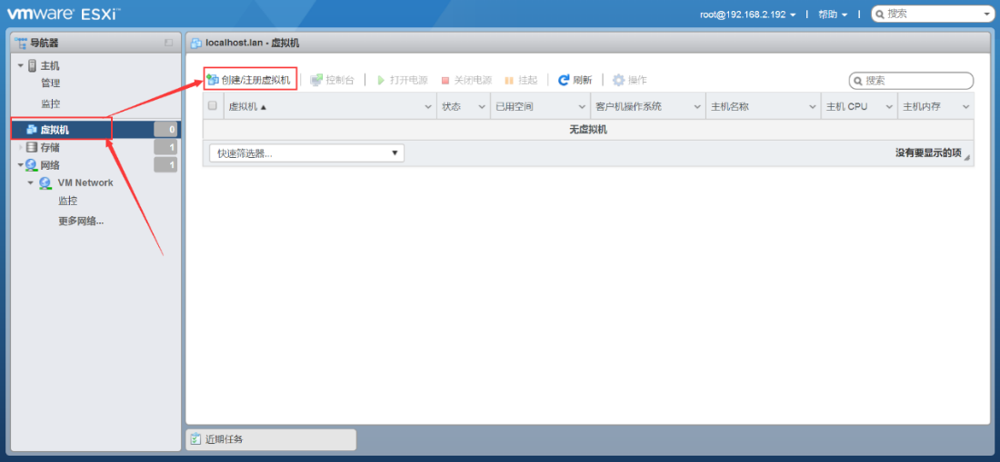

2)      选择虚拟机类型

3)   这里选Linux，版本选centos6(64位)

4)   先暂时选个存储，等下编辑替换为我们刚才上传的vmdk文件：

5)   点完成，刷新一下就能看到刚建好的虚拟机了：

# 四、开启DRS与HA
## 1.   新建集群，添加主机
1)      要想实现DRS和HA功能，先新建群集，再把Esxi主机添加到集群中

2)      给集群命名，并把DRS和vSphere HA功能打开，单击”确定“按钮

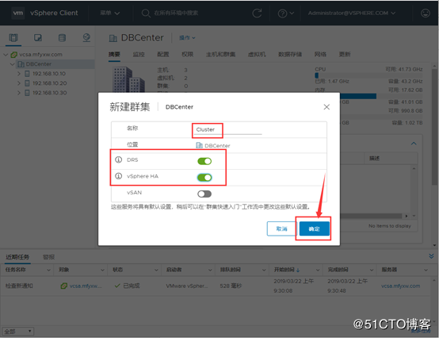

3)      右击新建好的群集，单击”添加主机”

4)      选中现有的所有主机，单击”下一页“按钮直到完成即可

5)      成功把三台Esxi主机添加到群集

## 2.   配置DRS
1)      对群集的DRS功能编辑设置

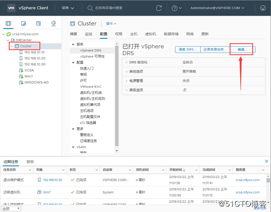

2)      在“自动化”页面中，选择“全自动”

3)      在”其他选项”页面上，勾选“虚拟机分布”，单击“确定”按钮

4)      对HA功能进行编辑设置

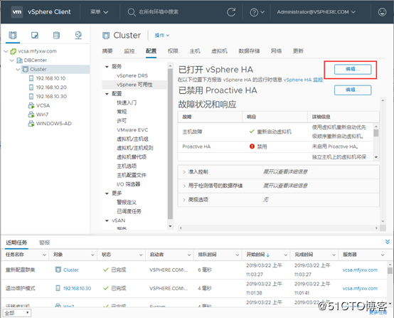

5)      在“故障和响应”页面进行相对应的设置，单击”确定“按钮

## 3.   配置HA
1)      对Proactive HA进行编辑设置

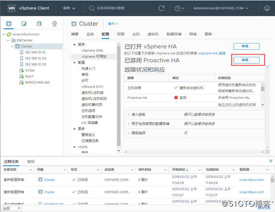

2)      开启Proactive HA功能，自动化级别选择”自动“，单击”确定”

3)      验证HA功能，需要把虚拟机的存储迁移到共享存储服务器上。右击虚拟机VCSA,单击”迁移

4)      在”选择迁移类型”页面上，选择“仅更改存储”，单击”NEXT“按钮  
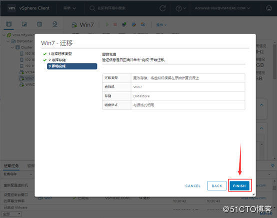

5)      在“即将完成”页面中，单击“FINISH”按钮

6)      验证HA功能，先查看原Win7是运行在哪个Esxi主机上

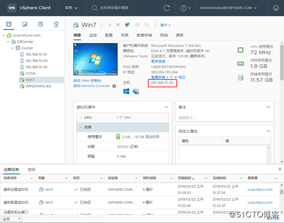

6)      右击”192.168.10.20“主机，依次”维护模式”-->”进入维护模式”

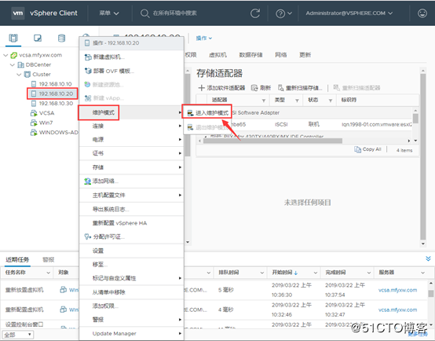

7)      在”进入维护模式”页面上，单击”确定”按钮进入维护模式

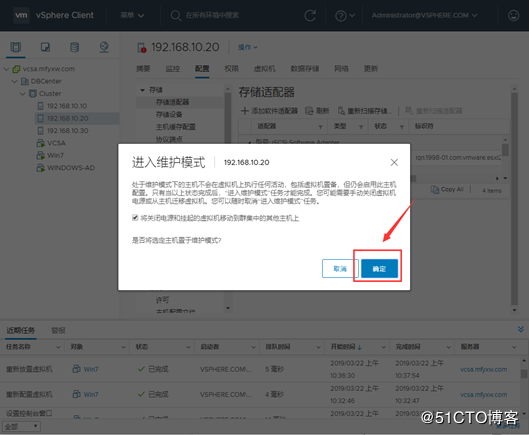

8)      自动进入迁移

 

