# 虚拟机管理
# 一、虚拟机模板
1. 创建模板

1. 通过模板部署虚拟机

1. 更新模板

1. 克隆虚拟机

# 二、向虚拟机添加裸设备映射(RDM)
1. 存储设备创建卷，设置磁盘类型为block
2. 重新扫描磁盘

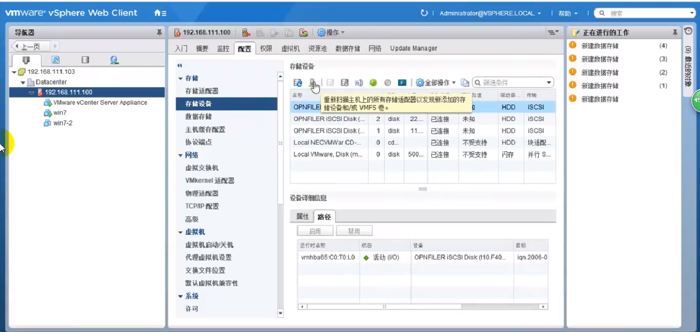

1. 编辑虚拟机，添加rdm磁盘

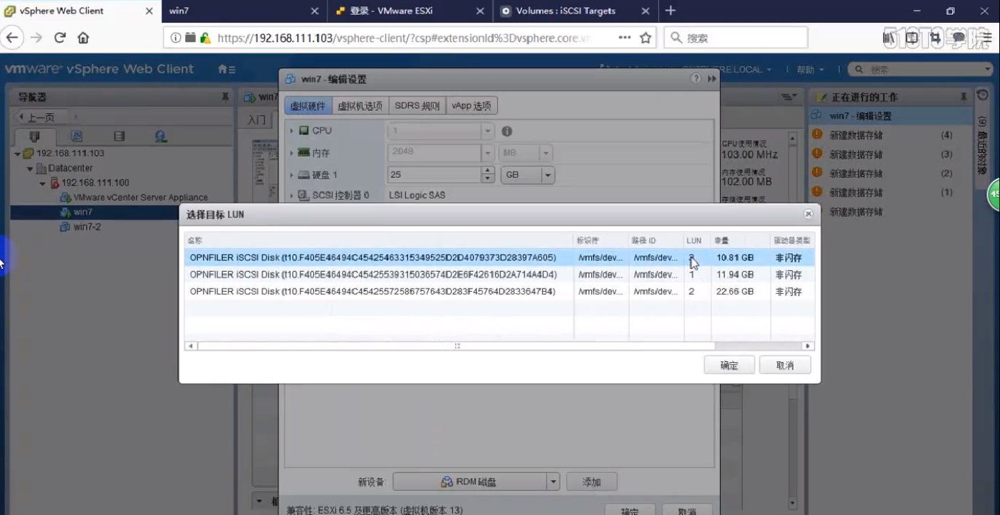

# 三、将磁盘精简模式改为厚配置模式
1. 虚拟机——数据存储——浏览文件

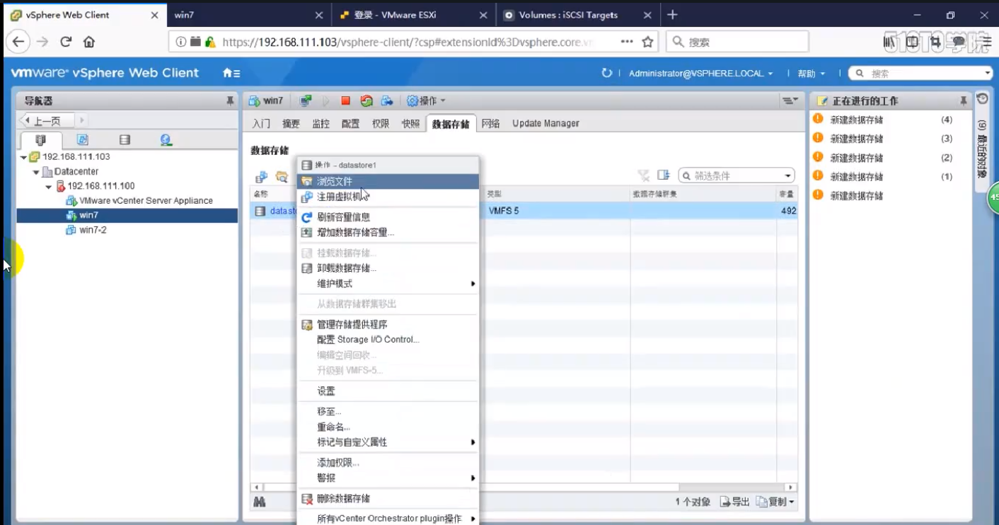

1. 找到vmdk虚拟磁盘文件，点击扩充

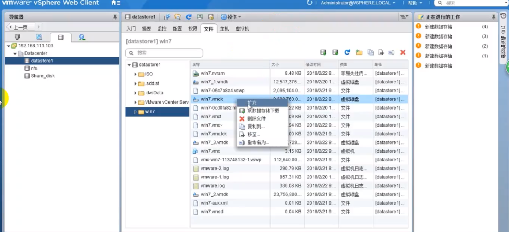

1. 使用迁移更改磁盘类型

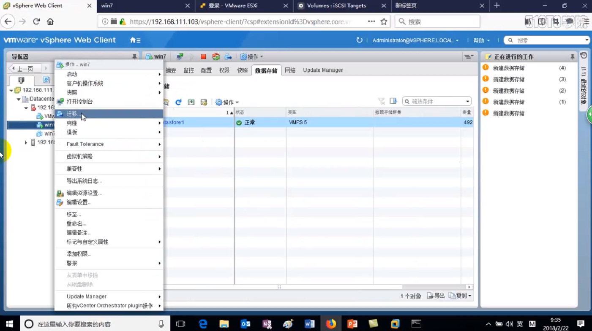

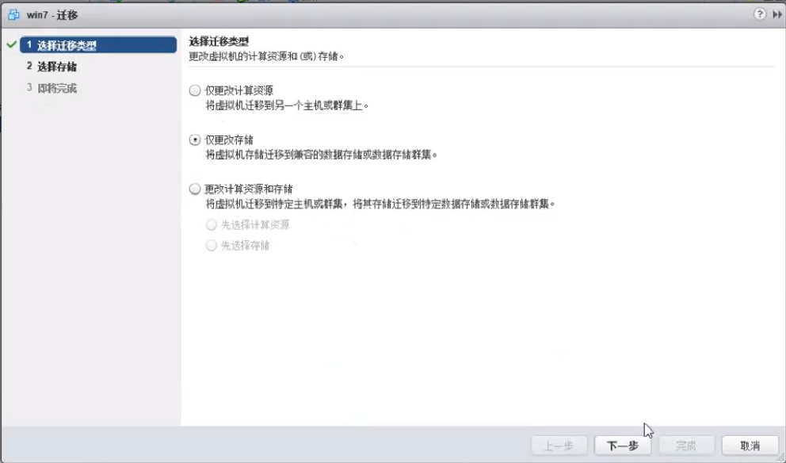

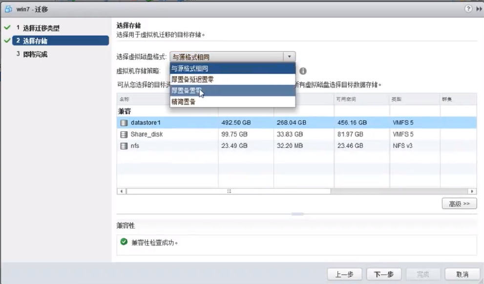

# 四、迁移虚拟机
1. 概念

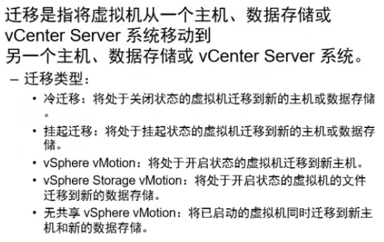

1. 迁移提示vmotion未配置解决办法

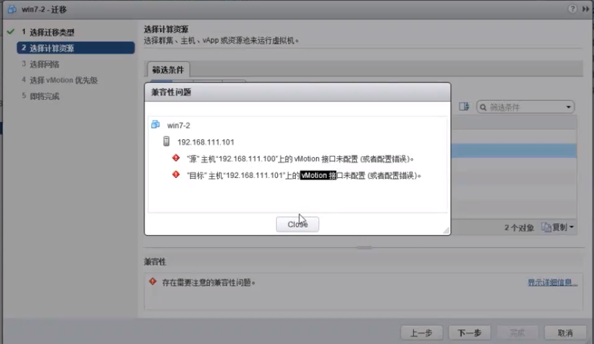

+ 修改vmkernel适配器vmk0网卡配置

+ 开启vmotion

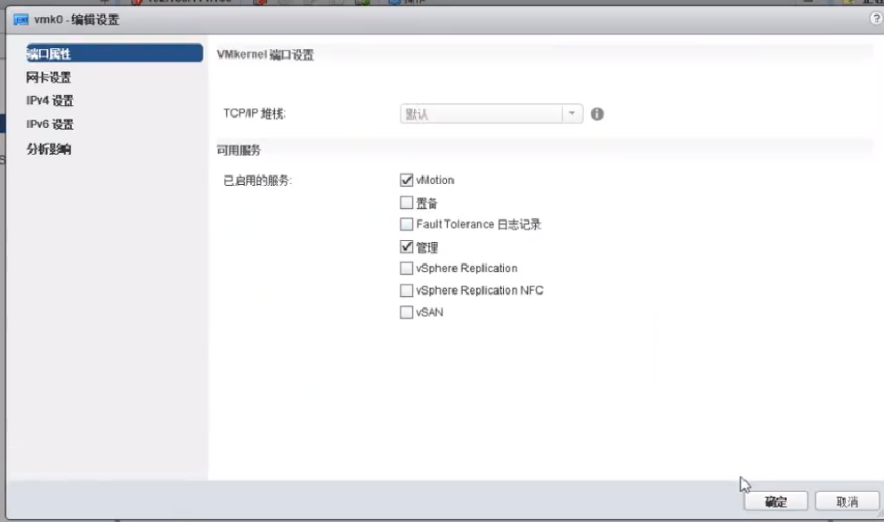

1. 常见迁移失败原因

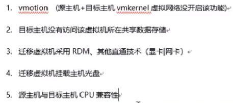

# 五、迁移数据存储
1. 选中虚拟机——迁移——仅更改数据存储

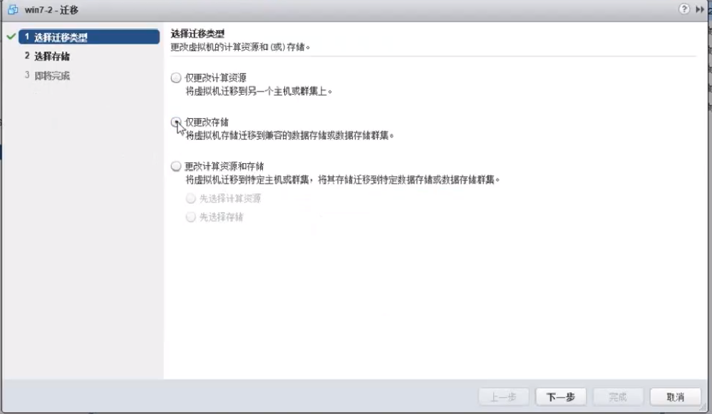

1. 选中存储模式

# 六、迁移类型
1. 迁移类型比较

1. vmotion迁移

1. vmotion迁移流程

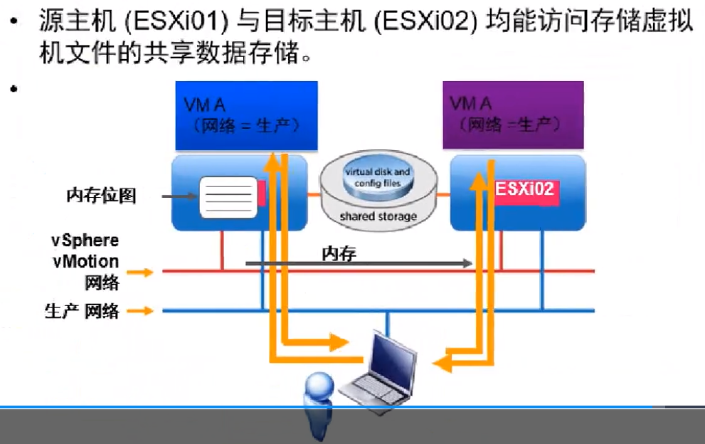

1. 迁移要求

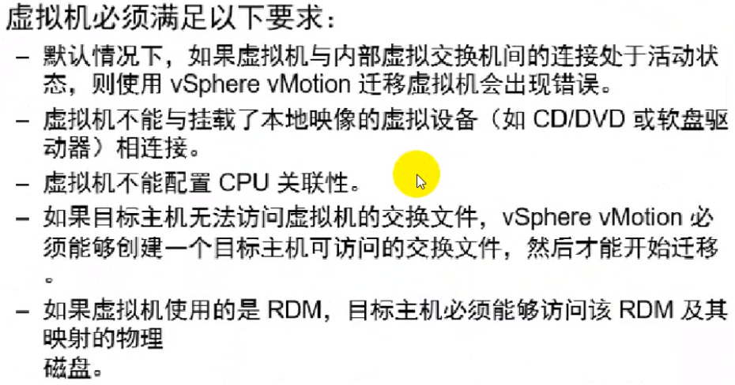

1. 迁移对主机要求

1. 对cpu要求

# 七、快照
1. 虚拟机快照文件

1. 创建快照

1. 删除虚拟机快照

 

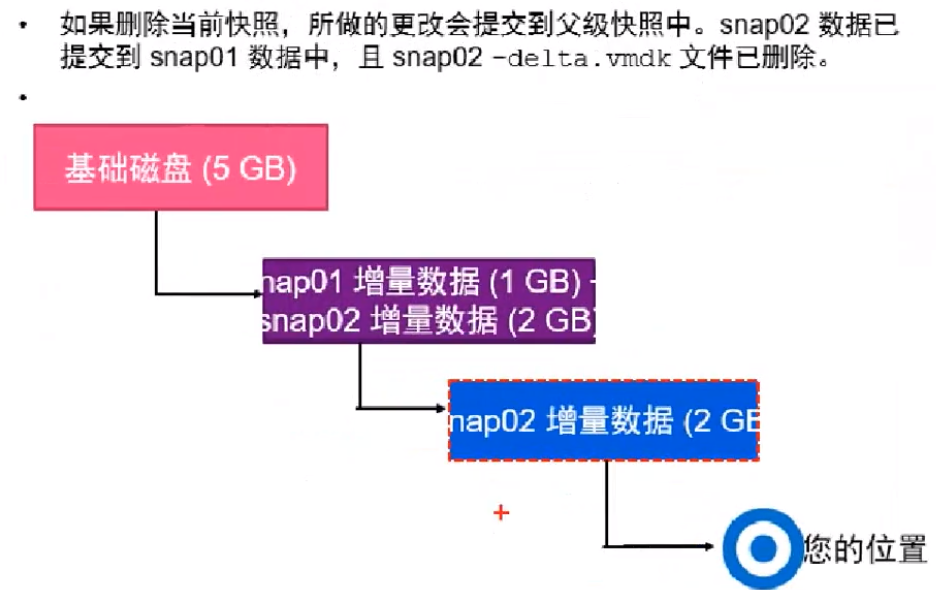

 

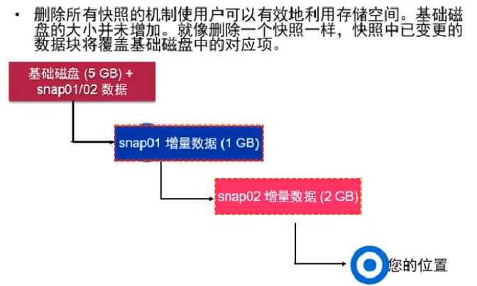

 

