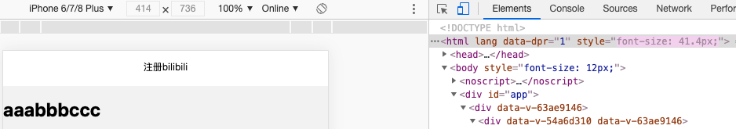

# rem布局

> 分类: Web > rem布局
> 更新时间: 2026-01-10T23:34:05.832919+08:00

---

# 一、项目配置
1. 安装<font style="color:#121212;">flexible</font>

`<font style="color:#121212;">npm i lib-flexible --save</font>` 

2. 在项目入口文件 main.js 里 引入 lib-flexible

import 'lib-flexible'

3. public/index.html 中修改meta

<meta name="viewport" content="width=device-width, user-scalable=no, initial-scale=1.0, maximum-scale=1.0, minimum-scale=1.0">

4. app.vue设置全局样式

```css
body{
  min-width: 320px;
  max-width: 560px;
  width: 10rem;
  margin: 0 auto!important;
  padding: 0;
  box-sizing: border-box;
}
```

5. 验证




# 二、编辑器配置
1. 安装插件

名称px2rem

2. 设置

preferences——Px to Rem

fontsize为设计稿宽度除以10


3. 使用

ALT+D既可转换

