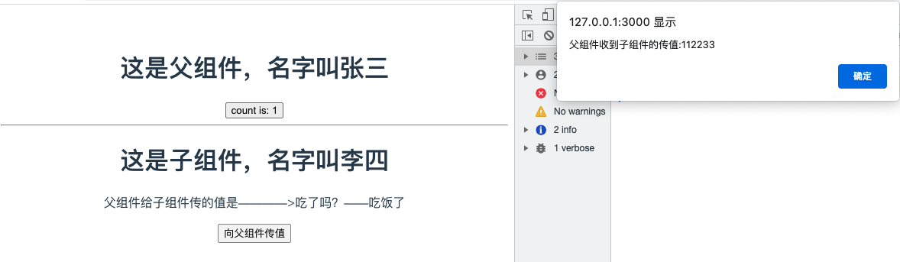

# setup script语法示例

> 分类: Web > vite
> 更新时间: 2026-01-10T23:34:09.711765+08:00

---

> 分别创建src/components/HelloWorld.vue（父组件）和src/components/Test.vue（子组件）。演示setup script的基本用法
>

1. HelloWorld.vue（父组件）

```vue
<template>
  <h1>这是父组件，名字叫{{ name }}</h1>
  <button type="button" @click="valueAdd">
    count is: {{ state.count }}
  </button>
  <hr/>
  <Test msg="吃了吗？" :status="state.count%2===0 ? '没吃饭' : '吃饭了'" @toFather="toFather"/>
</template>

<script setup>
// 引入组件
import {ref, reactive, onMounted} from 'vue'
import Test from '@/components/Test.vue';
// 定义变量
const name = ref('张三')
const state = reactive({count: 0})
// 定义方法
const valueAdd = () => {
  state.count++
}
// 获取子组件的传值
const toFather = (value) => {
  alert('父组件收到子组件的传值:' + value)
}
// 生命周期函数
onMounted(() => {
  console.log("执行onMounted函数")
});
</script>

<style scoped>
a {
  color: #42b983;
}
</style>
```

2. Test.vue（子组件）

```vue
<template>
  <h1>这是子组件，名字叫{{ name }}</h1>
  <p>父组件给子组件传的值是————>{{ msg }}——{{ status }}</p>
  <button type="button" @click="toFather">
    向父组件传值
  </button>
</template>

<script setup>
// 引入组件
import {ref} from "vue";
// 定义变量
const name = ref('李四')
// 组件属性参数(子组件接收父组件传值)
const props = defineProps({
  msg: String,
  // 参数校验与默认值
  status: {
    type: String,
    required: false,
    default: '未定义',
  },
})
// 定义事件(子组件向父组件传参)
const emit = defineEmit(['toFather']);
const toFather = () => {
  emit('toFather', '112233');
}
</script>

<style scoped>

</style>
```

3. 效果演示



